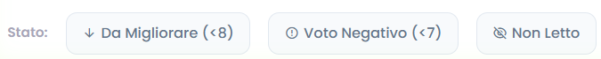
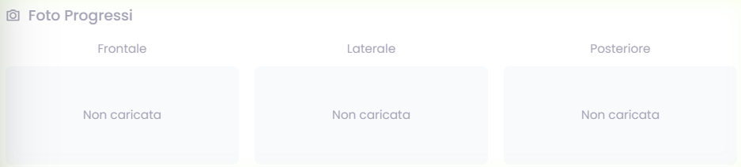
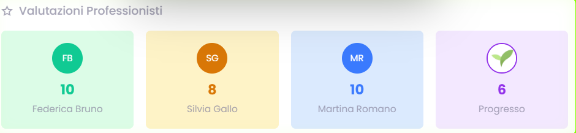
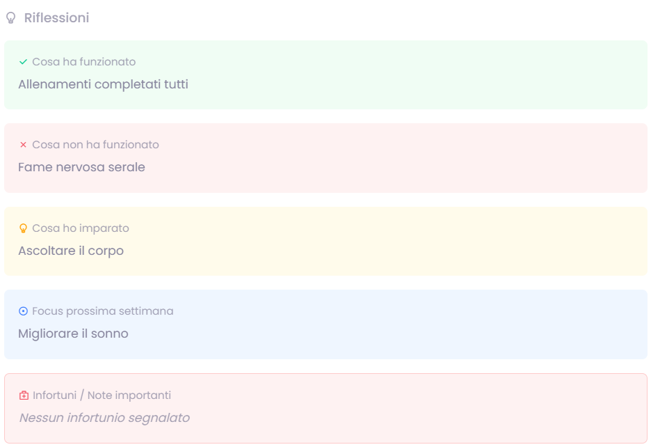

# Check Azienda - Guida Professionista

Questa pagina raccoglie i check compilati dai pazienti e li rende leggibili in modo ordinato. La usi per leggere feedback, aprire il dettaglio delle risposte e collegare quello che vedi al lavoro sul caso.

## KPI iniziali

In alto trovi una sintesi dei punteggi della vista che stai osservando.

### Cosa mostrano

- Nutrizione.
- Psicologia.
- Coach.
- Progresso.
- Quality.

### Come leggerli

- Usali come orientamento rapido prima di entrare nel dettaglio.
- Guarda colori e andamento generale per capire dove concentrare l'attenzione.

## Filtri

La barra dei filtri ti aiuta a restringere i check e a leggere un gruppo di risposte alla volta.

### Strumenti principali

- Periodo temporale.
- Tipo di professionista.
- Professionista specifico.
- Filtri rapidi come `Da migliorare`, `Voto negativo`, `Non letto`.

## Tabella risposte

Ogni riga rappresenta un check compilato da un paziente.

### Cosa trovi

- Paziente e programma.
- Data del check.
- Valutazioni per area.
- Stato di lettura.
- Indicazione del progresso percepito.

### Come usarla

- Parti dalle righe che vuoi approfondire.
- Apri il dettaglio quando il voto numerico non basta.
- Usa lettura e feedback testuale per capire meglio il contesto.

## Dettaglio check

Aprendo una riga entri nella scheda completa del check.

### Foto progressi

### Valutazioni e feedback

### Riflessioni del paziente

## Come usare bene questa pagina

- Parti dal quadro generale e poi entra nel dettaglio delle singole risposte.
- Rileggi i check in relazione alla scheda paziente e al lavoro piu recente.
- Usa i filtri per non leggere tutto insieme e mantenere il focus.
