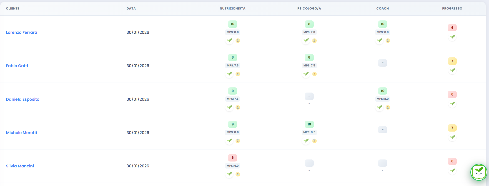
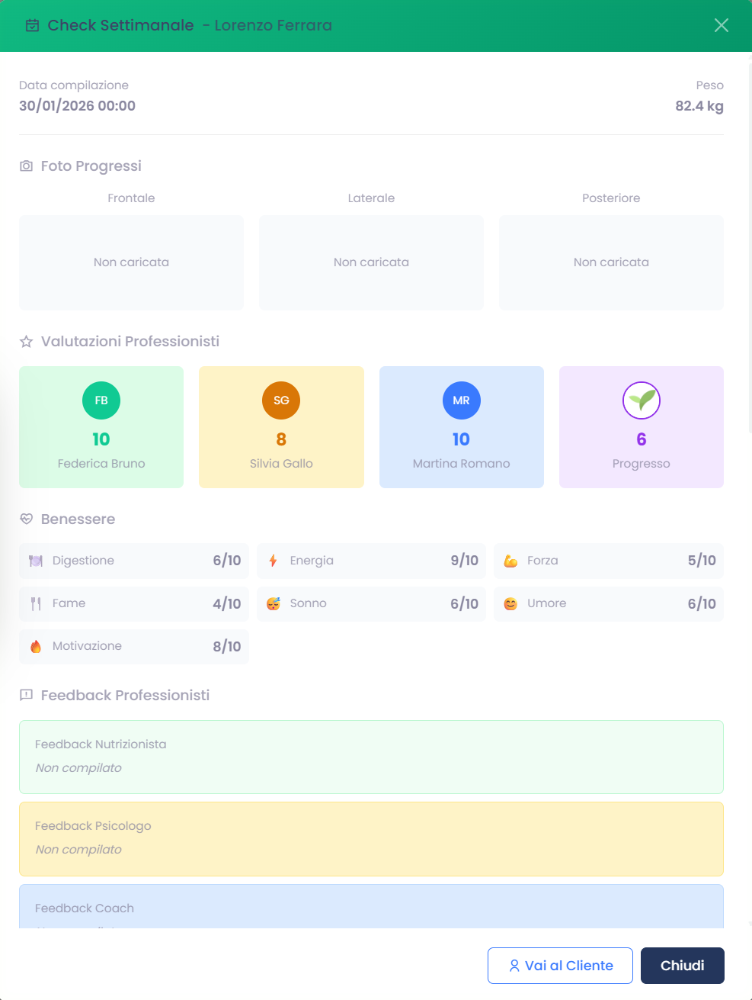

# Check Azienda - Professionista Psicologia

Questa pagina raccoglie i check utili a leggere la qualita percepita del lavoro psicologico.

## Come usarla

- Parti dai KPI e dai filtri rapidi.
- Apri il dettaglio quando il voto non basta a capire il problema.
- Rileggi feedback e riflessioni del paziente prima di intervenire sul caso.

