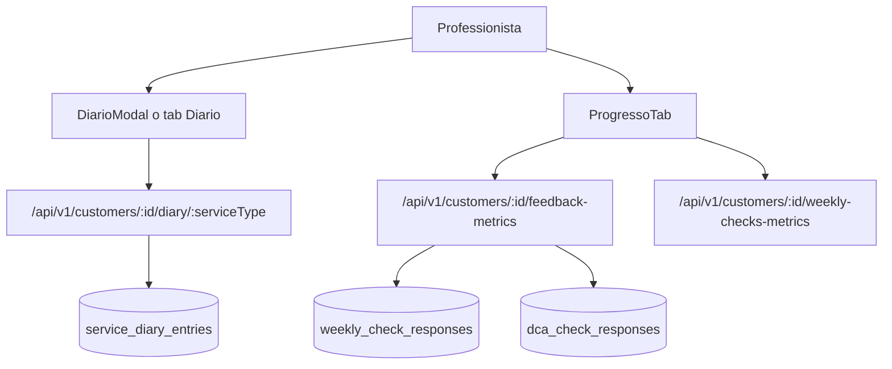

# Diario e Progresso Cliente

> **Categoria**: `clienti`
> **Destinatari**: Sviluppatori, Professionisti, Team Leader
> **Stato**: 🟢 Completo
> **Ultimo aggiornamento**: 27/03/2026

---

## Cos'è e a Cosa Serve

L'area Diario e Progresso raccoglie due funzionalità complementari per il monitoraggio dell'evoluzione del paziente: il **Diario clinico per servizio** (note operative datate e storicizzate) e il **Progresso paziente** (visualizzazione grafica di trend e confronto fotografico basati sui check periodici).

---

## Chi lo Usa

| Ruolo | Utilizzo |
|-------|----------|
| **Professionista** | Documentazione delle sedute e analisi dei cambiamenti fisici/metrici |
| **Team Leader** | Supervisione della qualità clinica dei percorsi del team |
| **Admin / CCO** | Audit log delle sedute e supporto operativo |

---

## Flusso Principale (Technical Workflow)

1. **Daily Entry**: Il professionista apre il modal o il tab diario e inserisce una nota (`DiarioModal`).
2. **Metrics Ingestion**: Ad ogni check compilato, il sistema aggiorna le serie temporali dei pesi e dei rating.
3. **Trend Analysis**: Il frontend richiede le metriche aggregate (`feedback-metrics`).
4. **Visual Comparison**: Il sistema seleziona l'immagine di baseline e l'ultima caricata per il "Prima & Dopo".

```
1. L'utente apre la scheda paziente
2. Usa il diario nel tab di servizio (Nutrizione/Coaching/Psicologia)
3. Aggiunge note contestualizzate per data
4. Passa al tab Progresso
5. Analizza grafici parametri + confronto foto prima/dopo
6. Usa le evidenze per adattare piano e comunicazione col paziente
```

---

## Architettura tecnica

### Componenti coinvolti

| Layer | File / Modulo | Ruolo |
|---|---|---|
| Frontend | `corposostenibile-clinica/src/pages/clienti/DiarioModal.jsx` | Modal diario riusabile per le liste |
| Frontend | `corposostenibile-clinica/src/pages/clienti/ClientiDetail.jsx` | Diario e progresso nella scheda paziente |
| Frontend | `corposostenibile-clinica/src/pages/clienti/ProgressoTab.jsx` | Grafici e confronto foto |
| Service | `corposostenibile-clinica/src/services/clientiService.js` | API diary/anamnesi/metrics |
| Backend | `backend/corposostenibile/blueprints/customers/routes.py` | Endpoints diario + aggregazione dati progresso |

### Flusso dati



---

## Endpoint API Principali

### Diario per servizio

| Metodo | Endpoint | Descrizione |
|---|---|---|
| `GET` | `/api/v1/customers/<id>/diary/<service_type>` | Legge le note diario |
| `POST` | `/api/v1/customers/<id>/diary/<service_type>` | Crea nuova nota |
| `PUT` | `/api/v1/customers/<id>/diary/<service_type>/<entry_id>` | Aggiorna nota |
| `DELETE` | `/api/v1/customers/<id>/diary/<service_type>/<entry_id>` | Elimina nota |
| `GET` | `/api/v1/customers/<id>/diary/<service_type>/<entry_id>/history` | Storico voce |

`service_type` valido: `nutrizione`, `coaching`, `psicologia`.

### Progresso

| Metodo | Endpoint | Descrizione |
|---|---|---|
| `GET` | `/api/v1/customers/<id>/feedback-metrics` | KPI e segnali sintetici |
| `GET` | `/api/v1/customers/<id>/weekly-checks-metrics` | Metriche derivate dai check |

---

## Modelli di Dati Principali

- `ServiceDiaryEntry`
  - `cliente_id`, `service_type`, `entry_date`, `content`, `author_user_id`
- `WeeklyCheckResponse`
  - rating benessere, peso, foto front/side/back, feedback professionisti
- `DCACheckResponse`
  - metriche dedicate area psicologica/DCA
- `TypeFormResponse` (fallback foto iniziali in alcune viste confronto)

---

## Variabili d'Ambiente Rilevanti

| Variabile | Descrizione | Obbligatoria |
|---|---|---|
| `BASE_URL` | Coerenza URL frontend/backend per chiamate API | Sì |
| `VITE_BACKEND_URL` | Endpoint backend usato dalla SPA in dev | Sì (dev) |

---

## Permessi e Ruoli (RBAC)

| Funzionalità | Admin/CCO | Team Leader | Professionista |
|---|---|---|---|
| Leggere diario cliente | ✅ | ✅ nel proprio scope | ✅ nel proprio scope |
| Scrivere diario cliente | ✅ | ✅ nel proprio scope | ✅ nel proprio scope |
| Eliminare voce diario | ✅ | ⚠️ dipende policy | ❌ default |
| Visualizzare progresso | ✅ | ✅ nel proprio scope | ✅ nel proprio scope |

---

## Note Operative e Casi Limite

- Errore comune: usare `serviceType="coach"` nel modal diario. Il valore corretto API è `coaching`.
- Il modal diario usa `createPortal(..., document.body)`: senza container valido React lancia `Target container is not a DOM element`.
- La resa grafica progresso dipende dalla qualità/storicità dei check: con pochi dati alcuni grafici risultano vuoti.
- Il confronto "Prima & Dopo" usa la prima immagine disponibile (incluso fallback typeform) e l'ultima immagine valida.

---

## Documenti Correlati

- [Check periodici](./check-periodici.md)
- [Gestione clienti](./gestione-clienti.md)
- [Modulo nutrizione](./modulo-nutrizione.md)
