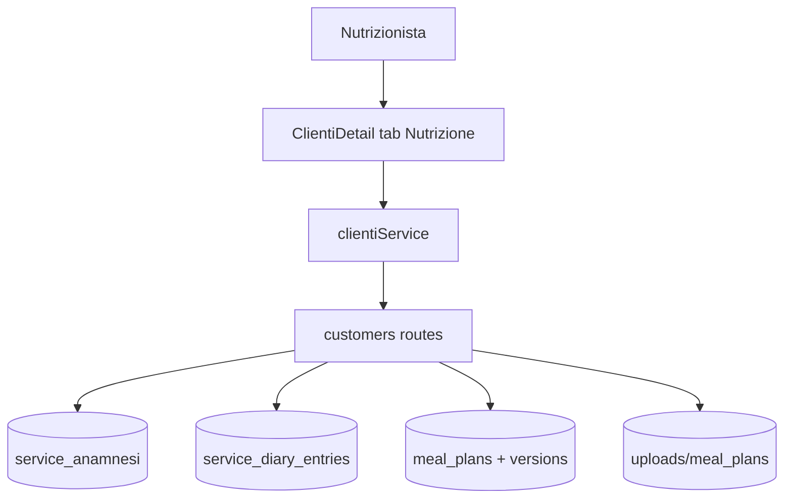

# Modulo Nutrizione

> **Categoria**: `clienti`
> **Destinatari**: Sviluppatori, Nutrizionisti, Team Leader
> **Stato**: 🟢 Completo
> **Ultimo aggiornamento**: 27/03/2026

---

## Cos'è e a Cosa Serve

Il modulo Nutrizione gestisce la parte clinico-operativa nutrizionale della scheda paziente. Permette al nutrizionista di documentare l'anamnesi iniziale, gestire un diario professionale per ogni seduta, e caricare/aggiornare i piani alimentari PDF con un sistema di versioning integrato, garantendo la tracciabilità storica del percorso.

---

## Chi lo Usa

| Ruolo | Utilizzo |
|-------|----------|
| **Nutrizionista** | Gestione anamnesi, diario professionale e caricamento piani alimentari |
| **Team Leader Nutrizione** | Supervisione dei casi clinici e supporto operativo al team |
| **Admin / CCO** | Visione globale e gestione dei permessi di eliminazione |

---

## Flusso Principale (Technical Workflow)

1. **Anamnesi Onboarding**: Compilazione dei dati iniziali nel tab Nutrizione.
2. **Periodic Diary**: Inserimento di note ad ogni check o variazione.
3. **Meal Plan Delivery**: Caricamento del PDF (`MealPlan`).
4. **Versioning**: In caso di aggiornamento, il vecchio file viene spostato nello storico (`PlanFileVersion`).
5. **Extra Assets**: Caricamento di file binari aggiuntivi correlati al piano.

```
1. Il professionista apre la scheda paziente
2. Entra nel tab "Nutrizione"
3. Compila/aggiorna anamnesi
4. Aggiunge note nel diario (data + contenuto)
5. Carica o aggiorna piano alimentare PDF
6. Consulta storico versioni e scarica documenti
```

---

## Architettura tecnica

### Componenti coinvolti

| Layer | File / Modulo | Ruolo |
|---|---|---|
| Frontend | `corposostenibile-clinica/src/pages/clienti/ClientiDetail.jsx` | UI tab Nutrizione |
| Frontend | `corposostenibile-clinica/src/services/clientiService.js` | Client API |
| Backend | `backend/corposostenibile/blueprints/customers/routes.py` | API anamnesi/diario + upload piani |
| Database | `ServiceAnamnesi`, `ServiceDiaryEntry`, `MealPlan`, `PlanFileVersion` | Persistenza dati |

### Flusso sintetico



---

## Endpoint API principali

### Anamnesi e diario (REST `/api/v1/customers`)

| Metodo | Endpoint | Descrizione |
|---|---|---|
| `GET` | `/api/v1/customers/<cliente_id>/anamnesi/nutrizione` | Recupera anamnesi nutrizione |
| `POST` | `/api/v1/customers/<cliente_id>/anamnesi/nutrizione` | Crea/aggiorna anamnesi |
| `GET` | `/api/v1/customers/<cliente_id>/diary/nutrizione` | Lista voci diario |
| `POST` | `/api/v1/customers/<cliente_id>/diary/nutrizione` | Crea voce diario |
| `PUT` | `/api/v1/customers/<cliente_id>/diary/nutrizione/<entry_id>` | Aggiorna voce diario |
| `DELETE` | `/api/v1/customers/<cliente_id>/diary/nutrizione/<entry_id>` | Elimina voce diario (admin) |
| `GET` | `/api/v1/customers/<cliente_id>/diary/nutrizione/<entry_id>/history` | Storico modifiche voce |

### Piani alimentari (route legacy `/customers`)

| Metodo | Endpoint | Descrizione |
|---|---|---|
| `POST` | `/customers/<cliente_id>/nutrition/add` | Nuovo piano alimentare (PDF obbligatorio) |
| `POST` | `/customers/<cliente_id>/nutrition/change` | Cambio piano esistente |
| `GET` | `/customers/<cliente_id>/nutrition/history` | Storico piani |
| `GET` | `/customers/<cliente_id>/nutrition/<plan_id>/versions` | Versioni di un piano |
| `GET` | `/customers/<cliente_id>/nutrition/<plan_id>/download` | Download PDF piano |
| `POST` | `/customers/<cliente_id>/nutrition/<plan_id>/extra-files/add` | Aggiunta allegato extra |
| `DELETE` | `/customers/<cliente_id>/nutrition/<plan_id>/extra-files/<file_id>` | Rimozione allegato extra |
| `GET` | `/customers/<cliente_id>/nutrition/<plan_id>/extra-files/<file_id>/download` | Download allegato extra |

---

## Modelli di Dati Principali

- `ServiceAnamnesi`
  - `cliente_id`, `service_type`, `content`, `created_by_user_id`, `last_modified_by_user_id`
- `ServiceDiaryEntry`
  - `cliente_id`, `service_type`, `entry_date`, `content`, `author_user_id`
- `MealPlan`
  - metadati piano, date validità, file principale PDF
- `PlanFileVersion`
  - versioning file e change reason

---

## Variabili d'Ambiente Rilevanti

| Variabile | Descrizione | Obbligatoria |
|---|---|---|
| `UPLOAD_FOLDER` | Percorso base upload piani/allegati | Sì |
| `BASE_URL` | URL base applicazione (link download/redirect) | Sì |

---

## RBAC (sintesi)

| Funzionalità | Admin/CCO | Team Leader | Professionista |
|---|---|---|---|
| Visualizzare anamnesi/diario | ✅ | ✅ nel proprio scope | ✅ nel proprio scope |
| Modificare anamnesi/diario | ✅ | ✅ nel proprio scope | ✅ nel proprio scope |
| Eliminare voce diario | ✅ | ⚠️ dipende permessi | ❌ (di default) |
| Gestire piani alimentari | ✅ | ✅ se abilitato | ✅ se `_can_manage_meal_plans` |

---

## Note Operative e Casi Limite

- I `service_type` validi lato API diario/anamnesi sono: `nutrizione`, `coaching`, `psicologia`.
- Il diario nutrizione in lista specialistica usa un modal condiviso (`DiarioModal`) e deve passare `serviceType="nutrizione"`.
- Le route piani alimentari sono ancora sotto prefix legacy `/customers/...` (non `/api/v1/customers/...`).
- Upload e versioni dipendono dal filesystem/persistent storage configurato in deploy.

---

## Documenti Correlati

- [Gestione clienti](./gestione-clienti.md)
- [Diario e progresso](./diario-progresso.md)
- [Check periodici](./check-periodici.md)
