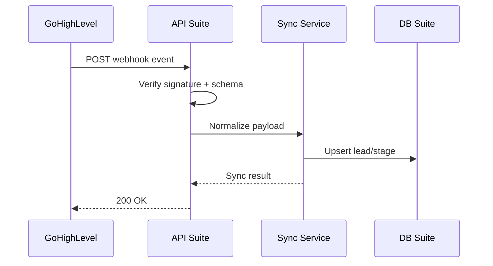

# Integrazione GoHighLevel (GHL) Webhook

> **Categoria**: `integrazione`
> **Destinatari**: Sviluppatori, Team Marketing, Appointment Setters
> **Stato**: 🟡 Bozza avanzata
> **Ultimo aggiornamento**: 27/03/2026

---

## Cos'è e a Cosa Serve

Questa integrazione collega la Suite Clinica a GoHighLevel (GHL) per sincronizzare eventi di funnel (nuovi lead, cambio stage, prenotazioni) verso i moduli operativi interni. L'obiettivo e' centralizzare i dati commerciali in un unico punto operativo, riducendo ritardi e passaggi manuali tra marketing e team clinico.

In pratica consente di:
- Registrare in Suite i principali eventi provenienti dai funnel GHL.
- Allineare lo stato lead tra piattaforme esterne e dashboard interne.
- Tracciare errori di sincronizzazione con log dedicati e retry controllato.

---

## Chi lo Usa

| Ruolo | Utilizzo |
|-------|----------|
| **Sviluppatori** | Configurazione endpoint, sicurezza webhook e monitoraggio errori |
| **Marketing/AS** | Verifica allineamento lead e stage di conversione |
| **Health Manager** | Consultazione stato onboarding dopo prenotazione |

---

## Flusso Principale (Technical Workflow)

1. GHL invia un evento webhook alla Suite.
2. La Suite valida firma/origine e formato payload.
3. Il sistema mappa il payload sul modello interno lead/cliente.
4. Viene aggiornata la timeline operativa e, se necessario, creato un task.
5. In caso di errore transiente, il job viene accodato per retry asincrono.

---

## Architettura Tecnica

### Componenti coinvolti

| Layer | Componente | Ruolo |
|-------|------------|-------|
| Ingress | Endpoint webhook GHL | Ricezione eventi funnel |
| Service | Mapper payload | Traduzione schema GHL -> schema Suite |
| Persistence | Tabelle lead/eventi | Storico e tracciabilita' |
| Worker | Retry queue | Gestione errori transitori |

### Schema del flusso

---

## Endpoint API Principali

| Metodo | Endpoint | Descrizione | Autenticazione |
|--------|----------|-------------|----------------|
| `POST` | `/ghl/webhook/acconto-open` | Webhook opportunita' in stato `acconto_open` (queue Celery). | `X-GHL-Signature` / `X-Webhook-Signature` |
| `POST` | `/ghl/webhook/chiuso-won` | Webhook opportunita' in stato `chiuso_won` (queue Celery). | `X-GHL-Signature` / `X-Webhook-Signature` |
| `POST` | `/ghl/webhook/nuovo-cliente` | Alias operativo di `acconto-open`. | `X-GHL-Signature` / `X-Webhook-Signature` |
| `POST` | `/ghl/webhook/opportunity-data` | Salvataggio dati lead/opportunity per assegnazioni AI. | Rate-limit IP, no login |
| `POST` | `/ghl/webhook/calendario-prenotato` | Assegnazione owner servizio clienti da calendario GHL. | `X-GHL-Signature` / `X-Webhook-Signature` |
| `POST` | `/ghl/webhook/call-bonus-sale` | Vendita call bonus da GHL verso Suite. | Webhook pubblico |
| `POST` | `/ghl/webhook/ghost-recovery` | Recupero stato cliente ghost -> attivo. | Webhook pubblico |
| `POST` | `/ghl/webhook/pausa-servizio` | Pausa servizio con auto-riattivazione schedulata. | Webhook pubblico |
| `GET` | `/ghl/api/opportunity-data` | Lista dati opportunity per frontend assegnazioni. | Login richiesto |
| `GET` | `/ghl/api/calendar/events` | Eventi calendario GHL (scope per ruolo). | Login richiesto |

---

## Modelli di Dati Principali

- `GHLConfig`: configurazione singleton integrazione (`api_key`, `location_id`, stato sync).
- `GHLOpportunityData`: payload opportunity semplificato con campi lead/HM e `ai_analysis`.
- `GHLOpportunity`: tracking completo opportunita' (`status`, importi, retry, payload webhook).

---

## Variabili d'Ambiente Rilevanti

| Variabile | Descrizione | Obbligatoria |
|-----------|-------------|--------------|
| `GHL_WEBHOOK_SECRET` | Segreto per validare la firma webhook | Sì |
| `GHL_API_KEY` | API key per chiamate outbound verso GHL | Sì |
| `GHL_LOCATION_ID` | Identificativo workspace/location in GHL | Sì |
| `GHL_API_BASE_URL` | Base URL API GHL (default `https://rest.gohighlevel.com/v1`) | No |
| `BASE_URL` | Base URL Suite usata per generare URL webhook/config | Sì |

---

## Permessi e Ruoli (RBAC)

| Funzionalita' | Admin | Finance | Team Leader | Professionista |
|-------------|-------|---------|-------------|----------------|
| Gestione configurazione GHL (`/ghl/api/config*`) | ✅ | ❌ | ❌ | ❌ |
| View webhook logs (`ghl:view_logs`) | ✅ | ✅ | ❌ | ❌ |
| Test webhook (`ghl:test_webhooks`) | ✅ | ❌ | ❌ | ❌ |
| View assignments (`ghl:view_assignments`) | ✅ | ❌ | ✅ (scope team) | ✅ (ruoli professionali) |
| Webhook inbound (`/ghl/webhook/*`) | Sistema esterno | Sistema esterno | Sistema esterno | Sistema esterno |

---

## Note Operative e Casi Limite

- **Firma webhook**: il decorator usa HMAC SHA256 su payload raw; in dev senza secret puo' essere bypassato con warning.
- **Rate limiting**: webhook limitati per IP (`WebhookRateLimiter`) con risposta `429`.
- **Asincrono Celery**: `acconto-open` e `chiuso-won` vengono accodati (`process_*_webhook`) con retry.
- **Scope Team Leader**: endpoint list/calendario applicano filtro membri team quando l'utente non e' admin.
- **Endpoint debug**: presenti endpoint debug (`/ghl/api/opportunity-data-debug`) da trattare come non-production.

---

## Documenti Correlati

- [Integrazione Respond.io](./integrazione-respond-io.md)
- [Appointment Setting](./appointment-setting.md)
- [Report completamento documentazione](../sviluppo/report-completamento-documentazione.md)
