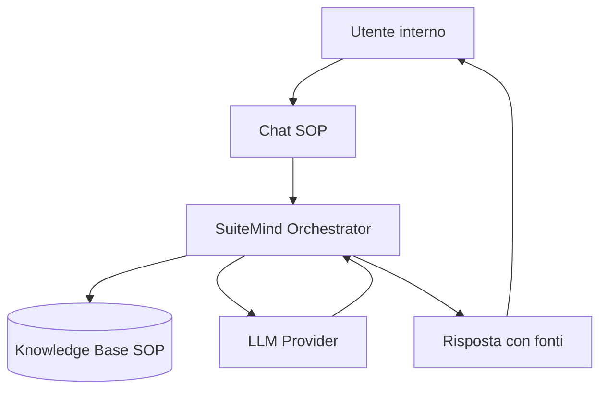

# SuiteMind AI e SOP Chatbot

> **Categoria**: `integrazione`
> **Destinatari**: Sviluppatori, Team Operativo, Team Leader
> **Stato**: 🟡 Bozza avanzata
> **Ultimo aggiornamento**: 27/03/2026

---

## Cos'è e a Cosa Serve

SuiteMind e' il layer AI della piattaforma che supporta ricerca knowledge, risposte guidate e recupero SOP operative. Il chatbot SOP riduce i tempi di onboarding e uniforma le risposte interne, mantenendo traccia delle fonti usate.

Benefici principali:
- Accesso rapido a procedure operative standard da un'interfaccia conversazionale.
- Riduzione errori dovuti a interpretazioni non uniformi.
- Possibilita' di escalare facilmente verso un referente umano quando il confidence score e' basso.

---

## Chi lo Usa

| Ruolo | Utilizzo |
|-------|----------|
| **Team Operativo** | Consulta SOP durante l'esecuzione di task complessi |
| **Team Leader** | Controlla qualita' risposte e gap di knowledge |
| **Sviluppatori** | Gestisce ingestion documenti, prompt e policy di sicurezza |

---

## Flusso Principale (Technical Workflow)

1. L'utente invia una domanda nel widget/chat interno.
2. Il sistema recupera chunk rilevanti dalla knowledge base.
3. Il motore AI genera risposta con citazioni e confidence.
4. Se confidence e' basso, viene proposta escalation o risposta conservativa.
5. La sessione viene tracciata per audit e miglioramento continuo.

---

## Architettura Tecnica

### Componenti coinvolti

| Layer | Componente | Ruolo |
|-------|------------|-------|
| Frontend | Widget Chat SOP | Interfaccia conversazionale |
| Orchestrazione | SuiteMind Service | Gestione prompt, retrieval e policy |
| Knowledge | Indice vettoriale SOP | Recupero semantico contenuti |
| Audit | Log interazioni AI | Tracciamento e quality review |

### Schema del flusso

---

## Endpoint API Principali

| Metodo | Endpoint | Descrizione | Autenticazione |
|--------|----------|-------------|----------------|
| `GET` | `/api/sop/documents` | Lista documenti SOP caricati e stato ingestione. | Login richiesto |
| `POST` | `/api/sop/documents/upload` | Upload documento (`pdf/doc/docx`) e avvio processing in background. | Login richiesto |
| `DELETE` | `/api/sop/documents/<doc_id>` | Eliminazione documento + vettori associati. | Login richiesto |
| `POST` | `/api/sop/chat` | Q&A RAG con fonti (`sources`) e `session_id`. | Login richiesto |
| `POST` | `/api/sop/chat/clear` | Pulizia cronologia sessione chat. | Login richiesto |
| `GET` | `/api/sop/stats` | Statistiche documenti/chunk in knowledge base SOP. | Login richiesto |

---

## Modelli di Dati Principali

- `SOPDocument`: metadata documento (`status`, `chunks_count`, `error_message`, uploader).
- Qdrant collection `sop_documents`: chunk vettoriali con payload (`doc_id`, `text`, `chunk_index`, `filename`).
- Sessioni chat in-memory (`_sessions`): storico breve per continuita' conversazionale.

---

## Variabili d'Ambiente Rilevanti

| Variabile | Descrizione | Obbligatoria |
|-----------|-------------|--------------|
| `GOOGLE_API_KEY` | Chiave per chiamate GenAI usate da `ChatService` | Sì |
| `QDRANT_URL` | URL istanza Qdrant (default `http://localhost:6333`) | Sì |
| `QDRANT_COLLECTION` | Nome collection vettoriale (default `sop_documents`) | No |
| `UPLOAD_FOLDER` | Directory base upload, include `sop_documents/` | Sì |

---

## Permessi e Ruoli (RBAC)

| Funzionalita' | Admin | Team Leader | Professionista | Health Manager |
|-------------|-------|-------------|----------------|----------------|
| Usa chat SOP (`/api/sop/chat`) | ✅ | ✅ | ✅ | ✅ |
| Upload/elimina documenti SOP | ✅ | ✅ | ✅ | ✅ |
| Visualizza stats knowledge | ✅ | ✅ | ✅ | ✅ |

> Nota: al momento il backend applica `login_required` su tutte le route SOP, senza separazione ruoli specifica per singolo endpoint.

---

## Note Operative e Casi Limite

- **Pipeline RAG reale**: chunking (`500/50`) + embedding `BAAI/bge-small-en-v1.5` + retrieval top-5 da Qdrant.
- **Provider AI**: implementazione corrente usa Google GenAI (`gemini-2.5-flash-lite`), non provider multipli.
- **Session storage volatile**: cronologia in memoria processo (`_sessions`), non persistente su restart.
- **Upload asincrono**: ingestione avviata in thread background; stato documento evolve `processing -> ready/error`.
- **Controllo accessi**: se serve policy enterprise, aggiungere RBAC fine-grained (es. upload solo admin/TL).

---

## Documenti Correlati

- [Guida Team Leader](../guide-ruoli/guida-team-leader.md)
- [Quality score](../strumenti/quality-score.md)
- [Report completamento documentazione](../sviluppo/report-completamento-documentazione.md)
