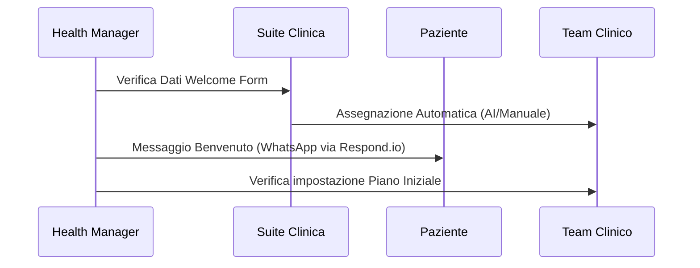

# Guida Operativa: Health Manager (HM)

> **Categoria**: `guida-ruolo`
> **Destinatari**: Health Managers, Team Leader HM, CCO
> **Stato**: 🟢 Completo
> **Ultimo aggiornamento**: 27/03/2026

---

## Cos'è e a Cosa Serve

L'Health Manager è l'architetto del percorso del paziente e il punto di riferimento organizzativo. Gestisce l'onboarding, monitora la soddisfazione complessiva, coordina il team clinico e interviene nei momenti critici del ciclo di vita del cliente per garantire la ritenzione e il raggiungimento dei risultati.

---

## Attività Giornaliere

| Attività | Frequenza | Modulo Suite |
|----------|-----------|--------------|
| Benvenuto nuovi pazienti | Quotidiana | `customers (New Lead)` |
| Gestione "Clienti in Prova" | Quotidiana | `customers / in-prova` |
| Filtro e smistamento richieste | Quotidiana | `ticket` / `chat` |
| Monitoraggio Capienza Team | Settimanale | `capienza` |

---

## Flussi Principali (Technical Workflow)

### 1. Ciclo di Onboarding

---

## Errori Comuni e Gotcha

- **Saturazione Team**: Prima di assegnare un paziente, controlla sempre il modulo **Capienza** per evitare di sovraccaricare un professionista.
- **In Prova**: I pazienti in prova richiedono un follow-up più frequente (scadenza task ridotta). Non trascurare i badge rossi nella lista "In Prova".

---

## Escalation

| Problema | Referente | Strumento |
|----------|-----------|-----------|
| Richiesta Recesso / Rimborso | Amministrazione / CCO | Ticket Urgente |
| Conflitto tra professionisti team | Team Leader Rispettivo | Chat Interna |
| Bug bloccante onboarding | Supporto IT | Ticket Supporto |

---

## Documenti Correlati

- [Gestione Clienti](../clienti-core/gestione-clienti.md)
- [Integrazione Respond.io](../comunicazione/integrazione-respond-io.md)
- [Assegnazioni AI (Sviluppo)](../sviluppo/refactor_status_report.md)
