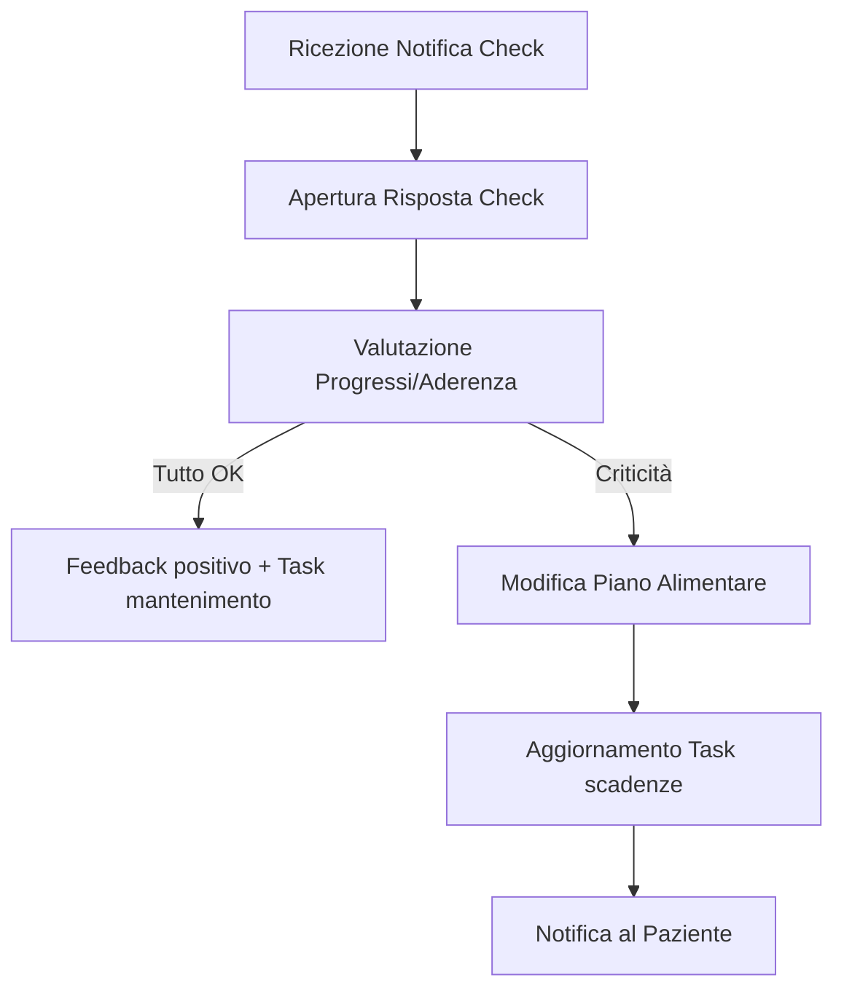

# Guida Operativa: Nutrizionista

> **Categoria**: `guida-ruolo`
> **Destinatari**: Nutrizionisti, CCO, Team Leader Nutrizione
> **Stato**: 🟢 Completo
> **Ultimo aggiornamento**: 27/03/2026

---

## Cos'è e a Cosa Serve

Il Nutrizionista è il responsabile della strategia alimentare del paziente. Utilizza la Suite Clinica per monitorare l'aderenza al piano, analizzare i feedback biomorfologici e biochimici ricevuti tramite i check e aggiornare le prescrizioni nutrizionali per garantire il raggiungimento degli obiettivi di salute e composizione corporea.

---

## Attività Giornaliere

| Attività | Frequenza | Modulo Suite |
|----------|-----------|--------------|
| Revisione "Check da Leggere" | Quotidiana | `customers / client_checks` |
| Risposta a dubbi su piano alimentare | Quotidiana | `comunicazioni-chat` |
| Aggiornamento piani nutrizionali | Settimanale | `nutrition` |
| Gestione Task scaduti | Quotidiana | `tasks` |
| Escalation casi critici (DCA/Patologie) | Al bisogno | `ticket` |

---

## Flussi Principali (Technical Workflow)

### 1. Gestione Nuovo Paziente (Onboarding)
Quando un nuovo paziente viene assegnato, il nutrizionista riceve una notifica push.
1. Apertura **Scheda Cliente** → Tab **Nutrizione**.
2. Analisi **Check Welcome** e **Anamnesi Medico/Nutrizionale**.
3. Creazione del **Piano Alimentare** iniziale nel modulo `nutrition`.
4. Assegnazione di eventuali **Task** di supporto (es. "Fai la spesa").

### 2. Analisi Check Settimanale

---

## Errori Comuni e Gotcha

- **Mancata sincronizzazione**: Se il piano non appare aggiornato, verifica di aver salvato correttamente la versione "Attiva".
- **Filtri Liste**: Assicurati che nel modulo clienti sia selezionata la visuale "Nutrizione" per vedere solo il tuo perimetro.
- **Dati Sensibili**: Non inserire dati sanitari critici nei campi "Note Rapide" (Post-it), usa sempre il Diario Clinico protetto da RBAC.

---

## Escalation

| Problema | Referente | Strumento |
|----------|-----------|-----------|
| Dubbio clinico complesso | Team Leader Nutrizione | Chat / Commento Task |
| Errore tecnico salvataggio | Admin / Supporto IT | Ticket Supporto |
| Segnalazione DCA Grave | CCO + Medico di Riferimento | Email / Ticket Urgente |

---

## Documenti Correlati

- [Modulo Nutrizione](../clienti-core/modulo-nutrizione.md)
- [Check Periodici](../clienti-core/check-periodici.md)
- [Diario e Progresso](../clienti-core/diario-progresso.md)
