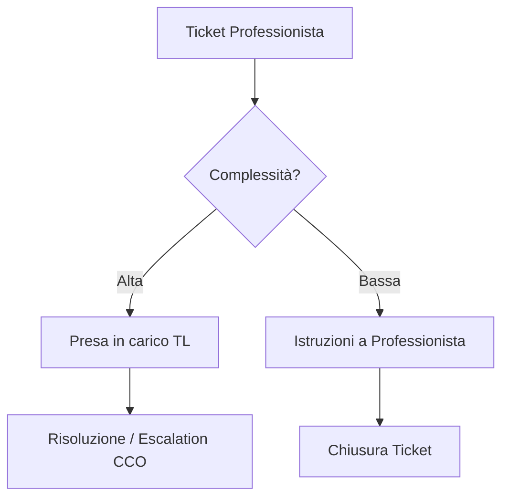

# Guida Operativa: Team Leader (TL)

> **Categoria**: `guida-ruolo`
> **Destinatari**: Team Leader (Nutrizione/Coach/Psicologia/HM)
> **Stato**: 🟢 Completo
> **Ultimo aggiornamento**: 27/03/2026

---

## Cos'è e a Cosa Serve

Il Team Leader è il garante della qualità clinica e operativa del proprio dipartimento. Utilizza la Suite Clinica per monitorare il carico di lavoro, validare la qualità dei piani dei sottoposti tramite il Quality Score e intervenire come secondo livello di supporto nelle problematiche cliniche o organizzative complesse.

---

## Attività Giornaliere

| Attività | Frequenza | Modulo Suite |
|----------|-----------|--------------|
| Dashboard Team Monitor | Quotidiana | `welcome (TL View)` |
| Gestione Ticket di Dipartimento | Quotidiana | `ticket` |
| Revisione Check Critici Team | Settimanale | `quality / client_checks` |
| Approvazione Training interni | Al bisogno | `formazione` |

---

## Flussi Principali (Technical Workflow)

### 1. Gestione Escalation Clinica

---

## Errori Comuni e Gotcha

- **Scope Visibilità**: Il TL vede solo i dati del proprio team. Se mancano dati, verifica l'assegnazione dei membri nel modulo `Team`.
- **Quality Score**: Il calcolo del Quality Score è automatico, ma il TL deve intervenire manualmente per i "Super Malus" se si verificano violazioni gravi delle SOP.

---

## Escalation

| Problema | Referente | Funzione |
|----------|-----------|-----------|
| Crisi di reparto / Turnover | CCO | Gestione People |
| Malfunzionamento modulo Quality | Supporto IT | Bug Report |
| Proposta miglioramento SOP | IT Manager / Admin | Evolution Management |

---

## Documenti Correlati

- [Quality Score](../strumenti/quality-score.md)
- [KPI e Performance](../team/kpi-performance.md)
- [Team e Professionisti](../team/team-professionisti.md)
