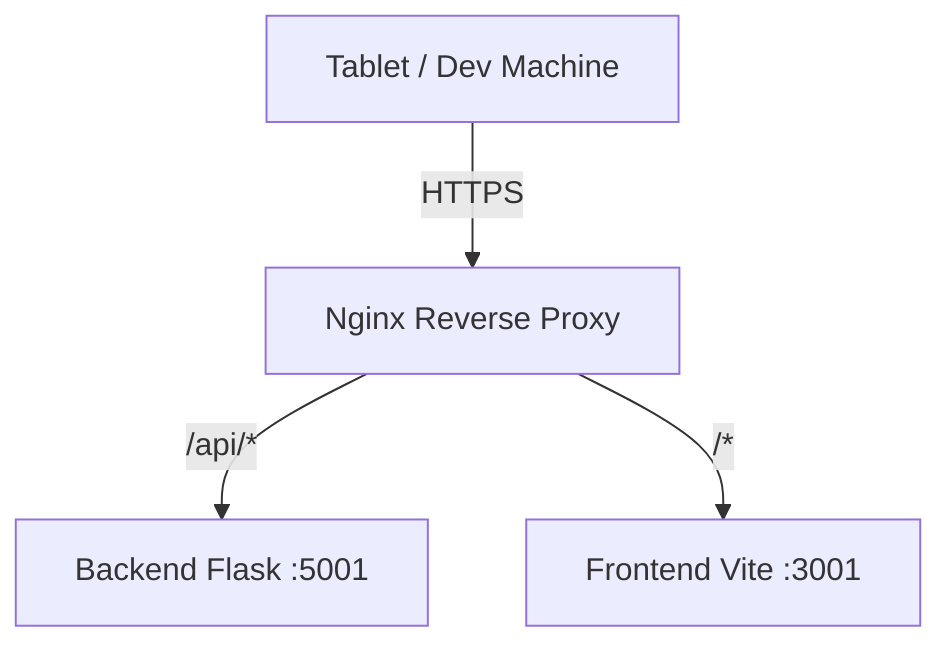

# Sviluppo Locale su VPS (DuckDNS)

> **Categoria**: `infrastruttura`
> **Destinatari**: Sviluppatori
> **Stato**: 🟢 Completo
> **Ultimo aggiornamento**: 27/03/2026

---

## Cos'è e a Cosa Serve

Questa guida descrive la configurazione dell'ambiente di sviluppo "locale" ospitato su VPS. Utilizza DuckDNS per fornire un dominio pubblico (`suite-clinica.duckdns.org`) e HTTPS, permettendo il test delle PWA su tablet e l'integrazione con servizi esterni che richiedono webhook HTTPS senza dover deployare ogni volta su GCP.

---

## Chi lo Usa

| Ruolo | Utilizzo |
|-------|----------|
| **Sviluppatori** | Sviluppo quotidiano, test PWA, debug webhook esterni |

---

## Flusso Principale (Development Workflow)

1. **Start Services**: Avvio di backend e frontend tramite PM2 (wrapper `dev.sh`).
2. **Coding**: Modifica del codice localmente (o via SSH).
3. **Hot Reload**: Vite (frontend) e PM2 Watch (backend) applicano le modifiche istantaneamente.
4. **Testing**: Accesso via `https://suite-clinica.duckdns.org` da qualsiasi dispositivo.

---

## Architettura Tecnica

### Componenti coinvolti

| Layer | Componente | Ruolo |
|-------|------------|-------|
| Proxy | Nginx | Reverse proxy, Terminazione TLS, Routing root |
| Frontend | Vite (Port 3001) | Sviluppo PWA via PM2 |
| Backend | Flask (Port 5001) | API Backend via PM2 |
| DNS / SSL | DuckDNS + Certbot | Risoluzione dominio e certificati SSL |

### Schema del setup



---

## Dettaglio Configurazione VPS

## 0) Due ambienti diversi (separazione importante)

### Ambiente normale / generico (sviluppo locale classico)

- Uso tipico: laptop/dev machine con avvio manuale di backend/frontend
- Comandi `dev.sh` tipici:
  - `fullstack`, `debug`, `frontend`, `start/stop/restart`
- Non è detto che usi `PM2`/`systemd`

### Nostro ambiente VPS locale (DuckDNS) - quello usato quotidianamente

- Dominio: `https://suite-clinica.duckdns.org`
- Backend live: `PM2` (`backend-manu`)
- Frontend live (standard attuale): `PM2` (`frontend-manu`) con `vite dev --watch` (auto-reload)
- Comandi `dev.sh` da usare qui:
  - `vps-status`
  - `vps-restart-backend`
  - `vps-restart-frontend`
  - `vps-refresh`
  - `vps-watch-backend` / `vps-unwatch-backend`

Regola pratica:
- se stai lavorando su `suite-clinica.duckdns.org`, usa i comandi `vps-*` e non i comandi generici.

## 1) Architettura attuale

Dominio pubblico:
- `https://suite-clinica.duckdns.org`

Servizi locali su VPS:
- Frontend PWA (Vite dev via PM2 watch): `http://127.0.0.1:3001`
- Backend Flask: `http://127.0.0.1:5001`
- Nginx: espone `80/443`, termina TLS e fa reverse proxy

Routing Nginx:
- `/api/*`, `/ghl/*`, `/review/*`, `/postit/*`, `/team/*`, ecc. -> backend `127.0.0.1:5001`
- tutte le route pagina (`/`, `/auth/*`, `/clienti-lista`, ...) -> frontend `127.0.0.1:3001`
- compatibilità legacy: `/static/clinica/*` -> redirect 301 verso `/*`

Nota PWA:
- URL canonico login: `https://suite-clinica.duckdns.org/auth/login`
- `manifest.webmanifest` e `sw.js` sono serviti in root (`/manifest.webmanifest`, `/sw.js`).

## 2) Prerequisiti

- Dominio DuckDNS attivo: `suite-clinica.duckdns.org`
- DNS del dominio puntato all'IP VPS (es. `161.97.116.63`)
- Utente con privilegi `sudo`
- Node/npm installati per build frontend
- Python + Poetry installati per backend

Verifica DNS:

```bash
dig +short suite-clinica.duckdns.org
```

## 3) Setup iniziale HTTPS (solo prima volta)

Da root repo:

```bash
bash scripts/setup_vps_https_pwa.sh \
  --domain suite-clinica.duckdns.org \
  --upstream http://127.0.0.1:3001 \
  --email tua-email@dominio.it
```

Opzionale con update DuckDNS:

```bash
bash scripts/setup_vps_https_pwa.sh \
  --domain suite-clinica.duckdns.org \
  --upstream http://127.0.0.1:3001 \
  --email tua-email@dominio.it \
  --duckdns-subdomain suite-clinica \
  --duckdns-token NUOVO_TOKEN_DUCKDNS
```

## 4) Gestione servizi runtime (verificare sempre lo stack attivo)

Nota importante:
- standard corrente: frontend servito da `PM2` (`frontend-manu`) con `watch` attivo
- `systemd` (`clinica-pwa-preview`) è stato disabilitato per evitare build/restart manuali ad ogni modifica
- prima di fare "deploy VPS" verificare quale processo sta effettivamente ascoltando su `:3001` / `:5001`
- modificare i file del repo **non** aggiorna automaticamente il sito: serve restart del processo frontend/backend corretto

### 4.0 Comandi consigliati via `dev.sh` (nuovo flusso)

Per evitare errori (es. usare `./dev.sh restart manu` che fa anche check/setup con `sudo`), usare i comandi VPS dedicati:

```bash
# Stato stack live (backend PM2 + frontend auto-detect systemd/PM2)
./dev.sh vps-status manu

# Applica modifiche al VPS locale:
# - backend: PM2 restart
# - frontend: PM2 restart (nessuna build obbligatoria in dev mode)
./dev.sh vps-refresh manu

# Solo backend (PM2)
./dev.sh vps-restart-backend manu

# Solo frontend (auto-detect stack live)
./dev.sh vps-restart-frontend manu

# Auto-restart backend su modifiche codice (PM2 watch, utile in sviluppo VPS)
./dev.sh vps-watch-backend manu
./dev.sh vps-unwatch-backend manu
```

Nota:
- su stack `PM2 + vite dev`, le modifiche frontend sono visibili con hot-reload/auto-restart
- in caso di blocco, usare `./dev.sh vps-restart-frontend manu`

### 4.1 Frontend PWA (PM2, standard attuale)

Processo: `frontend-manu`

```bash
npx pm2 list
npx pm2 describe frontend-manu
npx pm2 logs frontend-manu --lines 100
npx pm2 restart frontend-manu
```

Verifica rapida watch:

```bash
npx pm2 describe frontend-manu | rg "watch & reload"
```

Setup/ripristino standard (se il processo non esiste):

```bash
cd /home/manu/suite-clinica/corposostenibile-clinica
npx pm2 start "npm run dev -- --host 0.0.0.0 --port 3001 --strictPort" \
  --name frontend-manu \
  --namespace manu \
  --watch \
  --ignore-watch="node_modules dist .git"
npx pm2 save
```
### 4.2 Frontend PWA (systemd, fallback opzionale)

Servizio: `clinica-pwa-preview`

```bash
sudo systemctl status clinica-pwa-preview --no-pager
sudo systemctl restart clinica-pwa-preview
sudo journalctl -u clinica-pwa-preview -n 100 --no-pager
```

### 4.3 Backend Flask (PM2)

Processo: `backend-manu`

```bash
npx pm2 list
npx pm2 logs backend-manu --lines 100
npx pm2 restart backend-manu
```

Alternativa consigliata (wrapper con naming standard):

```bash
./dev.sh vps-restart-backend manu
```

## 5) Deploy frontend (PWA)

Nota:
- stack standard (PM2 + vite dev): `build` non necessario per sviluppo quotidiano
- fallback systemd preview: richiede `npm run build` + restart servizio

Stack standard (PM2 + vite dev):

```bash
cd /home/manu/suite-clinica/corposostenibile-clinica
npx pm2 restart frontend-manu
```

Fallback systemd preview:

```bash
cd /home/manu/suite-clinica/corposostenibile-clinica
npm ci
npm run build
sudo systemctl restart clinica-pwa-preview
```

Shortcut consigliato (se lo stack live è già configurato):

```bash
./dev.sh vps-restart-frontend manu
```

Verifiche minime:

```bash
curl -I https://suite-clinica.duckdns.org/auth/login
curl -I https://suite-clinica.duckdns.org/manifest.webmanifest
curl -I https://suite-clinica.duckdns.org/sw.js
```

## 6) Deploy backend (Flask + Poetry)

```bash
cd backend
poetry install
poetry run flask db upgrade
npx pm2 restart backend-manu
```

Shortcut consigliato:

```bash
./dev.sh vps-restart-backend manu
```

Verifiche minime:

```bash
curl -i http://127.0.0.1:5001/api/auth/me | head -n 20
curl -i https://suite-clinica.duckdns.org/api/auth/me | head -n 20
```

## Variabili d'Ambiente Rilevanti

| Variabile | Descrizione |
|-----------|-------------|
| `VAPID_PUBLIC_KEY` | Chiave pubblica per notifiche push |
| `VAPID_PRIVATE_KEY` | Path alla chiave privata VAPID |
| `VAPID_CLAIMS_SUB` | Email di contatto per push provider |

---

## Note Operative e Casi Limite

2. Esegui le migrazioni (obbligatorio):

```bash
cd backend
poetry run flask db upgrade
```

3. Riavvia backend:

```bash
npx pm2 restart backend-manu
```

4. Test endpoint autenticato:

```bash
curl -i https://suite-clinica.duckdns.org/api/push/public-key
```

Atteso:
- senza login: `401` (corretto)
- con sessione utente: JSON con `enabled: true`

### 6.2 Import DB produzione in locale (script ufficiale)

Per clonare il DB produzione nel DB locale VPS usare lo script:

```bash
cd /home/manu/suite-clinica/backend
poetry run python scripts/local_db_ops/import_cached_migrated_sql.py \
  --dump-file /home/manu/suite-clinica/backend/backups/prod_db_local/prod_db.sql
```

Note operative:
- lo script è `backend/scripts/local_db_ops/import_cached_migrated_sql.py`
- il dump custom `.dump` può fallire se la versione locale di `pg_restore` è più vecchia (`unsupported version in file header`)
- in quel caso usare il dump plain `.sql` come nell'esempio sopra
- dopo import eseguire sempre:

```bash
cd /home/manu/suite-clinica/backend
poetry run flask db upgrade
```

## 7) Deploy completo

```bash
# 1) Pull codice
git pull

# 2) Frontend (standard PM2 vite dev)
cd /home/manu/suite-clinica/corposostenibile-clinica
npx pm2 restart frontend-manu

# 3) Backend
cd /home/manu/suite-clinica/backend
poetry install
poetry run flask db upgrade
cd /home/manu/suite-clinica
npx pm2 restart backend-manu

# 4) Smoke test
curl -I https://suite-clinica.duckdns.org/auth/login
curl -i https://suite-clinica.duckdns.org/api/auth/me | head -n 20
```

Variante fallback (solo se frontend su systemd preview): eseguire build + `sudo systemctl restart clinica-pwa-preview`.

Versione rapida (riavvio stack live già installato/configurato):

```bash
./dev.sh vps-refresh manu
```

Nota:
- `vps-refresh` non esegue `git pull`, `npm ci`, `poetry install`, né migrazioni DB
- serve per applicare rapidamente modifiche codice già presenti sul VPS locale

Nota importante:
- la migrazione va sempre deployata insieme al codice che introduce nuovi modelli/tabelle (es. `push_subscriptions`).

## 8) Test da tablet (installazione PWA)

1. Apri `https://suite-clinica.duckdns.org/auth/login`
2. Fai login almeno una volta online
3. Installa app:
- Android Chrome: menu -> `Installa app`
- iOS Safari: Condividi -> `Aggiungi a Home`
4. Test offline:
- apri app installata una volta online
- modalità aereo
- riapri dall'icona Home

## 9) Troubleshooting rapido

### 9.1 Route legacy `/static/clinica/*`

```bash
curl -I https://suite-clinica.duckdns.org/static/clinica/auth/login
```

Atteso: `301` verso `https://suite-clinica.duckdns.org/auth/login`.

### 9.2 Nginx non parte

```bash
sudo nginx -t
sudo systemctl status nginx --no-pager
sudo journalctl -xeu nginx --no-pager
sudo ss -ltnp | rg ':80|:443'
```

### 9.3 Backend non raggiungibile

```bash
ss -ltnp | rg ':5001'
npx pm2 list
npx pm2 logs backend-manu --lines 100
```

Comandi `dev.sh` utili:

```bash
./dev.sh vps-status manu
./dev.sh vps-restart-backend manu
./dev.sh vps-watch-backend manu   # per sviluppo con auto-restart alle modifiche
```

## 10) Sicurezza operativa

- Mantieni pubbliche solo `80/443`; non esporre `3001` e `5001` su Internet.
- Se un token DuckDNS è stato esposto, rigeneralo.
- Verifica certificati:

```bash
sudo certbot certificates
```

### Documenti Correlati

- [Setup Infrastruttura GCP](./gcp_infrastructure_setup_report.md)
- [Analisi CI/CD](./ci_cd_analysis.md)
- [Panoramica Generale](../panoramica/overview.md)
