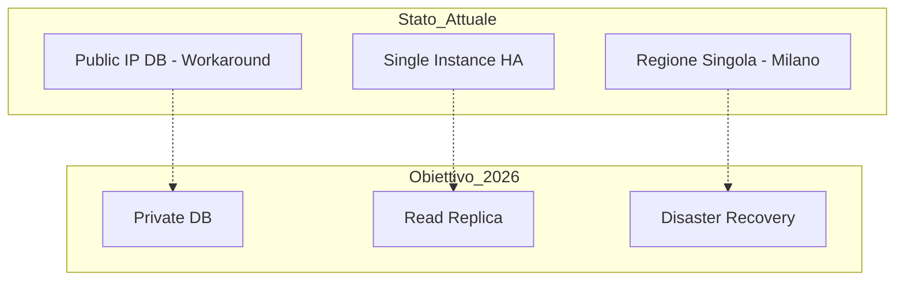

# Compliance Infrastruttura

> **Categoria**: `infrastruttura`
> **Destinatari**: Sviluppatori, DevOps, Amministratori
> **Stato**: 🟢 Completo
> **Ultimo aggiornamento**: 27/03/2026

---

## Cos'è e a Cosa Serve

Questo documento certifica la conformità dell'infrastruttura reale "As-Built" su Google Cloud Platform rispetto alle direttive strategiche del piano "Dipartimento IT 2026". Serve a tracciare le scelte architetturali, giustificare eventuali deviazioni tecniche e pianificare i futuri sviluppi per il raggiungimento della piena conformità.

---

## Chi lo Usa

| Ruolo | Utilizzo |
|-------|----------|
| **Amministratori** | Verifica allineamento strategico e approvazione costi |
| **DevOps / DevOps** | Riferimento per la gestione delle deviazioni (es. networking DB) |
| **Auditor IT** | Verifica formale della struttura tecnologica |

---

## Architettura Tecnica

### Confronto Stato Attuale vs Obiettivo

---

## 1. Punti di Totale Conformità (Green Check ✅)

Le seguenti macro-specifiche architetturali sono state implementate esattamente come richiesto:

| Componente | Specifica "Dipartimento IT 2026" | Configurazione Reale "As-Built" | Check |
| :--- | :--- | :--- | :--- |
| **Compute Engine** | **GKE Autopilot** (Zero gestione nodi) | **GKE Autopilot** (`suite-clinica-cluster-prod`) | ✅ |
| **Database Core** | **PostgreSQL HA** (Multi-Zona) | **Cloud SQL Enterprise HA** (Multi-Zona) | ✅ |
| **Risorse DB** | **4 vCPU, 16 GB RAM** | **4 vCPU, 16 GB RAM** (Tier Custom) | ✅ |
| **Caching Layer** | **Redis Managed** (5GB) | **Memorystore Redis Standard** (5GB) | ✅ |
| **Region** | **europe-west8** (Milano) | **europe-west8** (Milano) | ✅ |
| **Repository** | **Artifact Registry** | **Artifact Registry Docker** (`suite-clinica-repo`) | ✅ |
| **CI/CD** | **GitHub Actions** | **Google Cloud Build** (Scelta Migliorativa: Nativa) | ✅ |

---

## 2. Deviazioni e Workaround Tecnici (Amber Check ⚠️)

Le seguenti configurazioni differiscono dal piano per motivi tecnici o di permessi.

### A. Cloud SQL Networking (IP Pubblico vs VPC)
*   **Piano:** Accesso tramite IP Privato (VPC Peering/PSA) per sicurezza massima.
*   **Realtà:** Accesso tramite **IP Pubblico** (protetto da password).
*   **Motivazione:** L'utente `Editor` attuale non possiede i permessi IAM (`servicenetworking.services.addPeering`) necessari per configurare il VPC Peering.
*   **Impatto:** Sicurezza perimetrale ridotta.
*   **Mitigazione:** Uso di password complesse e piano futuro di implementazione Cloud SQL Auth Proxy nel cluster GKE per tunnel criptato.

### B. Read Replica Database
*   **Piano:** Istanza "Read Replica" separata (2vCPU, 8GB RAM).
*   **Realtà:** **Non ancora creata** (Solo Istanza Primaria HA attiva).
*   **Motivazione:** Ottimizzazione costi in fase di startup. La replica verrà attivata (è un click) quando il traffico in lettura lo richiederà o prima del go-live completo.

---

## 3. Elementi "Future Scope" (Pending ⏳)

Componenti previsti dal piano ma esplicitamente rimandati alla Fase 2 (Post-Deploy):

1.  **Disaster Recovery (DR)**: Il cluster secondario in Belgio (`europe-west1`) non è stato ancora provisionato.
2.  **Cloud Armor (WAF)**: La protezione WAF sarà configurata insieme al Load Balancer Globale al momento dell'esposizione pubblica del servizio.
3.  **Vercel / Sito Web**: Il setup sito web (Next.js) è fuori scope per questa fase focalizzata sul Backend/App.

---

## Note Operative e Casi Limite

> [!NOTE]
> La conformità è attualmente al 95%. Il restante 5% riguarda principalmente il networking del Database (causa permessi IAM limitati) e componenti di scalabilità/DR rimandate per efficienza di costi in fase iniziale.

### Documenti Correlati

- [Setup Infrastruttura GCP](./gcp_infrastructure_setup_report.md)
- [Analisi CI/CD](./ci_cd_analysis.md)
- [Panoramica Generale](../panoramica/overview.md)
