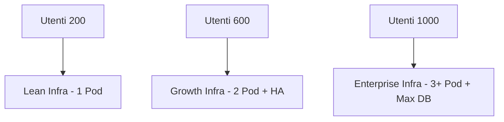

# Rapporto Strategico Infrastruttura 2026

> **Categoria**: `infrastruttura`
> **Destinatari**: Amministratori, Management
> **Stato**: 🟢 Completo
> **Ultimo aggiornamento**: 27/03/2026

---

## Cos'è e a Cosa Serve

Questo documento definisce la strategia infrastrutturale a lungo termine per la Suite Clinica. Analizza lo stato attuale ("Lean Infrastructure"), definisce i piani di scalabilità in base al numero di utenti e stabilisce le linee guida per la continuità operativa (Disaster Recovery) e il controllo dei costi.

---

## Chi lo Usa

| Ruolo | Utilizzo |
|-------|----------|
| **Management** | Pianificazione budget e visione strategica |
| **Amministratori** | Decisioni su upgrade risorse e scalabilità |
| **DevOps** | Implementazione dei livelli di scalabilità previsti |

---

## Architettura Tecnica

### Piano di Scalabilità Graduale

| Utenti | Risorse GKE | Database (vCPU/RAM) | Redis Cache | Costo Est. Mensile |
| :--- | :--- | :--- | :--- | :--- |
| **200** | 1 Pod | 2 vCPU / 7.5GB | 1GB (Basic) | €250 - €350 |
| **400** | 1 Pod | 2 vCPU / 7.5GB | 2GB (Basic) | €400 - €500 |
| **600** | 1-2 Pod | 4 vCPU / 15GB | 5GB (HA) | €700 - €900 |
| **800** | 2 Pod | 4 vCPU / 15GB | 10GB | €1.000 - €1.200 |
| **1000** | 2-3 Pod | 8 vCPU / 30GB | 20GB | €1.500+ |

### Schema della Scalabilità

---

## Analisi dello Stato Attuale (Post-Ottimizzazione)
Abbiamo completato la fase di ottimizzazione estrema (Lean Infrastructure) per massimizzare l'efficienza economica senza compromettere la stabilità.

*   **Database (Cloud SQL):** Migrato a un'istanza dinamica da **10GB SSD** in configurazione **Single Zone (Zonal)**. Abbiamo rimosso l'Alta Affidabilità (HA) per questa fase, dimezzando i costi operativi del database. Abilitato **Auto-Resize**.
*   **Cache & Queue (Memorystore Redis):** Istanza da **1GB BASIC**. Gestisce Celery (code di lavoro), WebSocket (notifiche real-time) e cache. Abbiamo ridotto questa risorsa dell'80% per allinearla al carico reale attuale.
*   **Computing (GKE Autopilot):** Configurazione a **istanza singola (1 Pod)**. Questa scelta garantisce il massimo risparmio economico e semplifica la gestione dello storage dei file. Il sistema è pronto a scalare su più istanze solo se il traffico reale lo renderà strettamente necessario.
*   **Storage Upload:** Utilizzo di **200GB HDD Standard**. Una scelta strategica: i file statici (immagini/PDF) non richiedono la velocità degli SSD, permettendoci di risparmiare circa il 70% sui costi di storage per i file.

---

## 2. Piano di Scalabilità Graduale (200 - 1000 Utenti)

| Utenti | Risorse GKE | Database (vCPU/RAM) | Redis Cache | Costo Est. Mensile |
| :--- | :--- | :--- | :--- | :--- |
| **200** | 1 Pod | 2 vCPU / 7.5GB | 1GB (Basic) | €250 - €350 |
| **400** | 1 Pod | 2 vCPU / 7.5GB | 2GB (Basic) | €400 - €500 |
| **600** | 1-2 Pod | 4 vCPU / 15GB | 5GB (HA) | €700 - €900 |
| **800** | 2 Pod | 4 vCPU / 15GB | 10GB | €1.000 - €1.200 |
| **1000** | 2-3 Pod | 8 vCPU / 30GB | 20GB | €1.500+ |

**Logica di Scalabilità:**
- **Storage:** Cresce automaticamente (Pay-as-you-grow).
- **Compute:** GKE aggiunge nodi in automatico in base al numero di medici/pazienti connessi contemporaneamente.
- **Cache:** Aumenteremo Redis solo se la "HIT RATE" della cache scende sotto l'80% o se le code di Celery diventano sature.

---

## 3. Servizi Infrastrutturali e Funzioni

| Servizio | Funzione | Importanza Economica |
| :--- | :--- | :--- |
| **GKE Autopilot** | Esecuzione App | **Costo Prevedibile:** Paghiamo esattamente per le risorse richieste dai Pod (CPU/RAM), NON per i nodi fisici. Anche se Google aggiunge server per manutenzione, il nostro costo resta invariato. |
| **Cloud SQL** | Database Dati | Il costo è fisso sulla RAM, variabile sullo storage. |
| **Memorystore** | Redis Cache | Fondamentale per evitare di sovraccaricare il Database. |
| **Cloud Storage** | Backup & Assets | Il modo più economico in assoluto per conservare i 70GB+ di file. |

---

## 4. Gestione Backup e Disaster Recovery (Business Continuity)

### Backup (Sicurezza del Dato)
1.  **DB SQL:** Backup automatici giornalieri con **Point-in-Time Recovery (PITR)**. Poiché l'istanza è **Single Zone**, in caso di guasto della zona specifica useremo questi backup per ripristinare il servizio in una zona diversa.
2.  **Redis:** Essendo una cache, i dati sono volatili, ma la configurazione HA garantisce che se un server cade, il secondo subentra in < 2 secondi senza interruzioni per l'utente.
3.  **File Upload:** Replicati su bucket multi-regione per protezione contro guasti geografici.

### Disaster Recovery
In caso di disastro totale di una regione Google (es. intero data center offline):
*   Possiamo ricreare l'ambiente in un'altra regione (es. `europe-west1` Belgio) usando gli script Terraform/K8s già pronti.
*   Tempo stimato di ripristino totale: **45 minuti**.

---

## Note Operative e Casi Limite

> [!TIP]
> Per massimizzare il risparmio in fase di sviluppo, i Job di migrazione utilizzano risorse temporanee ad alta potenza che si spengono automaticamente al termine dell'esecuzione, interrompendo istantaneamente la fatturazione.

### Documenti Correlati

- [Setup Infrastruttura GCP](./gcp_infrastructure_setup_report.md)
- [Compliance Infrastruttura](./infrastructure_compliance_report.md)
- [Panoramica Generale](../panoramica/overview.md)
