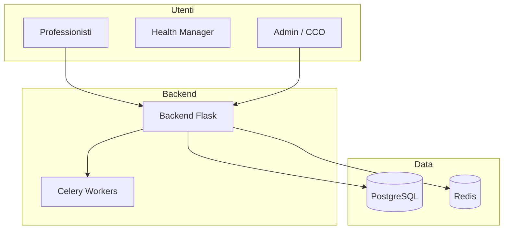

# Panoramica Generale — Suite Clinica Corposostenibile

> **Categoria**: panoramica  
> **Destinatari**: Sviluppatori, Professionisti, Team Interno  
> **Stato**: 🟢 Completo (Sprint B)  
> **Ultimo aggiornamento**: 27/03/2026

---

## Cos'è la Suite Clinica

La **Suite Clinica Corposostenibile** è la piattaforma gestionale interna sviluppata per supportare le operazioni quotidiane dell'azienda Corposostenibile. Permette di gestire l'intero ciclo di vita di un paziente: dall'acquisizione al follow-up clinico, passando per la comunicazione, la nutrizione, il coaching e la psicologia.

---

## Architettura Generale

---

## Macro Aree e Guide Operative

1. **🔐 Autenticazione e Gestione Team**: Accesso, RBAC, profili.
2. **🏥 Gestione Clienti (Core Clinico)**: Scheda paziente, check, nutrizione e diario.
3. **⚙️ Strumenti Operativi**: Task, calendario, quality score e ricerca globale.
4. **💬 Comunicazione**: WhatsApp (Respond.io), Appointment Setting e Push.
5. **📘 Manuali Operativi (Sprint B)**:
   - [Manuale Nutrizionista](../guide-ruoli/guida-nutrizionista.md)
   - [Manuale Coach](../guide-ruoli/guida-coach.md)
   - [Manuale Psicologo](../guide-ruoli/guida-psicologo.md)
   - [Manuale Health Manager](../guide-ruoli/guida-health-manager.md)
   - [Manuale Team Leader](../guide-ruoli/guida-team-leader.md)

---
Ultimo aggiornamento: Marzo 2026
