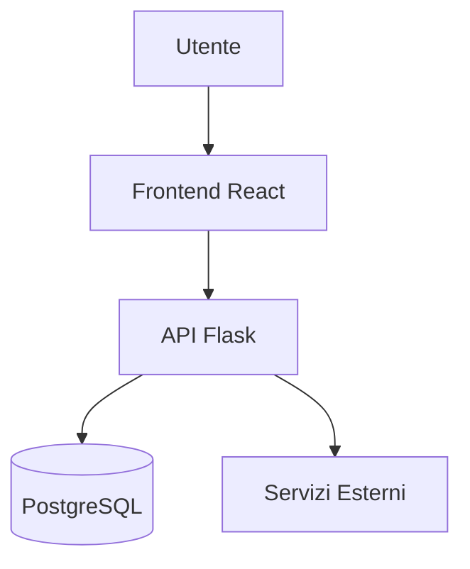

# Template Standard — Documento di Blueprint

> **Nota per chi scrive**: Ogni sezione è obbligatoria. Se una sezione non è applicabile al documento corrente, scrivi `N/A` con una breve motivazione. Elimina questo blocco introduttivo prima di pubblicare.

---

# [Nome Area / Blueprint]

> **Categoria**: `infrastruttura` | `clienti` | `operatività` | `integrazione`  
> **Destinatari**: Sviluppatori, Professionisti  
> **Stato**: 🟡 Bozza | 🟢 Completo | 🔴 Da aggiornare  
> **Ultimo aggiornamento**: GG/MM/AAAA

---

## Cos'è e a Cosa Serve

*Spiegazione in linguaggio chiaro, accessibile anche a chi non è tecnico.*

Descrivi in 2-4 righe:
- Qual è il problema che questo modulo risolve
- Quale valore porta agli utenti finali o al team

---

## Chi lo Usa

| Ruolo | Come interagisce |
|-------|-----------------|
| Es. Nutrizionista | Accede alla lista pazienti e consulta il diario |
| Es. Health Manager | Monitora i progressi e assegna i check |
| Es. Amministratore | Gestisce configurazioni e permessi |

---

## Flusso Principale (dal punto di vista dell'utente)

*Descrizione passo-passo di come si usa questo modulo nella pratica quotidiana.*

```
1. L'utente accede alla sezione [...]
2. Seleziona / inserisce [...]
3. Il sistema elabora e [...]
4. Il risultato è [...]
```

---

## Architettura Tecnica

### Componenti coinvolti

| Layer | File / Modulo | Ruolo |
|-------|--------------|-------|
| Backend | `blueprints/nome_blueprint/` | API REST, logica business |
| Frontend | `src/pages/nome/` | Interfaccia React |
| Database | Modello `NomeModello` | Persistenza dati |

### Schema del flusso



---

## Endpoint API Principali

| Metodo | Endpoint | Descrizione | Autenticazione |
|--------|----------|-------------|----------------|
| `GET` | `/api/...` | Recupera la lista | Richiesta |
| `POST` | `/api/...` | Crea un nuovo elemento | Richiesta |
| `PATCH` | `/api/.../id` | Aggiorna un campo | Richiesta |
| `DELETE` | `/api/.../id` | Elimina un elemento | Solo Admin |

---

## Modelli di Dati Principali

```python
# Descrizione sintetica dei modelli SQLAlchemy coinvolti
class NomeModello(db.Model):
    id          = ...
    campo_chiave = ...
    # Relazioni:
    # - NomeModello → AltraTabella (1:N)
```

---

## Variabili d'Ambiente Rilevanti

| Variabile | Descrizione | Obbligatoria |
|-----------|-------------|--------------|
| `NOME_VAR` | Descrizione della variabile | ✅ Sì / No |

---

## Permessi e Ruoli (RBAC)

| Funzionalità | Admin | CCO | Professionista | Health Manager |
|-------------|-------|-----|----------------|----------------|
| Visualizza | ✅ | ✅ | ✅ solo i propri | ✅ |
| Modifica | ✅ | ✅ | ✅ solo i propri | ❌ |
| Elimina | ✅ | ❌ | ❌ | ❌ |

---

## Note Operative e Casi Limite

> [!NOTE]
> *Comportamenti non ovvi, edge case, dipendenze critiche che chiunque lavori su questo modulo deve conoscere.*

- **Punto di attenzione 1**: ...
- **Punto di attenzione 2**: ...

---

## Documenti Correlati

- [Nome documento correlato](../path/al/documento.md)
- [Altro documento](../path/all-altro.md)
