# 📋 La Scheda Completa del Paziente

Questa è la "casa" di ogni paziente. Qui trovi TUTTO quello che devi sapere e puoi fare per seguire il suo percorso. È come avere tutte le cartelle cliniche, i diari, i piani e le comunicazioni in un unico posto.

## Percorso Team Leader {#team-leader}

- Usa la scheda per supervisionare casi complessi e qualità delle note del team.
- Verifica coerenza tra stato operativo, piani attivi e cronologia interventi.
- Supporta il professionista con decisioni rapide su pause, rinnovi e priorità.

## Percorso Professionista {#professionista}

- Usa i tab clinici per gestire operatività quotidiana e continuità terapeutica.
- Aggiorna diari, piani e note in tempo reale dopo ogni interazione.
- Tieni allineati stato paziente e prossime azioni per evitare task in sospeso.

## 🏠 Come Arrivare Qui

### Da "Lista Pazienti"
1. Vai alla pagina "Lista Pazienti"
2. Clicca sul **nome** del paziente nella tabella
3. Si apre automaticamente questa scheda

### Da Altre Pagine
- Alcuni link nel sistema ti portano direttamente qui
- L'URL finisce sempre con `/clienti-dettaglio/[numero-paziente]`

- Link diretti in pagina

## 👀 Quello che Vedi Subito (Il Profilo a Sinistra)

A sinistra c'è il "biglietto da visita" del paziente. È sempre visibile mentre navighi.

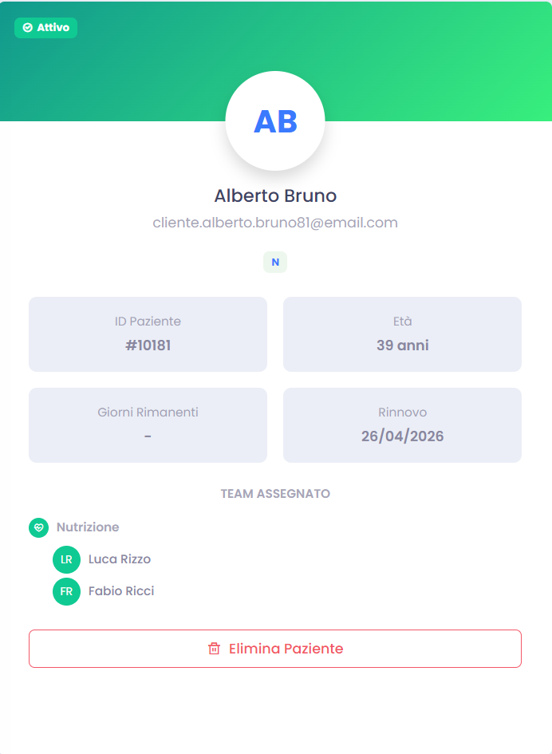

### Il Colore di Sfondo
- **Verde chiaro**: Paziente attivo e regolare
- **Rosa**: In pausa temporanea
- **Blu**: Non risponde più (ghost)
- **Rosso**: Problemi di pagamento
- **Rosso scuro**: Ha smesso definitivamente
- **Azzurro**: Bloccato per infortuni o altri motivi

### L'Avatar e il Nome
- **Cerchio bianco**: Con le iniziali del paziente
- **Nome completo**: In grande sotto
- **Email**: Per contattarlo

### I Badge Importanti
- **Tipo programma**: A, B, o C (chiedi all'admin cosa significa)
- **Stato attuale**: Attivo, Pausa, Ghost, ecc.

### I Numerini Veloci
Quattro quadratini con info chiave:
- **ID Paziente**: Il numero di registrazione
- **Età**: Calcolata automaticamente dalla data di nascita
- **Giorni rimasti**: Quanti giorni mancano al rinnovo
- **Data rinnovo**: Quando scade l'abbonamento

### Il Team Che Lo Segue
Cerchietti colorati per ogni professionista:
- **Verde**: Nutrizionista
- **Arancione**: Coach
- **Blu**: Psicologo
- **Viola**: Health Manager
- **Giallo**: Consulente

**Esempio**: Se vedi 3 cerchietti, ha un team completo.

## 📑 Le 8 Sezioni Principali (I Tab in Alto)

La scheda è divisa in 8 parti. Clicca sui nomi in alto per passare da una all'altra.

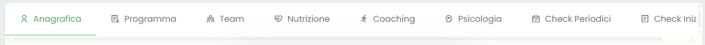

### 1. 👤 **ANAGRAFICA** - I Dati Personali

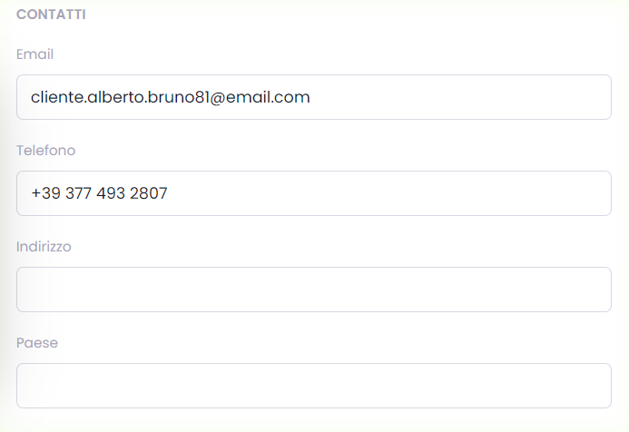

Qui trovi tutto quello che riguarda il paziente come persona.

#### Cosa Puoi Fare Qui:
- **Vedere i contatti**: Telefono, email, indirizzo
- **Leggere la storia**: Perché è venuto da noi
- **Modificare i dati**: Se qualcosa cambia (matrimonio, nuovo numero, ecc.)

#### I Campi Importanti:
- **Nome e cognome**: Obbligatorio
- **Data di nascita**: Per calcolare l'età
- **Professione**: Utile per capire il suo stile di vita
- **Storia del paziente**: Quello che ti ha raccontato al primo incontro

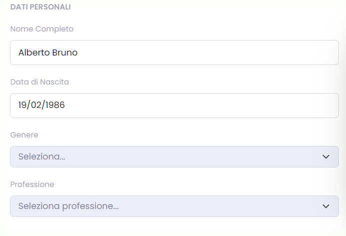

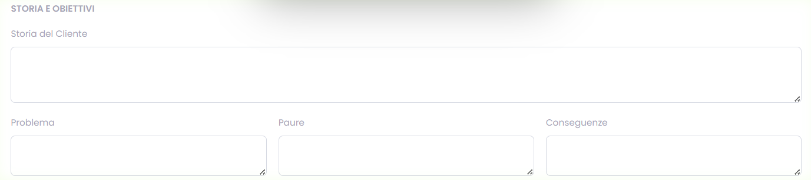

#### Come Modificare:
1. Clicca sul campo che vuoi cambiare
2. Scrivi il nuovo valore
3. Clicca "Salva Modifiche" in alto a destra

### 2. 📋 **PROGRAMMA** - L'Abbonamento

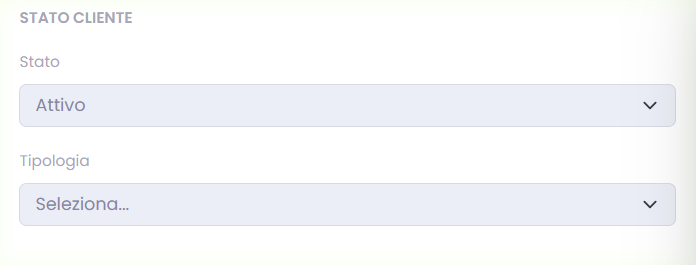
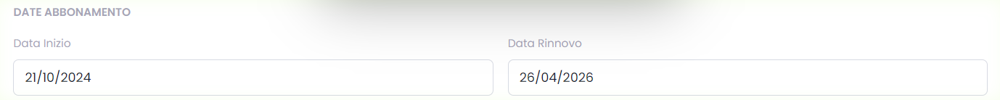

Qui gestisci lo stato amministrativo del paziente.

#### Cosa Vedi:
- **Se è attivo o in pausa**
- **Che tipo di programma ha** (A, B, C)
- **Quando ha iniziato**
- **Quando deve rinnovare**

#### Stati Possibili:
- **Attivo**: Tutto regolare
- **Pausa**: Si è fermato temporaneamente
- **Ghost**: Non risponde più
- **Insoluto**: Non ha pagato
- **Stop**: Ha deciso di smettere
- **Freeze**: Bloccato per motivi medici

#### Come Cambiare Stato:
1. Vai al campo "Stato"
2. Scegli il nuovo stato dal menu
3. **IMPORTANTE**: Scrivi sempre perché cambi stato
4. Salva

### 3. 👥 **TEAM** - Chi Lo Segue

Qui vedi e modifichi chi lavora con questo paziente.

#### Come È Organizzato:
- **Team Clinico**: I professionisti interni (nutrizione, coaching, psicologia)
- **Team Esterno**: Per integrazioni future

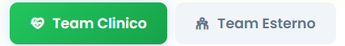

#### Come Assegnare un Professionista:
1. Clicca "Assegna" sotto il ruolo che vuoi
2. Scegli il professionista dal menu
3. Metti la data di inizio
4. Scrivi perché lo assegni (es: "Specialista in diabete")
5. Salva

#### Come Togliere un Assegnamento:
1. Clicca la X rossa vicino al professionista
2. Scrivi perché lo togli (es: "Trasferito ad altro collega")
3. Conferma

#### La Timeline Storica:
Sotto vedi una linea con tutti i cambi di team nel tempo. È utile per capire la storia del paziente.

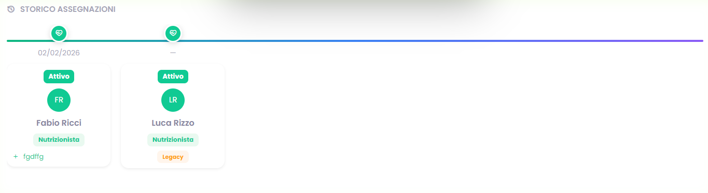

### 4. 🥗 **NUTRIZIONE** - Il Percorso Alimentare

Questa è la sezione completa per i nutrizionisti. Ha 6 sub-sezioni organizzate a tab.

#### **Sottosezioni della Nutrizione**

##### 🍽️ **Panoramica**
- Chi è il nutrizionista assegnato (se c'è)
- **Stato del servizio**: Attivo, Pausa, Ghost, Insoluto, Freeze, Stop
- **Stato chat**: Se comunica / non comunica
- **Cronologia degli stati**: Timeline di tutti i cambi di stato

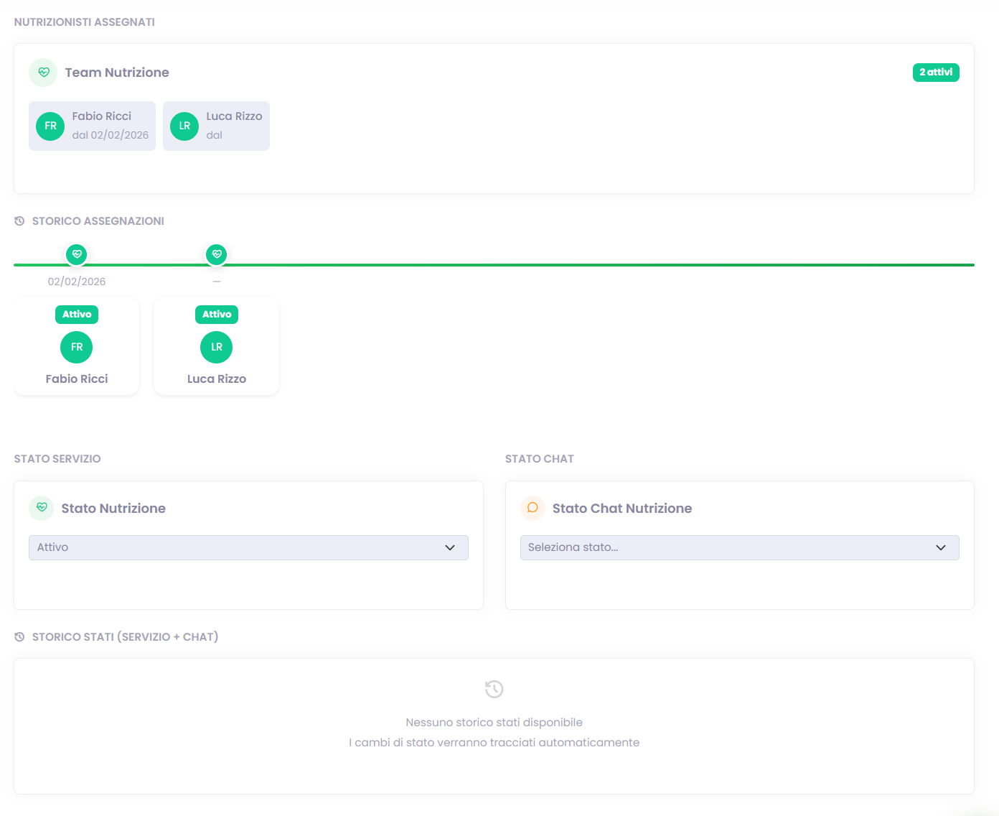

##### ⚙️ **Setup**
- **Call iniziale**: Checkbox data della prima chiamata
- **Reach out**: Giorni della settimana per contatti regolari
- **Altre configurazioni**: Parametri operativi personalizzati

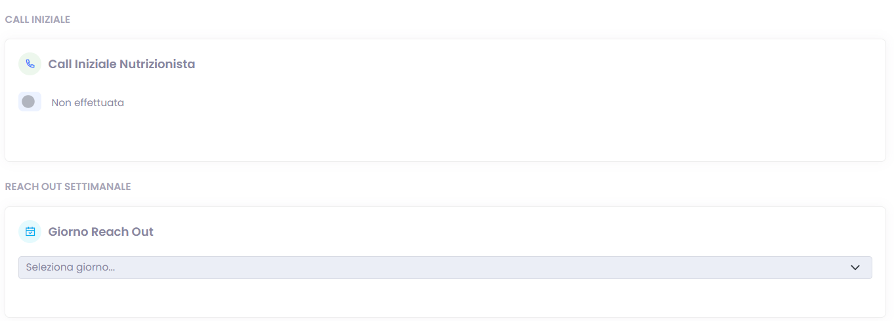

##### 🩺 **Patologie**
Checkbox per:
- **Nessuna patologia**: Spunta se sano
- Lista patologie specifiche (IBS, reflusso, diabete, ipertensione, tiroidee, ecc.)
- **Altro patologie**: Campo testo per aggiungere
- **Anamnesi**: Textarea con valutazione iniziale completa

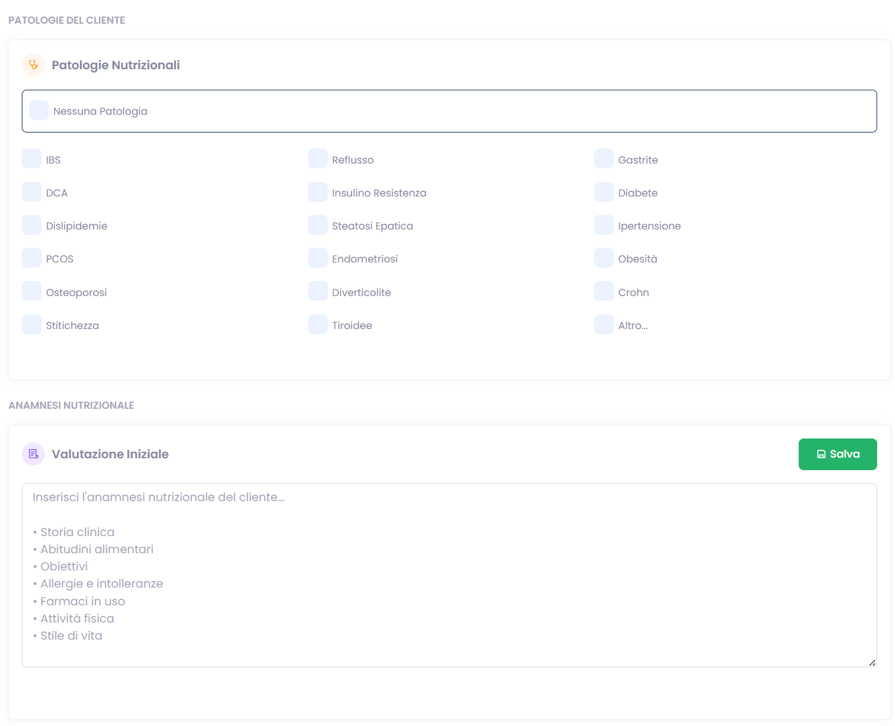

##### 📄 **Piano Alimentare**
- Carica PDF: Clic per scegliere file o drag & drop
- **Storico**: Versioni precedenti dei piani
- **Preview**: Visualizza il PDF direttamente
- **Metadati**: Nome, periodo, note

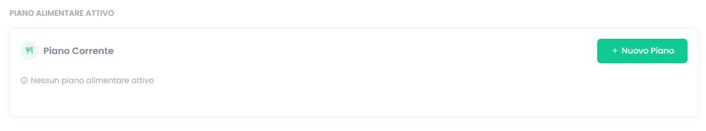

**Come caricare un piano:**
1. Clicca "Carica Nuovo Piano"
2. Trascina PDF o clicca per sfogliare
3. Aggiungi nome (es: "Piano Gennaio 2026")
4. Salva

##### 📓 **Diario**
- **Note giornaliere**: Quello che accade durante i follow-up
- **Data e autore**: Traccia chi ha scritto e quando
- **Storico**: Tutte le note in cronologia
- **Aggiungi nota**: Clic per nuova entry

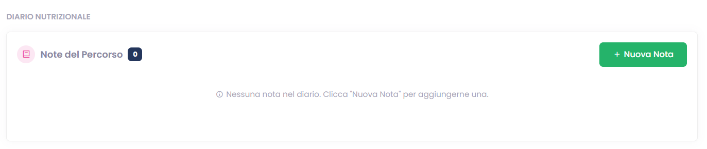

##### 🚨 **Alert**
- **Textarea rossa**: Per segnalazioni urgenti/critiche
- **Visibilità immediata**: Appare in evidenza per tutto il team
- **Uso**: Problemi gravi, allergie, controindicazioni

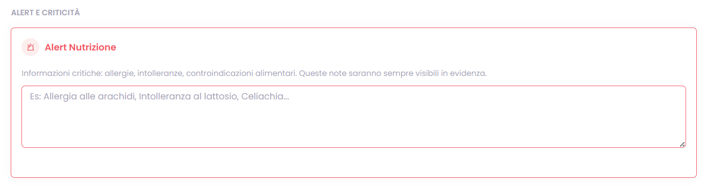

### 5. 🏃 **COACHING** - Il Percorso Fitness

Simile a nutrizione, ma specifico per allenamento e fitness.

#### **Sottosezioni del Coaching**

##### 🏋️ **Panoramica**
- Coach assegnato (se c'è)
- **Stato del servizio**: Attivo, Pausa, Ghost, ecc.
- **Stato chat**: Se comunica
- **Timeline degli stati**: Cronologia cambi

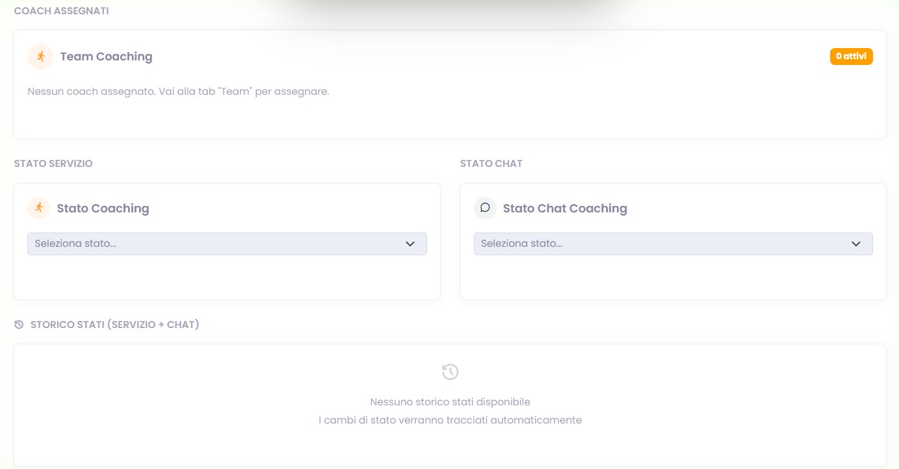

##### ⚙️ **Setup**
- **Call iniziale**: Data della prima chiamata
- **Reach out**: Giorni settimanali di contatto
- Configurazioni tecniche

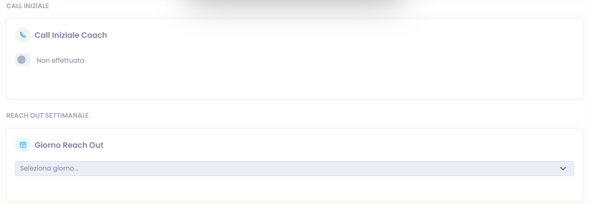

##### 📄 **Piano Allenamento**
- Carica PDF con il programma di allenamento
- Storico versioni precedenti
- Preview online del PDF
- Metadati e note

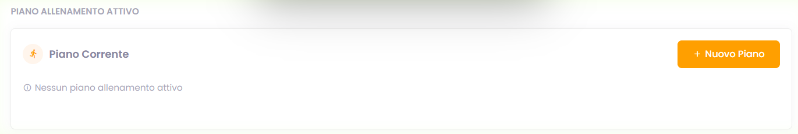

##### 📍 **Luoghi di Allenamento**
- **Timeline storica**: Dove ha allenato e per quanto
- **Date precise**: Inizio/fine per ogni location
- **Note**: Perché ha cambiato palestra
- **Tracciamento**: Tutte le location nel tempo

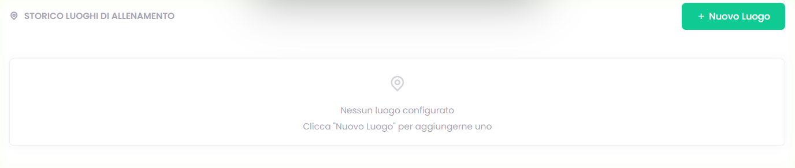

##### 🩺 **Patologie/Condizioni Fisiche**
- Checkbox per condizioni fisiche (infortuni, limitazioni, ecc.)
- Anamnesi delle condizioni
- Note mediche rilevanti per l'allenamento

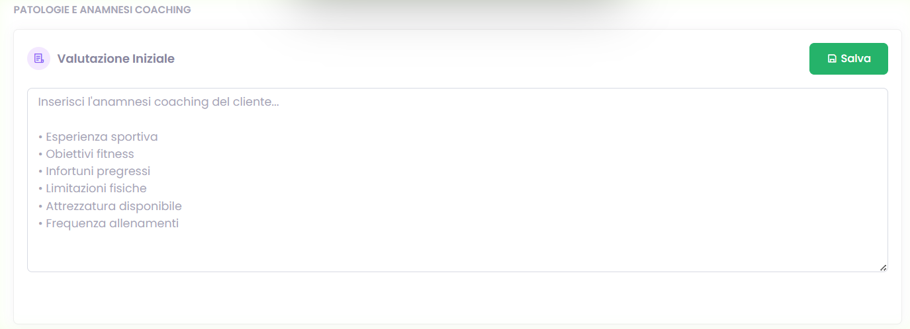

##### 📓 **Diario**
- Note sul percorso di allenamento
- Progressi, difficoltà, cambiamenti
- Data e autore di ogni nota

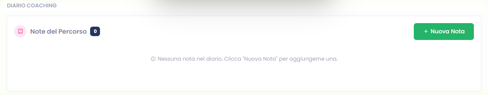

##### 🚨 **Alert**
- Per problemi fisici urgenti
- Infortuni o controindicazioni sollevate

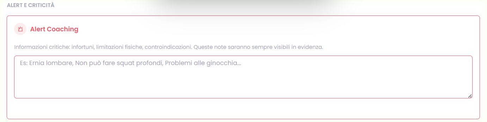

### 6. 🧠 **PSICOLOGIA** - Il Percorso Mentale

Sezione dedicata al benessere psicologico, con protezione massima della privacy.

#### **Sottosezioni della Psicologia**

##### 📊 **Panoramica**
- Psicologo/a assegnato (se presente)
- **Stato del servizio**: Attivo, Pausa, Ghost, ecc.
- **Stato chat**: Se comunica
- **Timeline degli stati**: Cronologia cambi

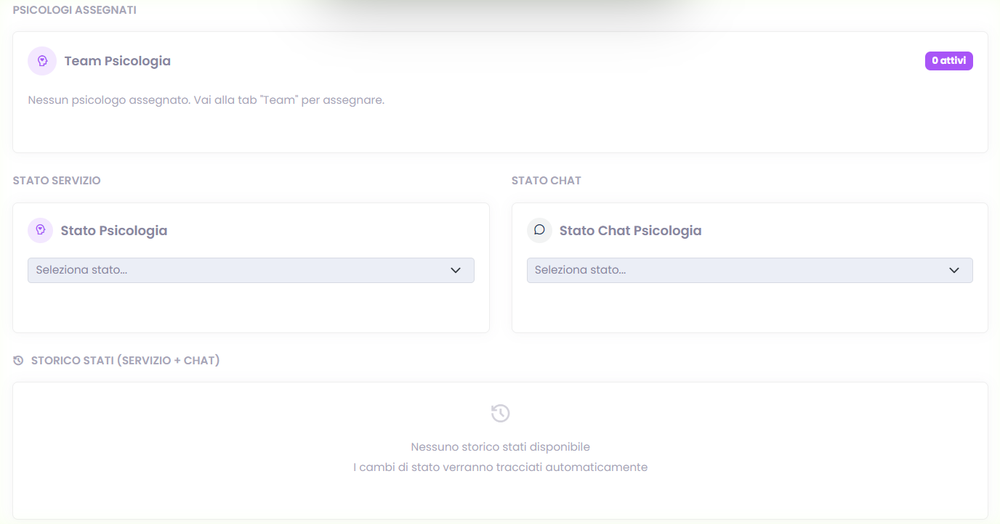

##### ⚙️ **Setup**
- **Call iniziale**: Data della prima sessione
- **Reach out**: Giorni settimanali di contatto
- Configurazioni per follow-up

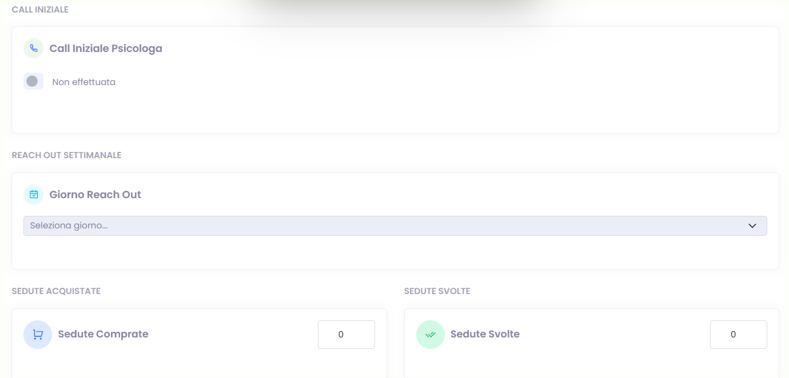

##### 🩺 **Patologie Psicologiche**
- Lista specializzata di disturbi (ansia, depressione, fobie, ecc.)
- **Altro patologie**: Campo per aggiunte
- **Anamnesi psicologica**: Textarea con storia completa dettagliata
- **Riservatezza**: Solo psicologi autorizzati vedono

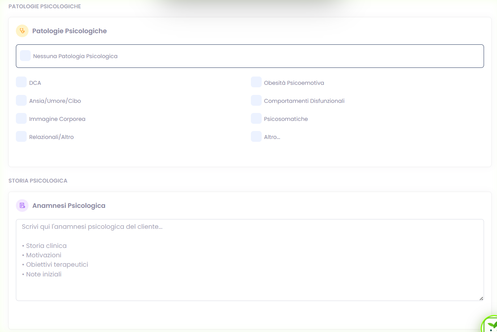

##### 📓 **Diario Psicologico**
- Note sulle sessioni e il progresso
- Osservazioni cliniche
- Completamente riservato

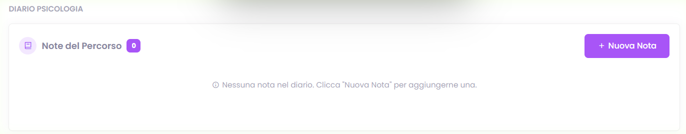

##### 🚨 **Alert**
- Per situazioni psicologiche critiche
- Rischi specifici o preoccupazioni urgenti
- Visibile al team per coordinamento

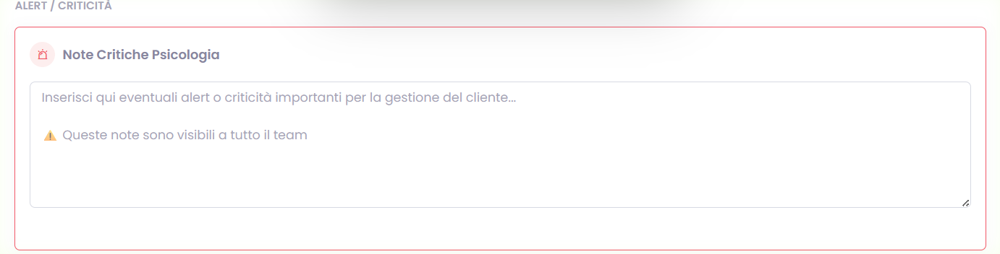

#### ⚠️ **IMPORTANTE - Privacy**
- Queste informazioni sono **estremamente riservate**
- Solo psicologi autorizzati hanno accesso completo
- Non condividere mai senza consenso esplicito
- Usa massima discrezione nel team

### 7. 📊 **CHECK PERIODICI** - Monitoraggio Regolare

Sistema per tracciare i progressi del paziente con questionari periodici online.

#### **Tipi di Check Disponibili**

- **Weekly**: Controlli settimanali rapidi (domande base)
- **DCA**: Specifico per Disturbi del Comportamento Alimentare
- **Minor**: Check leggeri/supplementari

#### **Come Funziona il Flusso**

1. **Generi un Link**: Clicca il bottone per il tipo di check desiderato
2. **Il sistema genera automaticamente**: URL univoco del questionario
3. **Copia il link**: Pulsante di copia per clipboard
4. **Mandi al paziente**: Email, WhatsApp, SMS, o altra piattaforma
5. **Paziente completa**: Risponde online quando vuole
6. **Risposte si vedono qui**: Appare la lista completa con data/ora
7. **Confermi lettura**: Marca come letto quando rivedi

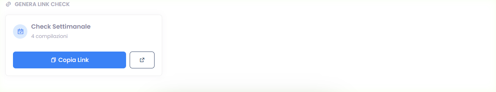

#### **Gestione delle Risposte**

- **Lista risposte**: Tutte le risposta con timestamp e dettagli
- **State clinico**: Vedi avatar del professionista che ha generato il link
- **Modal dettaglio**: Clicca per vedere risposte complete
- **Tracciamento**: Sai chi ha visto cosa e quando

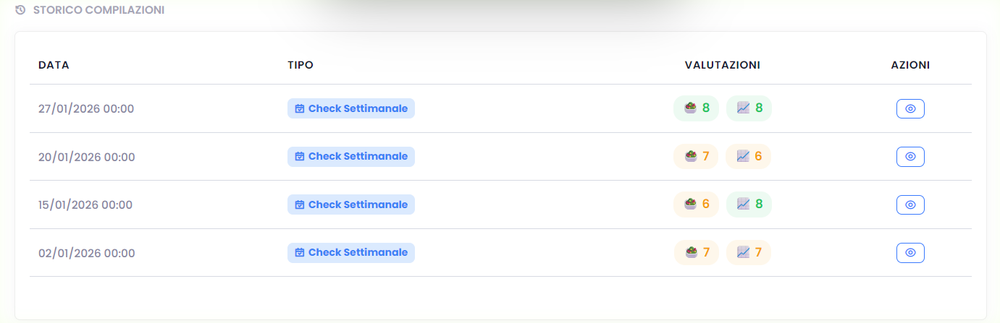

### 8. 📋 **CHECK INIZIALI** - Le Valutazioni di Ingresso

I questionari che il paziente compila quando arriva.

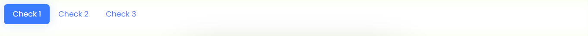

#### Cosa Sono:
- Valutazioni complete fatte all'inizio
- Diverse per ogni percorso
- Aiutano a capire da dove partire

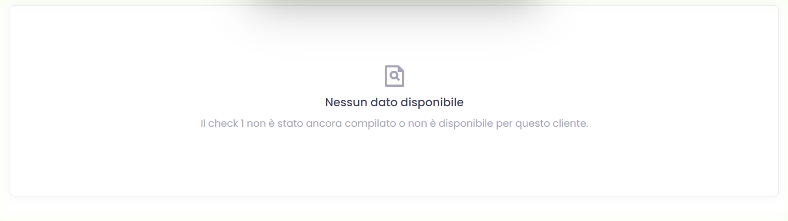

## 💾 Come Salvare le Modifiche

### Il Pulsante Magico:
- **In alto a destra**: "Salva Modifiche"
- **Colore**: Verde quando ci sono modifiche da salvare
- **Cosa fa**: Salva tutto quello che hai cambiato

### Quando Salvare:
- Dopo ogni modifica importante
- Prima di chiudere la scheda
- Se devi passare ad altro paziente

### Cosa Succede Quando Salvi:
- ✅ **Verde**: Tutto ok, modifiche salvate
- ❌ **Rosso**: Errore, controlla i campi obbligatori
- 🔄 **Loading**: Sta salvando, aspetta

## 🔙 Come Tornare Indietro

### Pulsanti Disponibili:
- **"Torna alla Lista"**: In alto a sinistra
- **Freccia indietro**: Nel browser
- **Menu laterale**: Per andare ad altre sezioni

---

> [!TIP]
> **La scheda è viva**: Si aggiorna automaticamente quando altri professionisti salvano modifiche. Ricarica se vedi qualcosa di strano.

> [!IMPORTANT]
> **Privacy**: Le informazioni psicologiche sono protette. Non condividerle senza permesso.

> [!NOTE]
> **Backup**: Tutto viene salvato automaticamente nel cloud. Non devi preoccuparti di perdere dati.

> [!WARNING]
> **Modifiche irreversibili**: Quando elimini qualcosa, potrebbe non essere recuperabile. Chiedi conferma prima.
---
