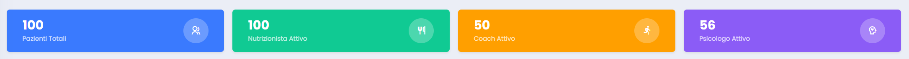
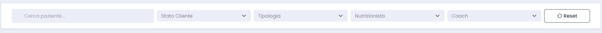
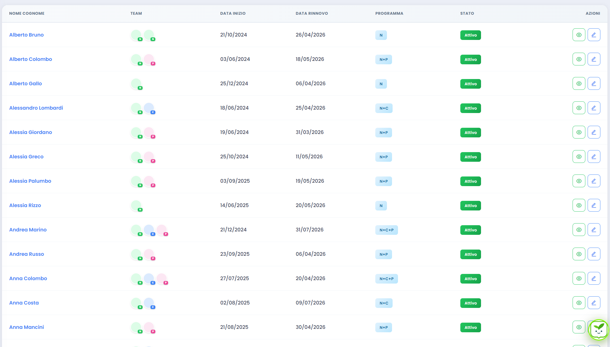
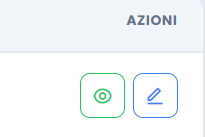

# Lista Pazienti - Guida Professionista

Per il professionista questa pagina e il punto di ingresso al lavoro quotidiano. Serve a costruire rapidamente la propria coda di pazienti, isolare le priorita e arrivare alla scheda giusta senza passaggi inutili.

## Vista iniziale

In alto trovi una sintesi del perimetro che stai leggendo.

### Cosa leggere subito

- Totale pazienti presenti nella vista.
- Suddivisione rapida per area attiva.
- Andamento generale del perimetro che stai filtrando.

### Come usarla

- Parti da qui all'inizio della giornata per capire il volume di lavoro.
- Se i numeri ti sembrano incoerenti, verifica i filtri attivi prima di entrare nelle schede.

## Ricerca e filtri

La barra dei filtri ti permette di stringere rapidamente la lista e lavorare per blocchi omogenei.

### Strumenti principali

- Ricerca per nome.
- Filtro stato del paziente.
- Filtro tipologia o programma.
- Filtri per professionista e area.
- Reset completo della vista.

### Buon uso dei filtri

- Usa la ricerca quando devi raggiungere subito un paziente specifico.
- Usa stato, rinnovo e tipologia per organizzare il lavoro della giornata.
- Resetta i filtri quando vuoi tornare alla vista completa.

## Tabella pazienti

La tabella e il cuore della pagina: ogni riga rappresenta un paziente e ti da accesso rapido alle informazioni essenziali.

### Colonne principali

- `Nome Cognome`: apre la scheda del paziente.
- `Team`: mostra a colpo d'occhio le figure coinvolte.
- `Data inizio`: aiuta a collocare il paziente nel percorso.
- `Data rinnovo`: evidenzia le scadenze da tenere presenti.
- `Programma`: indica il tipo di percorso.
- `Stato`: riassume la fase attuale del caso.

## Azioni rapide

Accanto a ogni riga trovi i pulsanti che aprono la scheda paziente.

### Come leggerle

- Usa il click sul nome o sui pulsanti azione per entrare subito nel caso.
- Apri la scheda quando ti serve aggiornare diario, controllare lo storico o verificare una scadenza.

## Paginazione

Quando la lista e lunga, la navigazione in basso ti aiuta a scorrere i risultati senza perdere il contesto.

### A cosa serve

- Spostarti tra le pagine della lista.
- Capire quanti risultati stai guardando.
- Tenere ordinata la vista anche con molti pazienti.

## Come usare bene questa pagina

- Parti dai filtri, non dalla navigazione casuale.
- Usa rinnovo e stato per definire la sequenza di lavoro.
- Entra nella scheda paziente solo quando hai gia chiaro perche lo stai aprendo.
- Torna qui dopo gli aggiornamenti per verificare la vista complessiva.
