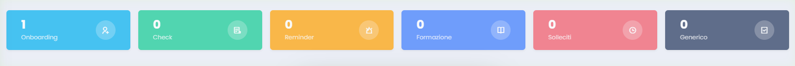
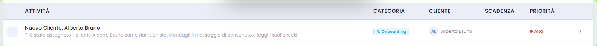
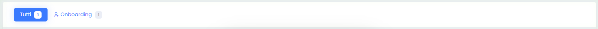

# Sistema Task - Team Leader Nutrizione

Questa pagina ti aiuta a leggere il backlog della nutrizione e a capire dove intervenire per riallineare il team.

## Cosa controllare

- Task in ritardo o task che stanno invecchiando male.
- Pazienti su cui il lavoro nutrizionale si sta fermando.
- Priorita e categorie che stanno concentrando il backlog.

## Uso corretto

- Filtra per area e assegnatario quando fai review.
- Apri i casi solo dopo avere capito il segnale operativo da verificare.
