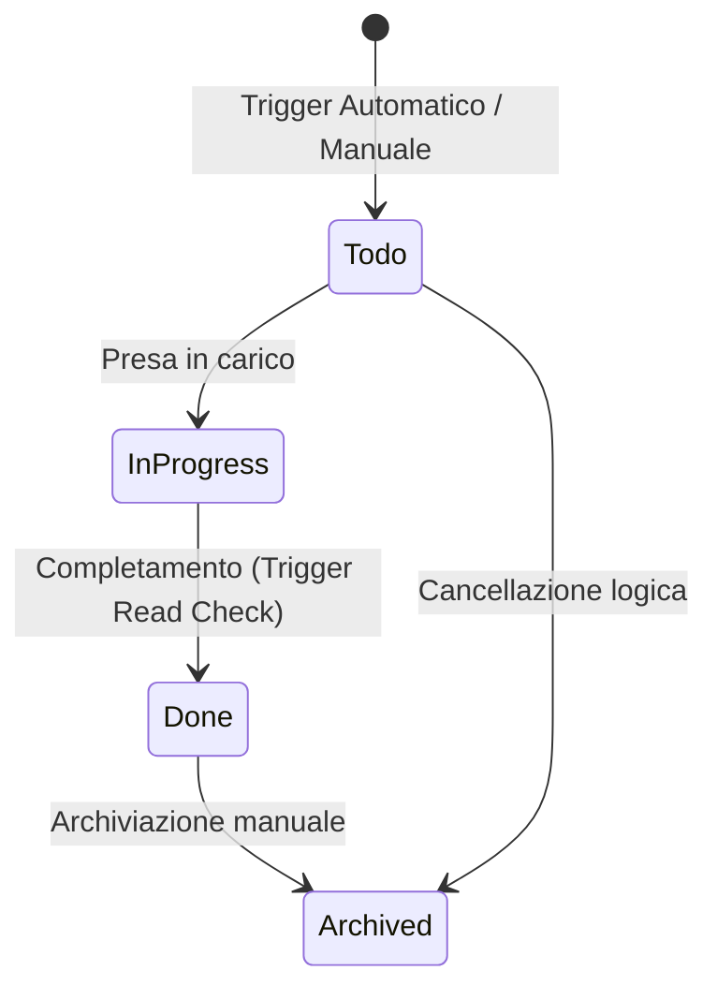

# Task & Calendario

> **Categoria**: `operativo`
> **Destinatari**: Professionisti, Admin, Team Leader
> **Stato**: 🟢 Completo
> **Ultimo aggiornamento**: 27/03/2026

---

## Cos'è e a Cosa Serve

La Suite Clinica fornisce un sistema integrato di gestione delle attività (**Task Manager**) e degli appuntamenti (**Calendario Google**). I due moduli permettono ai professionisti di organizzare il lavoro quotidiano, automatizzando la creazione di promemoria in risposta a eventi clinici (es. nuovi check, scadenze, onboarding) e sincronizzando bidirezionalmente i meeting con i pazienti.

---

## Chi lo Usa

| Ruolo | Utilizzo |
|-------|----------|
| **Professionisti** | Gestione della propria "To-Do" clinica e sincronizzazione appuntamenti Google |
| **Team Leader** | Supervisione dei task dei membri del team e coordinamento appuntamenti |
| **Admin / CCO** | Configurazione integrazioni OAuth2 e monitoraggio backlog operativo globale |

---

## Flusso Principale (Technical Workflow)

1. **Automation Trigger**: Un evento SQLAlchemy (es. check ricevuto) scatena la creazione di un `Task`.
2. **Notification**: Viene inviata una push notification all'assegnatario.
3. **Execution**: Il professionista gestisce l'attività (es. legge il check).
4. **Completion**: Il cambio stato in `done` sincronizza automaticamente lo stato di lettura dell'oggetto sorgente.
5. **Calendar Sync**: Il sistema sincronizza eventi Google ogni volta che viene visualizzato il calendario o creato un `Meeting`.

---

## Architettura Tecnica

### Componenti coinvolti

| Layer | Componente | Ruolo |
|-------|------------|-------|
| Eventi | `events.py` | Listener SQLAlchemy per task automatici |
| OAuth | `google_auth_bp` | Gestione token Google OAuth2 |
| Backend | `tasks_bp`, `calendar_bp` | API REST e logica di business |

### Schema Ciclo di Vita Task



---

### Chi vede quali task (RBAC)

La visibilità è determinata dalla funzione `_apply_visibility_scope()`:

| Ruolo | Visibilità |
|-------|-----------|
| **Admin** | Tutti i task di tutti gli utenti |
| **CCO** (specialty=`cco`) | Tutti i task, come admin |
| **Team Leader** | Task propri + task dei membri dei propri team |
| **Professionista** | Solo i propri task (`assignee_id == current_user.id`) |

> [!NOTE]
> Il filtro `mine=true` riduce la visibilità al solo task assegnato all'utente loggato, indipendentemente dal ruolo.

---

### Task automatici — Trigger SQLAlchemy Events

Il sistema genera task automaticamente tramite listener SQLAlchemy registrati in `events.py`. **Nessun cron job** — i task nascono in risposta a modifiche del database.

#### 1. Onboarding (nuova assegnazione cliente)

**Quando**: viene assegnato (o cambiato) un professionista a un cliente.

**Come**: listener `after_update` sul modello `Cliente`, che controlla la history dei campi FK (`health_manager_id`) e delle relazioni M2M (`nutrizionisti_multipli`, `coaches_multipli`, `psicologi_multipli`, `consulenti_multipli`).

**Task creato**:
```
Titolo: "Nuovo Cliente: <nome>"
Descrizione: "Ti è stato assegnato il cliente <nome> come <ruolo>. Mandagli il messaggio di benvenuto e leggi i suoi check!"
Categoria: onboarding
Priorità: high
Assegnatario: ID del professionista appena assegnato
```

#### 2. Check compilato

**Quando**: un cliente compila un check (Weekly, DCA o Minor).

**Come**: listener `after_insert` su `WeeklyCheckResponse`, `DCACheckResponse`, `MinorCheckResponse`.

**Task creato**: **uno per ogni professionista assegnato al cliente** (nutrizionista, coach, psicologa, HM, consulente).

```
Titolo: "Check <Settimanale|DCA|Minore> Ricevuto: <nome cliente>"
Descrizione: "Il cliente <nome> ha compilato il check. Leggilo!"
Categoria: check
Priorità: high
Payload: { "response_type": "weekly_check|dca_check|minor_check", "response_id": <id> }
```

> [!IMPORTANT]
> Quando un task di tipo `check` viene **completato** (`status → done`), il sistema lo considera automaticamente come "conferma lettura" del check associato, creando un record `ClientCheckReadConfirmation`. Questo elimina il check dalla Inbox da leggere del professionista.

#### 3. Formazione assegnata

**Quando**: viene creata una `Review` (assegnazione di formazione).

**Task creato**:
```
Titolo: "Nuova Formazione Assegnata"
Categoria: formazione
Priorità: medium
Assegnatario: reviewee_id della Review
Payload: { "review_id": <id> }
```

#### 4. Richiesta training

**Quando**: viene creata una `ReviewRequest`.

**Task creato**:
```
Titolo: "Richiesta training: <soggetto>"
Descrizione: "<nome richiedente> ha inviato una richiesta di training"
Categoria: formazione
Priorità: mappata da low/normal/high/urgent della richiesta
Assegnatario: requested_to_id (chi deve rispondere)
```

#### Push notification

Al commit, ogni task creato scatena una push notification all'assegnatario tramite `send_task_assigned_push()`. Il sistema usa una lista `session.info["pending_task_push"]` accumulata durante il flush e svuotata after_commit.

---

### Filtri disponibili nella lista task

| Parametro | Tipo | Descrizione |
|-----------|------|-------------|
| `category` | string | Filtra per categoria |
| `status` | string | Filtra per stato |
| `completed` | bool | `true`=solo completati, `false`=solo non completati |
| `q` | string | Ricerca su titolo e descrizione |
| `assignee_id` | int | Filtra per assegnatario (admin/TL) |
| `assignee_role` | string | Filtra per ruolo assegnatario |
| `assignee_specialty` | string | Filtra per specialty |
| `team_id` | int | Filtra per team (admin) |
| `mine` | bool | Solo i propri task |
| `paginate` | bool | Abilita paginazione strutturata |
| `include_summary` | bool | Aggiunge statistiche nella risposta |
| `include_filter_options` | bool | Aggiunge lista assegnatari/team disponibili |

---

## Endpoint API Principali

**Esempio risposta task** (`_serialize_task`):
```json
{
  "id": 42,
  "title": "Check Settimanale Ricevuto: Mario Rossi",
  "description": "...",
  "category": "check",
  "status": "todo",
  "priority": "high",
  "due_date": null,
  "assignee_id": 7,
  "assignee_name": "Giulia Bianchi",
  "client_id": 1023,
  "client_name": "Mario Rossi",
  "completed": false,
  "payload": { "response_type": "weekly_check", "response_id": 891 }
}
```

---

## Calendario (Google Calendar)

### Cos'è e come funziona

Il modulo calendario integra l'account Google di ogni professionista tramite **OAuth2**, sincronizzando eventi bidirezionalmente tra Google Calendar e la suite. Ogni evento è salvato localmente come `Meeting`.

### Flusso di connessione

```
1. Professionista → "Connetti a Google Calendar"
2. Redirect a OAuth Google (via Flask-Dance)
3. Google autorizza → callback /calendar/connect
4. Token (access_token + refresh_token) salvati in GoogleAuth
5. Dashboard mostra stato: "Connesso"
```

> [!IMPORTANT]
> Se non viene ricevuto il `refresh_token`, il token scadrà dopo 1 ora senza possibilità di rinnovo automatico. Questo avviene se l'app Google non è in production mode o se l'utente ha già autorizzato in precedenza senza revocare.

### Refresh automatico del token

La funzione `_ensure_valid_token()` controlla a ogni operazione di calendario se il token è valido:

```
is_expiring_soon(5 min)?
  → No: procedi
  → Sì + has refresh_token: chiama token refresh API Google → aggiorna DB → procedi
  → Sì + no refresh_token: errore, utente deve riconnettersi
```

Il token viene salvato in `GoogleAuth.token_json` (JSONB), con campi `access_token`, `refresh_token`, `expires_at`.

### Sincronizzazione eventi

```
GET /calendar/sync
→ Recupera eventi Google da -30gg a +90gg (max 100)
→ Per ogni evento:
   - Se google_event_id già presente in DB: aggiorna Meeting
   - Se nuovo: crea Meeting (user=utente corrente, cliente=null)
→ Commit
```

**Rilevamento link meeting**: il sistema cerca in cascata:
1. `conferenceData.entryPoints[video].uri` (Google Meet)
2. `hangoutLink` (Google Meet legacy)
3. URL in descrizione evento (Meet, Zoom, Teams)

### Creazione evento

```
POST /calendar/api/events
{ "title": "Call Mario", "start": "...", "end": "...", "cliente_id": 1023 }
→ GoogleCalendarService.create_event() → crea in Google Calendar
→ MeetingService.sync_google_event_to_meeting() → salva in DB locale
```


### Chi vede i meeting

| Utente | Visibilità |
|--------|-----------|
| **Professionista** | Solo i propri meeting (`user_id == current_user.id`) |
| **Admin** | Può filtrare per `user_id` |

I meeting di un cliente si recuperano per `cliente_id` — ogni professionista vede solo i propri.

### Meeting e cliente

Ogni `Meeting` può essere **collegato a un cliente** (campo `cliente_id`). La scheda cliente mostra tutti i meeting ad essa associati del professionista corrente.

I dettagli aggiuntivi compilabili dopo il meeting:
- `meeting_outcome` — esito della call
- `meeting_notes` — note personali
- `loom_link` — video registrazione (Loom)
- `status` — `scheduled`, `completed`, `cancelled`, `no_show`, ecc.

---

## Modelli di Dati Principali

### `Task` (tabella `tasks`)

| Campo | Tipo | Note |
|-------|------|------|
| `id` | Integer PK | — |
| `title` | String | Titolo del task |
| `description` | Text | Descrizione |
| `category` | `TaskCategoryEnum` | Tipo task |
| `status` | `TaskStatusEnum` | Stato corrente |
| `priority` | `TaskPriorityEnum` | Priorità |
| `due_date` | Date | Scadenza (opzionale) |
| `assignee_id` | FK → `users.id` | Responsabile |
| `client_id` | FK → `clienti.cliente_id` | Paziente collegato (opzionale) |
| `department_id` | FK → `departments.id` | Contestuale (opzionale) |
| `payload` | JSONB | Dati extra (es. ID check, ID review) |

### `GoogleAuth` (tabella `google_auth`)

| Campo | Tipo | Note |
|-------|------|------|
| `user_id` | FK → `users.id` UNIQUE | Un account Google per utente |
| `token_json` | JSONB | `{ access_token, refresh_token, scopes, ... }` |
| `expires_at` | DateTime | Scadenza access_token |

### `Meeting` (tabella `meetings`)

| Campo | Tipo | Note |
|-------|------|------|
| `google_event_id` | String UNIQUE | ID evento Google |
| `title` | String | Titolo evento |
| `start_time` / `end_time` | DateTime | Inizio/fine (con timezone) |
| `meeting_link` | String | Link Google Meet/Zoom/Teams |
| `location` | String | Luogo fisico (se presente) |
| `user_id` | FK → `users.id` | Professionista proprietario |
| `cliente_id` | FK → `clienti` | Cliente associato (nullable) |
| `event_category` | String | Categoria evento (call iniziale, follow-up...) |
| `status` | String | `scheduled`, `completed`, `cancelled`, `no_show` |
| `meeting_outcome` | Text | Esito della call |
| `meeting_notes` | Text | Note post-meeting |
| `loom_link` | String | URL video Loom |

---

## Endpoint API Calendario

---

## Note Operative e Casi Limite

- **Ordinamento task**: i task non completati appaiono prima di quelli `done`, poi per `created_at` decrescente.
- **Idempotenza push onboarding**: non c'è deduplicazione dei task di onboarding — se un professionista viene rimosso e riassegnato, viene generato un nuovo task ogni volta. Controllare prima di assegnare in massa.
- **Token Google e GDPR**: i token OAuth sono salvati cifrati nel campo JSONB. Non contengono dati clinici, ma consentono accesso al calendario Google del professionista — richiedono consenso esplicito utente.
- **Task completato = check letto**: l'associazione check↔task avviene via `payload.response_type + payload.response_id`. La `ClientCheckReadConfirmation` viene creata solo se l'utente che completa il task è lo stesso assegnatario e ha accesso al cliente.

---

## Documenti Correlati

- → [Check Periodici](../clienti-core/check-periodici.md) — integrazione task↔check, Inbox lettura
- → [Team & Professionisti](../team/team-professionisti.md) — struttura team per RBAC task
- → [Ticket & Supporto](./ticket-supporto.md) — sistema ticket interno
- → [Panoramica generale](../panoramica/overview.md)
