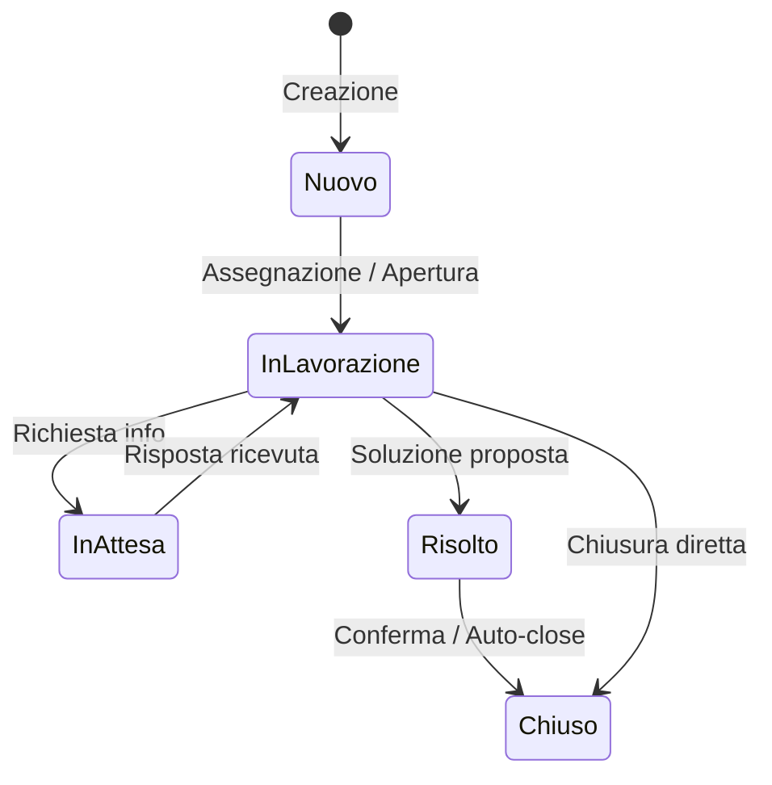

# Ticket & Supporto Interno

> **Categoria**: `operativo`
> **Destinatari**: Admin, Team Leader, Professionisti
> **Stato**: 🟢 Completo
> **Ultimo aggiornamento**: 27/03/2026

---

## Cos'è e a Cosa Serve

Il sistema di ticketing è lo strumento di **comunicazione interna strutturata** per la gestione delle richieste di supporto tra i diversi dipartimenti (IT, Sales, HR, Health Management). Permette di tracciare ogni richiesta dal momento dell'apertura fino alla risoluzione finale, con un sistema di multi-assegnazione, condivisione tra team e storico completo delle attività (Timeline).

---

## Chi lo Usa

| Ruolo | Utilizzo |
|-------|----------|
| **Professionisti** | Apertura di richieste di supporto tecnico o amministrativo |
| **Heads di Dipartimento** | Gestione, assegnazione e risoluzione dei ticket del proprio ambito |
| **Amministratori** | Supervisione globale e risoluzione di casi cross-dipartimentali |

---

## Flusso Principale (Technical Workflow)

1. **Creation**: Il richiedente apre un ticket specificando dipartimento e urgenza.
2. **Notification**: Il sistema invia email automatiche a richiedente e dipartimento.
3. **Drafting**: L'assegnatario apre il ticket; lo stato passa a `in_lavorazione`.
4. **Collaboration**: Aggiunta di commenti, allegati o condivisione con altri dipartimenti.
5. **Resolution**: Chiusura del ticket con registrazione del timestamp `closed_at`.

---

## Architettura Tecnica

### Componenti coinvolti

| Layer | Componente | Ruolo |
|-------|------------|-------|
| Backend | `tickets_bp` | Gestione ticket, commenti e allegati |
| Notifiche | `email_templates.py` | Generazione email HTML di supporto |
| Storage | `ticket_attachments/` | Filesystem storage per file caricati |

### Schema Ciclo di Vita Ticket



---

## Stati del ticket

| Stato (`TicketStatusEnum`) | Significato |
|---------------------------|-------------|
| `nuovo` | Appena creato, non ancora preso in carico |
| `in_lavorazione` | Preso in carico dall'assegnatario |
| `in_attesa` | In attesa di informazioni esterne o dal richiedente |
| `risolto` | Risolto, in attesa di conferma |
| `chiuso` | Definitivamente chiuso (timestamp `closed_at` registrato) |

> [!NOTE]
> Quando un assegnatario viene **assegnato** a un ticket `nuovo`, il sistema cambia automaticamente lo stato a `in_lavorazione` senza intervento manuale.

---

## Livelli di urgenza

| Urgenza (`TicketUrgencyEnum`) | Descrizione |
|------------------------------|-------------|
| `alta` | Alta urgenza — mostrata per prima in lista |
| `media` | Normale |
| `bassa` | Non urgente |

I ticket sono ordinati per urgenza (alta → bassa) e poi per data (più recente prima).

---

## Categorie di ticket

Le categorie (`TicketCategoryEnum`) sono disponibili solo per il **dipartimento 13** (Health Manager):

| Categoria | Uso tipico |
|-----------|-----------|
| — | _(i valori esatti dipendono dalla configurazione)_ |

Per gli altri dipartimenti, il campo categoria non è visibile nel form.

---

## Chi vede quale ticket (RBAC)

Il sistema usa una logica di visibilità basata su dipartimenti, definita in `permissions.py`.

### Dashboard — ticket visibili

| Ruolo | Ticket visibili |
|-------|---------------|
| **Admin** | Tutti, senza restrizioni |
| **Head di dipartimento** | Tutti i ticket del suo dipartimento + ticket condivisi con il suo dipartimento + ticket creati dai membri del suo dipartimento |
| **Utente normale** | Solo i ticket assegnati a lui (assegnazione singola o multi-utente) |

### Pagina "I Miei Ticket"

Mostra i ticket **creati** dall'utente corrente, indipendentemente dal destinatario. Tutti gli utenti hanno accesso alla propria cronologia.

### Permessi granulari

| Azione | Chi può |
|--------|---------|
| **Visualizzare** | Admin, head dipartimento (principale o condiviso), head di dipartimento se il creatore è suo membro, assegnatario, creatore |
| **Modificare** | Admin, head dipartimento, assegnatario |
| **Condividere con altri dip.** | Admin, head dipartimento, assegnatario |
| **Chiudere** | Stessi di "modificare" |
| **Eliminare** | Admin, head dipartimento principale — MA non se chiuso da più di 7 giorni |
| **Assegnare** | Admin (a chiunque nel dipartimento), Head (solo ai membri del proprio dipartimento) |

---

## Assegnazione multi-utente

Un ticket può essere assegnato a **più utenti contemporaneamente** (`assigned_users` — relazione M2M). Tutti gli assegnatari:
- Vedono il ticket nella loro dashboard
- Ricevono notifiche email
- Possono modificare e commentare

Il campo legacy `assigned_to_id` (assegnazione singola) è ancora supportato per compatibilità.

---

## Condivisione tra dipartimenti

Un ticket può essere **condiviso** con altri dipartimenti:

```
PATCH /tickets/<id>/share
{ "department_ids": [2, 5] }
→ Aggiunge dipartimenti a ticket.shared_departments (M2M)
→ Email di notifica agli head dei nuovi dipartimenti
→ Gli head dei dipartimenti condivisi ottengono visibilità
```

---

## Note interne (commenti)

I commenti sono sempre **interni** — non visibili al richiedente esterno. Gli utenti normali non-assegnatari vedono solo i commenti non-interni, ma attualmente tutti i commenti da backend sono marcati come `is_internal=True`.

```
GET /tickets/api/<id>/comments → lista commenti
POST /tickets/api/<id>/comments { "content": "Testo nota" }
```

Ogni commento scatena notifiche email a: head dipartimento, assegnatari, creatore del ticket (eccetto l'autore del commento).

---

## Timeline

La timeline di un ticket aggrega in ordine cronologico:
1. **Creazione** — timestamp e creatore
2. **Cambi di stato** — timestamp, da → a, chi ha cambiato, messaggio
3. **Commenti** — timestamp, autore, preview del testo

```
GET /tickets/api/<id>/timeline
→ Lista eventi ordinata per timestamp decrescente
→ Ogni entry ha: type, timestamp, description, icon, color
```

---

## Allegati

| Limite | Valore |
|--------|--------|
| Allegati per ticket | max 5 |
| Storage | Filesystem (`UPLOAD_FOLDER` configurato) |
| Percorso | `ticket_attachments/<ticket_number>/<uuid>_<filename>` |
| Metadati salvati | `filename`, `file_path`, `file_size`, `mime_type`, `uploaded_by_id` |

---

## Scadenza automatica

```python
ticket.due_date = ticket.calculate_due_date()
```

La scadenza viene calcolata automaticamente in base all'urgenza al momento della creazione. I ticket scaduti (`due_date < now` e non chiusi) sono evidenziati come `overdue` nelle statistiche.

---

## Notifiche email

Il sistema invia email automatiche in questi scenari:

| Evento | Destinatari |
|--------|------------|
| Ticket creato | Richiedente + `department.notification_email` + assegnatari |
| Cambio di stato | Assegnatari + creatore (se `notify_requester=True`) + email esterna richiedente |
| Condivisione | Head dei dipartimenti aggiunti |
| Assegnazione cambiata | Nuovi assegnatari + creatore (se non è assegnatario) |
| Nuovo commento | Head dipartimento + assegnatari + creatore (escluso l'autore del commento) |

Le email usano template HTML dedicati definiti in `email_templates.py`. L'invio è condizionato dalla configurazione `TICKET_EMAIL_ENABLED`.

---

## Endpoint API Principali

---

## Modelli di Dati Principali

### `Ticket` (tabella `tickets`)

| Campo | Tipo | Note |
|-------|------|------|
| `ticket_number` | String UNIQUE | Es. `TKT-20260326-0042` |
| `title` | String | Titolo |
| `description` | Text | Descrizione completa |
| `status` | `TicketStatusEnum` | Stato corrente |
| `urgency` | `TicketUrgencyEnum` | Urgenza |
| `category` | `TicketCategoryEnum` | Categoria (solo dept 13) |
| `requester_first_name` / `_last_name` | String | Nome richiedente |
| `requester_email` | String | Email richiedente (anche esterna) |
| `requester_department` | String | Dipartimento richiedente |
| `department_id` | FK → `departments.id` | Dipartimento destinatario |
| `created_by_id` | FK → `users.id` | Creatore interno (nullable) |
| `assigned_to_id` | FK → `users.id` | Assegnatario principale (legacy) |
| `assigned_users` | M2M → `users` | Multi-assegnazione |
| `shared_departments` | M2M → `departments` | Dipartimenti condivisi |
| `cliente_id` | FK → `clienti` | Cliente correlato (nullable) |
| `due_date` | DateTime | Scadenza (UTC) |
| `closed_at` | DateTime | Timestamp chiusura (timezone Rome) |

### `TicketComment` (tabella `ticket_comments`)

| Campo | Tipo | Note |
|-------|------|------|
| `ticket_id` | FK → `tickets.id` | — |
| `author_id` | FK → `users.id` | Chi ha scritto |
| `content` | Text | Testo del commento |
| `is_internal` | Boolean | Sempre `True` (nota interna) |

### `TicketStatusChange` (tabella `ticket_status_changes`)

| Campo | Tipo | Note |
|-------|------|------|
| `ticket_id` | FK | — |
| `from_status` | Enum | Stato precedente |
| `to_status` | Enum | Nuovo stato |
| `changed_by_id` | FK → `users.id` | Chi ha cambiato |
| `message` | Text | Messaggio di accompagnamento |
| `emails_sent_to` | JSONB | Lista email notificate |

### `TicketAttachment` (tabella `ticket_attachments`)

| Campo | Tipo | Note |
|-------|------|------|
| `ticket_id` | FK | — |
| `filename` | String | Nome originale |
| `file_path` | String | Percorso relativo su disco |
| `file_size` | Integer | Dimensione in byte |
| `mime_type` | String | Tipo MIME |
| `uploaded_by_id` | FK → `users.id` | — |

---

## Filtri dashboard

| Parametro | Tipo | Descrizione |
|-----------|------|-------------|
| `status` | string | Stato ticket |
| `urgency` | string | Livello urgenza |
| `category` | string | Categoria (solo admin/dept 13) |
| `search` | string | Ricerca su numero, titolo, email, cliente, assegnatario |
| `department_id` | int | Dipartimento (solo admin) |
| `date_from` / `date_to` | date | Intervallo date creazione |
| `include_closed` | bool | Include ticket chiusi (default: esclusi) |

---

## Note Operative e Casi Limite

- **Email esterna richiedente**: se il campo `requester_email` non corrisponde a nessun utente interno, viene trattato come email esterna e riceve notifiche semplificate.
- **Gestione speciale Sales**: i dipartimenti "Consulenti Sales 1" e "Consulenti Sales 2" sono trattati come un'unica entità logica "Sales Team" ai fini dell'assegnazione e della visualizzazione membri.
- **Eliminazione con finestra temporale**: un head dipartimento può eliminare un ticket chiuso solo nelle prime 7 ore dalla chiusura. Dopo quel periodo, solo l'admin può eliminarlo.
- **`ticket.calculate_due_date()`**: il metodo calcola la scadenza in base all'urgenza. Al momento non è documentato il mapping esatto (da verificare nel modello), ma la scadenza viene usata per identificare ticket `overdue`.
- **Ticket senza cliente**: è normale creare ticket non collegati a nessun paziente (es. richieste IT, HR). Il campo `cliente_id` e `related_client_name` sono facoltativi.

---

## Documenti Correlati

- → [Task & Calendario](./task-calendario.md) — task manager e integrazione Google Calendar
- → [Team & Professionisti](../team/team-professionisti.md) — struttura dipartimenti per RBAC
- → [Panoramica generale](../panoramica/overview.md) — visione d'insieme della suite
