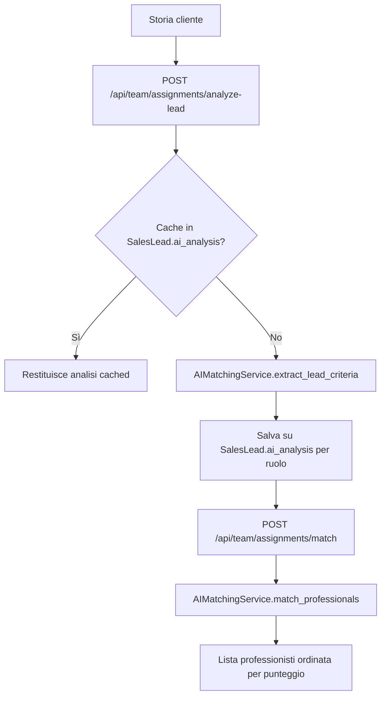
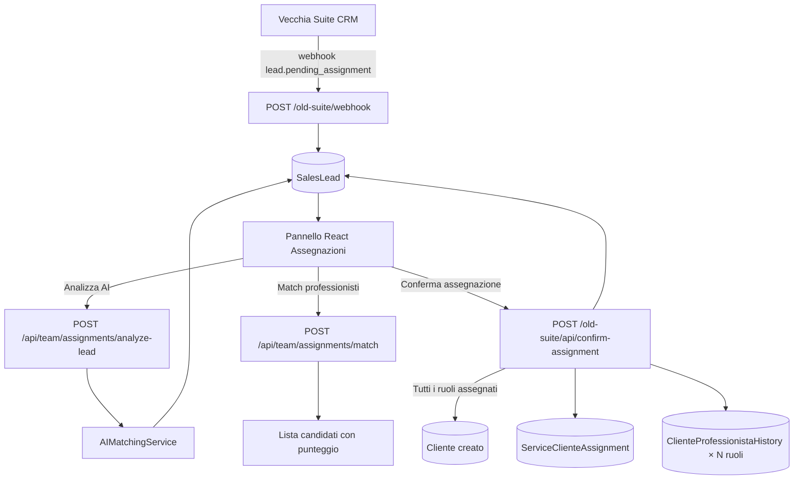

# Assegnazioni Old Suite

> **Categoria**: `team-organizzazione`
> **Destinatari**: Sviluppatori, Team Leader, Health Manager, Amministratori
> **Stato**: 🟢 Completo
> **Ultimo aggiornamento**: 14/04/2026

---

## Cos'è e a Cosa Serve

Il modulo **Assegnazioni Old Suite** è il pannello che consente di ricevere i nuovi clienti provenienti dalla vecchia piattaforma CRM (`suite.corposostenibile.com`) e di assegnarli ai professionisti corretti prima della conversione definitiva a pazienti nella suite.

Il flusso risolve un problema pratico: la vecchia suite gestisce la fase commerciale (acquisizione lead, firma contratto, onboarding con l'Health Manager), ma non ha visibilità sulla disponibilità dei professionisti nella nuova suite. Il pannello Assegnazioni è il punto di raccordo tra i due sistemi.

Funzionalità principali:
- Ricezione automatica di nuovi lead via **webhook** dalla vecchia suite
- Visualizzazione della lista lead in attesa di assegnazione con dati clinici (storia, check compilati)
- **Analisi AI** della storia del cliente per estrarre criteri clinici e suggerire i professionisti più adatti
- Assegnazione manuale o AI-assistita di nutrizionista, coach e psicologa
- Conversione automatica del lead a **Cliente** al completamento di tutti i ruoli richiesti dal pacchetto
- Creazione contestuale di `ServiceClienteAssignment` e `ClienteProfessionistaHistory` per ogni ruolo

---

## Chi lo Usa

| Ruolo | Accesso |
|-------|---------|
| **Team Leader** | Vede i lead e può assegnare solo i professionisti del proprio team |
| **Health Manager** | Può visualizzare lead del proprio portfolio e creare lead manualmente |
| **Admin** | Accesso completo: tutti i lead, tutti i professionisti |

> [!NOTE]
> I controlli di accesso non sono applicati a livello di route HTTP (tutti gli endpoint richiedono solo `@login_required`). La visibilità è filtrata a livello di **frontend React** e di endpoint di matching AI, che restringe i professionisti mostrati ai soli membri dei team del TL corrente.

---

## Flusso Principale (dal punto di vista dell'utente)

### Ricezione lead dalla vecchia suite

```
1. Il cliente firma un contratto nella vecchia suite
2. La vecchia suite invia un webhook POST a /old-suite/webhook
   con evento "lead.pending_assignment"
3. Il sistema crea (o aggiorna) un record SalesLead con:
   - source_system = 'old_suite'
   - status = 'PENDING_ASSIGNMENT'
   - Dati anagrafici, pacchetto, importi, HM assegnato, check compilati
4. Il lead compare nella lista del pannello Assegnazioni
```

### Completamento check pre-onboarding

La vecchia suite può aggiornare i check via webhook anche dopo la creazione del lead:

```
POST /old-suite/webhook con evento "lead.check_completed"
→ Aggiorna check1/check2/check3 responses e completed_at
```

Ci sono 3 check:
| Check | Contenuto |
|-------|-----------|
| **Check 1** | Nutrizione & Sport |
| **Check 2** | Stile di Vita |
| **Check 3 (Psico-Alimentare)** | Test psicologico con score (0-78) e tipo (A/B/C) |

### Assegnazione con supporto AI

```
1. Il TL/Admin apre la scheda del lead
2. Clicca "Analizza con AI" per un ruolo specifico
   → POST /api/team/assignments/analyze-lead
   → AI legge la storia del cliente ed estrae criteri clinici
   → I criteri vengono salvati su SalesLead.ai_analysis
3. Il sistema mostra i professionisti consigliati (punteggio matching)
   → POST /api/team/assignments/match (filtrato per team del TL)
4. Il TL seleziona il professionista e conferma
   → POST /old-suite/api/confirm-assignment
```

### Conversione a Cliente (automatica al completamento)

Il sistema assegna i ruoli **uno alla volta** (es. prima il nutrizionista, poi il coach). La conversione avviene solo quando **tutti** i ruoli richiesti dal pacchetto sono assegnati:

```
Pacchetto "BP-NPC-180d" (nutrizione + psicologia + coach, 180 giorni)
  → Assegna nutrizionista → salva, mostra "1/3 ruoli"
  → Assegna coach        → salva, mostra "2/3 ruoli"
  → Assegna psicologa    → CONVERTE:
       1. Crea Cliente con tutti i dati del lead
       2. Crea ServiceClienteAssignment (status='assigned')
       3. Crea 3 × ClienteProfessionistaHistory (is_active=True)
       4. Aggiunge ogni professionista alle relazioni M2M del Cliente
       5. Cliente.show_in_clienti_lista = True (compare nella lista pazienti)
```

---

## Analisi AI e Matching

### Come funziona l'analisi AI

L'AI (tramite `AIMatchingService.extract_lead_criteria`) legge la storia del cliente e restituisce una struttura di criteri clinici strutturati per ruolo. I criteri estratti vengono confrontati con quelli dichiarati da ogni professionista (`User.assignment_criteria`).



L'analisi è **persistita per ruolo**: se si analizza prima la parte nutrizione, poi il coach, le due analisi si accumulano in `ai_analysis` senza sovrascriversi:

```json
{
  "nutrition": { "criteri_estratti": [...], "note_cliniche": "..." },
  "coach":     { "criteri_estratti": [...], "note_cliniche": "..." }
}
```

### Criteri di assegnazione professionisti

Ogni professionista può avere configurato in `User.assignment_criteria` le proprie preferenze/specializzazioni (es. patologie trattate, target ideale). Il sistema di matching usa questi criteri per calcolare la compatibilità con i criteri estratti dalla storia del cliente.

Il Team Leader può aggiornare i criteri dei propri membri:
```
PUT /api/team/professionals/<user_id>/criteria
{ "criteria": { ... } }
```

Un professionista può essere contrassegnato come non disponibile per nuove assegnazioni:
```
PUT /api/team/professionals/<user_id>/toggle-available
→ Toggle di User.assignment_ai_notes.disponibile_assegnazioni
```

---

## Architettura Tecnica

### Componenti coinvolti

| Layer | File / Modulo | Ruolo |
|-------|--------------|-------|
| Backend | `blueprints/old_suite_integration/routes.py` | Webhook + API REST per il pannello |
| Backend | `blueprints/old_suite_integration/package_parser.py` | Parsing nome pacchetto → ruoli richiesti |
| Backend | `blueprints/team/api.py` | Endpoint AI analyze-lead, match, confirm |
| Backend | `blueprints/team/ai_matching_service.py` | Logica AI matching |
| Backend | `blueprints/team/criteria_service.py` | Schema e validazione criteri professionisti |
| Frontend | Pannello Assegnazioni Old Suite | Interfaccia React |
| Database | `SalesLead`, `ServiceClienteAssignment`, `Cliente` | Persistenza dati |

### Schema del flusso completo



### Package Parser

`parse_package_name` (wrapper di `parse_package_support`) legge il nome del pacchetto (es. `"BP-NPC-180d"`) e restituisce:

```python
{
  'code': 'BP-NPC',
  'roles': {'nutrition': True, 'coach': True, 'psychology': True},
  'duration_days': 180,
  'client_type': 'a',           # tipologia A/B/C
  'support_types': {
      'nutrizione': 'individuale',
      'coach': 'individuale',
  }
}
```

Questo dizionario determina quanti ruoli devono essere assegnati prima della conversione.

---

## Endpoint API Principali

### Blueprint `old_suite_integration` — prefix `/old-suite`

| Metodo | Endpoint | Auth | Descrizione |
|--------|----------|------|-------------|
| `POST` | `/old-suite/webhook` | Header `X-Webhook-Source` | Riceve eventi dalla vecchia suite |
| `GET` | `/old-suite/api/leads` | Login | Lista lead non ancora convertiti |
| `GET` | `/old-suite/api/leads/<id>` | Login | Dettaglio singolo lead |
| `GET` | `/old-suite/api/leads/<id>/check/<n>` | Login | Risposte check 1/2/3 |
| `POST` | `/old-suite/api/confirm-assignment` | Login | Conferma assegnazione (parziale o completa) |

### Blueprint `team_api` — prefix `/api/team`

| Metodo | Endpoint | Auth | Descrizione |
|--------|----------|------|-------------|
| `GET` | `/api/team/professionals` | Login | Lista professionisti con criteri e capienza |
| `PUT` | `/api/team/professionals/<id>/criteria` | Admin/TL | Aggiorna criteri assegnazione |
| `PUT` | `/api/team/professionals/<id>/toggle-available` | Admin/TL | Toggle disponibilità assegnazioni |
| `GET` | `/api/team/criteria/schema` | Login | Schema criteri disponibili |
| `POST` | `/api/team/assignments/analyze-lead` | Login | Analisi AI storia cliente |
| `POST` | `/api/team/assignments/match` | Login | Matching professionisti per criteri |
| `POST` | `/api/team/assignments/confirm` | Login | Conferma assegnazione (flusso GHL) |

### Payload webhook `lead.pending_assignment`

```json
{
  "event": "lead.pending_assignment",
  "lead": {
    "id": 1234,
    "unique_code": "CS-2026-001",
    "first_name": "Mario",
    "last_name": "Rossi",
    "email": "mario@example.com",
    "custom_package_name": "BP-NPC-180d",
    "health_manager": { "name": "Giulia Verdi" },
    "checks": {
      "check1": { "completed": true, "responses": {...}, "completed_at": "2026-04-01T10:00:00" },
      "check3": { "score": 42, "type": "B" }
    }
  }
}
```

### Payload `confirm-assignment`

```json
{
  "lead_id": 42,
  "nutritionist_id": 7,
  "notes": "Paziente con DCA - preferisce Giulia",
  "onboarding_notes": "Prima call fissata per lunedì",
  "ai_analysis": { "nutrition": { "criteri": ["DCA", "PCOS"] } }
}
```

---

## Modelli di Dati Principali

### `SalesLead` (tabella `sales_leads`)

| Campo | Tipo | Note |
|-------|------|------|
| `source_system` | String | `'old_suite'` per lead da questo flusso |
| `old_suite_id` | Integer | ID del lead nella vecchia suite |
| `status` | `LeadStatusEnum` | `PENDING_ASSIGNMENT` durante attesa assegnazione |
| `health_manager_id` | FK → `users.id` | HM assegnato (risolto da nome tramite `_resolve_user_by_name`) |
| `assigned_nutritionist_id` | FK → `users.id` | Nutrizionista assegnato (parziale o definitivo) |
| `assigned_coach_id` | FK → `users.id` | Coach assegnato |
| `assigned_psychologist_id` | FK → `users.id` | Psicologa assegnata |
| `converted_to_client_id` | FK → `clienti.cliente_id` | Popolato dopo la conversione |
| `check1/2/3_responses` | JSONB | Risposte per ogni check |
| `check3_score` | Integer | Punteggio Check 3 (0-78) |
| `check3_type` | String | Tipo psicologico: `A`, `B`, o `C` |
| `ai_analysis` | JSONB | Cache analisi AI per ruolo (`{"nutrition": {...}, "coach": {...}}`) |
| `form_responses` | JSONB | Dati extra (incluso `health_manager_name` per fallback display) |

### `ServiceClienteAssignment` (tabella `service_cliente_assignments`)

Creato al momento della conversione completa. Unico per `cliente_id`.

| Campo | Tipo | Note |
|-------|------|------|
| `status` | String | `pending_assignment` → `assigned` dopo conversione |
| `nutrizionista_assigned_id` | FK → `users.id` | — |
| `coach_assigned_id` | FK → `users.id` | — |
| `psicologa_assigned_id` | FK → `users.id` | — |
| `ai_analysis` | JSONB | Analisi AI associata all'assegnazione |

---

## Note Operative e Casi Limite

- **Match HM per nome**: la vecchia suite invia il nome testuale dell'Health Manager. Il sistema tenta un match per `first_name + last_name` (case-insensitive), con fallback sul solo cognome. Se il match fallisce, `health_manager_id` rimane `null` ma il nome originale è preservato in `form_responses['health_manager_name']` per il display.
- **Assegnazione parziale persistente**: le assegnazioni si accumulano sulla stessa lead. Se si assegna prima il nutrizionista, poi si torna per il coach, il nutrizionista già assegnato non viene perso.
- **Pacchetti senza tutti i ruoli**: se il pacchetto richiede solo nutrizione (es. `"BP-N-90d"`), la conversione avviene dopo l'assegnazione del solo nutrizionista.
- **Cliente già esistente per email**: prima di creare un nuovo `Cliente`, il sistema cerca per `email`. Se esiste, aggiorna il record esistente invece di crearne uno duplicato.
- **`show_in_clienti_lista`**: il cliente creato dalla conversione parte con `show_in_clienti_lista = False` e viene impostato a `True` solo al completamento dell'assegnazione. Questo evita che clienti parzialmente configurati appaiano nella lista principale.
- **AI analysis caching per ruolo**: l'analisi AI è saved per chiave-ruolo (`nutrition`, `coach`, `psychology`). Se si forza un refresh (`force_refresh: true`), l'analisi precedente per quel ruolo viene sovrascritta, le altre chiavi rimangono intatte.

---

## Documenti Correlati

- → [Team & Professionisti](./team-professionisti.md) — capienza, ruoli, struttura team
- → [Gestione Clienti](../clienti-core/gestione-clienti.md) — ciclo di vita del Cliente dopo conversione
- → [Panoramica generale](../panoramica/overview.md) — visione d'insieme della suite
