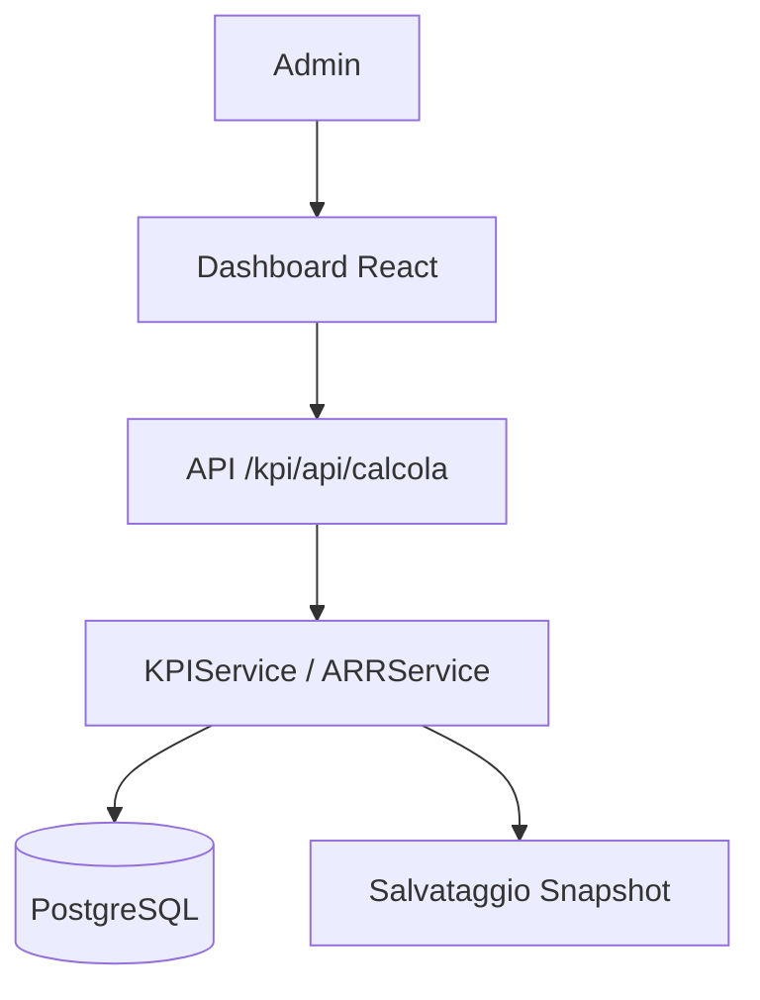

# KPI & Performance

# KPI & Performance

> **Categoria**: `team-organizzazione`
> **Destinatari**: Amministratori, CCO, Team Leader
> **Stato**: 🟢 Completo
> **Ultimo aggiornamento**: 27/03/2026

---

## Cos'è e a Cosa Serve

Il modulo KPI traccia le performance dell'azienda e dei singoli professionisti attraverso metriche calcolate su periodi configurabili. Serve a rispondere a due domande fondamentali:

1. **Come sta andando l'azienda?** → KPI aziendali (Tasso Rinnovi, Tasso Referral)
2. **Come sta andando ogni professionista?** → ARR individuale (Adjusted Renewal Rate)

I risultati vengono storicizzati come **snapshot** per confrontare periodi diversi e monitorare l'andamento nel tempo.

---

## Chi lo Usa

| Ruolo | Accesso |
|-------|---------|
| **Admin** | Accesso completo: calcolo, visualizzazione, salvataggio snapshot |
| **CCO** | Visualizzazione dashboard KPI |
| **Professionisti** | Non hanno accesso diretto al modulo KPI |

> [!NOTE]
> Tutte le route KPI richiedono il ruolo `admin`. Non esiste un accesso parziale per ruoli intermedi.

---

## Flusso Principale (dal punto di vista dell'utente)

```
1. L'admin accede alla dashboard KPI (/kpi/dashboard)
2. Seleziona il periodo di riferimento (inizio / fine)
3. Il sistema calcola in tempo reale:
   - Tasso Rinnovi aziendale
   - Tasso Referral aziendale
   - ARR per ogni professionista
4. L'admin può salvare uno snapshot per storicizzare i valori
5. I grafici mostrano l'andamento storico degli ultimi N periodi
```

---

## KPI Aziendali

### Tasso Rinnovi

Misura la percentuale di clienti in scadenza che hanno effettivamente rinnovato il pacchetto.

```
Tasso Rinnovi = (Clienti rinnovati / Clienti in scadenza) × 100
```

| Elemento | Fonte dati |
|----------|-----------|
| **Numeratore**: clienti rinnovati | `PagamentoInterno` con `stato_approvazione = 'approvato'` e `servizio_acquistato ILIKE '%rinnovo%'` nel periodo |
| **Denominatore**: clienti in scadenza | `Cliente.data_scadenza_pacchetto` nel range, con `stato_servizio IN ('attivo', 'in_scadenza')` |

### Tasso Referral

Misura la percentuale di referral (clienti portati da altri clienti) che si sono effettivamente convertiti.

```
Tasso Referral = (Referral convertiti / Referral totali) × 100
```

| Elemento | Fonte dati |
|----------|-----------|
| **Numeratore**: referral convertiti | `CallBonus` con `cliente_proveniente_da IS NOT NULL` e `convertito = True` nel periodo |
| **Denominatore**: referral totali | `CallBonus` con `cliente_proveniente_da IS NOT NULL` nel periodo |

---

## ARR — Adjusted Renewal Rate per Professionista

L'ARR misura le performance individuali di ogni professionista considerando rinnovi, upgrade proposti e referral gestiti. È la base per il **sistema bonus**.

### Formula ARR

```
Numeratore (pesato) =
    Rinnovi_diretti
    + Upgrade_convertiti_come_proponente  × 60%
    + Upgrade_convertiti_come_ricevente   × 40%
    + Referral_convertiti_come_proponente × 60%
    + Referral_convertiti_come_ricevente  × 40%

Denominatore =
    Clienti_eleggibili
    + Upgrade_totali_proposti
    + Referral_totali

ARR = (Numeratore / Denominatore) × 100
```

### Logica dello split 60/40

Quando un professionista propone un upgrade o un referral:
- **60%** del "credito" va al **proponente** (chi ha suggerito l'operazione)
- **40%** del "credito" va al **ricevente** (chi riceve il nuovo cliente)

Questo incentiva sia chi genera opportunità che chi le gestisce.

### Clienti eleggibili (denominatore)

Un cliente conta nel denominatore se:
- È assegnato al professionista (come nutrizionista, coach o psicologa)
- Ha `stato_servizio IN ('attivo', 'in_scadenza')`
- Ha `has_goals_left = True` oppure `has_goals_left IS NULL` (non è esplicitamente escluso)

### Call Bonus — meccanismo di upgrade e referral

Il modello `CallBonus` è il registro delle proposte di upgrade e referral:

| Campo | Significato |
|-------|-------------|
| `user_propone_id` | Professionista che propone l'upgrade/referral |
| `user_riceve_id` | Professionista che riceve il cliente |
| `cliente_proveniente_da` | Compilato se è un referral (nome/ID cliente che ha segnalato) |
| `convertito` | `True` se il paziente ha effettivamente acquistato |
| `data_bonus` | Data dell'evento (usata per filtrare il periodo) |

---

## Snapshot e storico

Gli snapshot permettono di confrontare periodi diversi e monitorare target nel tempo.

```
Admin definisce periodo → Calcola KPI → Salva snapshot
                                            ↓
                              Storico: ultimi N snapshot visualizzati
                              in grafici temporali sulla dashboard
```

Ogni snapshot include:
- Numeratore e denominatore della formula
- Valore percentuale calcolato
- Target (se impostato) e scostamento dal target
- JSON dettagli calcolo (per audit/debug)
- Utente che ha triggherato il calcolo

---

## Endpoint API Principali

Tutti gli endpoint richiedono autenticazione admin. Prefix: `/kpi`

| Metodo | Endpoint | Descrizione |
|--------|----------|-------------|
| `GET` | `/kpi/dashboard` | Dashboard KPI (pagina HTML) |
| `POST` | `/kpi/api/calcola` | Calcola KPI per periodo (con opzione salva snapshot) |
| `GET` | `/kpi/api/tasso-rinnovi` | Tasso rinnovi per periodo |
| `GET` | `/kpi/api/tasso-referral` | Tasso referral per periodo |
| `GET` | `/kpi/api/arr/professionisti` | ARR di tutti i professionisti |
| `GET` | `/kpi/api/arr/professionista/<user_id>` | ARR di un singolo professionista |
| `GET` | `/kpi/api/storico/kpi/<kpi_type>` | Storico snapshot KPI (default: ultimi 12) |
| `GET` | `/kpi/api/storico/arr/<user_id>` | Storico ARR di un professionista |
| `POST` | `/kpi/api/snapshot/salva` | Salva snapshot KPI + ARR per periodo |

### Payload tipici

```json
POST /kpi/api/calcola
{
  "periodo_inizio": "2026-01-01",
  "periodo_fine": "2026-01-31",
  "save_snapshot": true
}

GET /kpi/api/tasso-rinnovi?periodo_inizio=2026-01-01&periodo_fine=2026-01-31
```

---

## Modelli di Dati Principali

### `KPISnapshot` (tabella `kpi_snapshots`)

| Campo | Tipo | Note |
|-------|------|------|
| `id` | Integer PK | — |
| `kpi_type` | String | `tasso_rinnovi` \| `tasso_referral` |
| `periodo_inizio` | Date | Inizio periodo |
| `periodo_fine` | Date | Fine periodo |
| `numeratore` | Integer | Valore numeratore formula |
| `denominatore` | Integer | Valore denominatore formula |
| `valore_percentuale` | Numeric(5,2) | KPI calcolato |
| `target_percentuale` | Numeric(5,2) | Target (opzionale) |
| `dettagli_calcolo` | JSONB | Debug/audit del calcolo |
| `calcolato_da_user_id` | FK → `users.id` | Chi ha triggherato il calcolo |

### `ProfessionistaBonusSnapshot` (tabella `professionista_bonus_snapshots`)

| Campo | Tipo | Note |
|-------|------|------|
| `user_id` | FK → `users.id` | Professionista |
| `periodo_inizio` / `periodo_fine` | Date | Periodo analizzato |
| `rinnovi_count` | Integer | Rinnovi diretti |
| `upgrade_convertiti_proponente` | Integer | Upgrade conv. come proponente |
| `upgrade_convertiti_ricevente` | Integer | Upgrade conv. come ricevente |
| `referral_convertiti_proponente` | Integer | Referral conv. come proponente |
| `referral_convertiti_ricevente` | Integer | Referral conv. come ricevente |
| `clienti_eleggibili` | Integer | Clienti nel denominatore |
| `upgrade_totali` | Integer | Upgrade proposti totali |
| `referral_totali` | Integer | Referral totali |
| `numeratore_pesato` | Numeric | Numeratore ARR pesato |
| `denominatore_totale` | Integer | Denominatore ARR |
| `arr_percentuale` | Numeric(5,2) | ARR calcolato |
| `target_arr` | Numeric | Target ARR (opzionale) |
| `bonus_raggiunto` | Boolean | Bonus scattato o meno |
| `importo_bonus` | Numeric | Importo bonus (se calcolato) |

---

## Architettura Tecnica

### Componenti coinvolti

| Layer | File / Modulo | Ruolo |
|-------|--------------|-------|
| Backend | `blueprints/kpi/` | Endpoint HTTP e logica di calcolo |
| Backend | `kpi/services.py` | Business logic (KPIService, ARRService) |
| Frontend | `src/pages/kpi/` | Dashboard React (solo Admin) |
| Database | Modelli `KPISnapshot`, `ProfessionistaBonusSnapshot` | Persistenza metriche |

### Schema del flusso



Il modulo è organizzato in tre servizi separati:

```
kpi/
├── routes.py       ← Endpoint HTTP, autenticazione, input/output
└── services.py
    ├── KPIService              ← Calcolo Tasso Rinnovi e Tasso Referral
    ├── ARRService              ← Calcolo ARR per professionisti
    └── KPIDashboardService     ← Aggregazione dati per la dashboard
```

I servizi sono **stateless**: ricevono il periodo come parametro e restituiscono i valori calcolati. Il salvataggio su DB è opzionale (`save_snapshot=True`).

---

## Note Operative e Casi Limite

- **Denominatore mai zero**: se non ci sono clienti in scadenza o referral, il denominatore viene forzato a `1` per evitare divisioni per zero. Il risultato sarà 0% in quel caso.
- **Snapshot solo se denominatore > 0**: per ARR, lo snapshot non viene salvato se `denominatore_totale == 0` (nessuna attività nel periodo).
- **"Rinnovo" come testo libero**: il Tasso Rinnovi cerca `servizio_acquistato ILIKE '%rinnovo%'` — dipende dal testo inserito nei pagamenti. Attenzione a variazioni di scrittura.
- **ARR è read-only per i professionisti**: non c'è nessuna UI dedicata ai professionisti per vedere il proprio ARR. I dati sono visibili solo agli admin/CCO nella dashboard.

---

## Documenti Correlati

- → [Team & Professionisti](./team-professionisti.md) — struttura team, capienza, ruoli
- → [Autenticazione](./autenticazione.md) — accesso e sessioni
- → [Panoramica generale](../panoramica/overview.md) — visione d'insieme della suite
