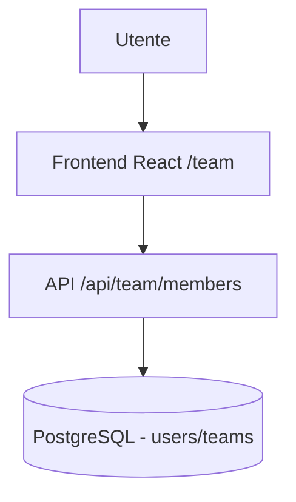
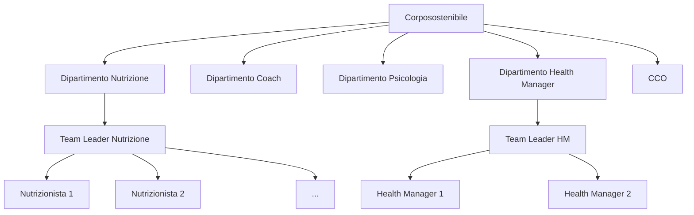

# Team & Professionisti

# Team & Professionisti

> **Categoria**: `team-organizzazione`
> **Destinatari**: Sviluppatori, Amministratori, CCO, Team Leader
> **Stato**: 🟢 Completo
> **Ultimo aggiornamento**: 27/03/2026

---

## Cos'è e a Cosa Serve

Il modulo Team gestisce l'intera struttura organizzativa di Corposostenibile: i professionisti, i loro ruoli, le specializzazioni, i team di appartenenza e i dipartimenti. È il punto di riferimento per capire **chi è chi** nel sistema, quali pazienti gestisce e quanta capacità ha disponibile.

Funzionalità principali:
- Anagrafica completa dei professionisti con foto, specializzazione e ruolo
- Struttura gerarchica: Dipartimenti → Team → Professionisti
- Monitoraggio capienza (clienti assegnati vs. capacità contrattuale)
- Sistema OKR (Objectives & Key Results) per dipartimento
- Gestione ferie e permessi
- Trial user system (onboarding graduale nuovi professionisti)

---

## Chi lo Usa

| Ruolo | Accesso |
|-------|---------|
| **Admin** | Vista e modifica completa di tutti i professionisti |
| **CCO** | Vista completa + modifica capienza |
| **Team Leader** | Vista e gestione del proprio team |
| **Professionista** | Solo il proprio profilo |
| **Health Manager** | Vista del proprio team HM |

---

## Flusso Principale (dal punto di vista dell'utente)

### Visualizzazione del Team

```
1. Il professionista accede a /team (App Clinica)
2. A seconda del ruolo vede:
   - Admin/CCO: tutti i professionisti con filtri avanzati
   - Team Leader: solo i membri dei propri team + sé stesso
   - Professionista: solo la propria scheda
3. Ogni scheda mostra: nome, avatar, specializzazione,
   capienza attuale, stato attivo/inattivo
```

### Gestione capienza

Il sistema calcola la capienza di ogni professionista in modo **ponderato** per nutrizione e coach:

```
Carico ponderato = (clienti_A × peso_A) + (clienti_B × peso_B) +
                   (clienti_C × peso_C) + (clienti_secondario × peso_secondario)

Percentuale capienza = (Carico ponderato / Capienza contrattuale) × 100
```

**Pesi default** (modificabili da admin):
| Tipologia cliente | Peso nutrizione | Peso coach |
|-------------------|----------------|------------|
| A (principale) | 2.0 | 2.0 |
| B | 1.5 | 1.5 |
| C | 1.0 | 1.0 |
| Secondario | 0.5 | 0.5 |

Per psicologia e Health Manager il carico è semplicemente il conteggio diretto dei pazienti (nessuna ponderazione).

### Trial User System

I nuovi professionisti possono essere inseriti come "trial" con accesso graduale:

| Stage | Accesso |
|-------|---------|
| **Stage 1** | Solo dashboard + sezione review |
| **Stage 2** | Clienti assegnati specifici |
| **Stage 3** | Accesso completo (utente ufficiale) |

La promozione tra stage è manuale da parte dell'admin/supervisor.

---

## Architettura Tecnica

### Componenti coinvolti

| Layer | File / Modulo | Ruolo |
|-------|--------------|-------|
| Backend | `blueprints/team/` | Route server-side (legacy/admin) |
| Backend | `blueprints/team_api/` | REST API |
| Frontend | `src/pages/team/` | Interfaccia React per gestione team |
| Database | Modelli `User`, `Team`, `Department` | Persistenza dati organizzativi |

### Schema del flusso



### Blueprint

| Blueprint | Prefix | Scopo |
|-----------|--------|-------|
| `team` (`team_bp`) | — | Route server-side (legacy/admin) |
| `team_api` (`team_api_bp`) | `/api/team` | REST API JSON per React |

L'App Clinica usa esclusivamente le API REST.

### RBAC (Role-Based Access Control)

Le regole di accesso sono implementate in tre livelli:

1. **Backend**: helper `_can_view_all_team_module_data()`, `_can_view_professional_capacity()`, `_get_visible_user_ids_for_dashboard()` in `team/api.py`
2. **Frontend React**: `src/utils/rbacScope.js` — definisce quali sezioni sono visibili per ruolo
3. **Endpoint**: ogni API route verifica il ruolo prima di restituire i dati

---

## Endpoint API Principali

| Metodo | Endpoint | Auth | Descrizione |
|--------|----------|------|-------------|
| `GET` | `/api/team/members` | Sì | Lista professionisti (paginata, filtri avanzati) |
| `GET` | `/api/team/members/<id>` | Sì | Dettaglio singolo professionista |
| `POST` | `/api/team/members` | Admin | Crea nuovo professionista |
| `PUT` | `/api/team/members/<id>` | Admin/TL | Aggiorna profilo |
| `DELETE` | `/api/team/members/<id>` | Admin | Disattiva utente |
| `GET` | `/api/team/members/<id>/capacity` | Admin/CCO/TL | Capienza professionista |
| `PUT` | `/api/team/members/<id>/capacity` | Admin/CCO/TL | Aggiorna capienza contrattuale |
| `GET` | `/api/team/departments` | Sì | Lista dipartimenti |
| `GET` | `/api/team/departments/<id>` | Sì | Dettaglio dipartimento |
| `GET` | `/api/team/teams` | Admin/CCO/TL | Lista team |
| `POST` | `/api/team/teams` | Admin | Crea team |
| `PUT` | `/api/team/teams/<id>` | Admin/TL | Aggiorna team |

### Filtri disponibili su `GET /api/team/members`

| Parametro | Tipo | Descrizione |
|-----------|------|-------------|
| `page` | int | Pagina (default 1) |
| `per_page` | int | Risultati per pagina (max 10000) |
| `q` | string | Ricerca per nome/email |
| `role` | string | Filtro ruolo (`admin`, `team_leader`, `professionista`, `health_manager`, `team_esterno`) |
| `specialty` | string | Filtro specializzazione (supporta valori separati da virgola) |
| `active` | `1` / `0` | Filtro attivi/inattivi |
| `department_id` | int | Filtro per dipartimento |

---

## Modelli di Dati Principali

### `User` — campi rilevanti per il Team

| Campo | Tipo | Note |
|-------|------|------|
| `role` | `UserRoleEnum` | Ruolo organizzativo |
| `specialty` | `UserSpecialtyEnum` | Area clinica di competenza |
| `is_external` | Boolean | Collaboratore esterno |
| `is_trial` | Boolean | In periodo di prova |
| `trial_stage` | Integer | Fase trial (1/2/3) |
| `trial_supervisor_id` | FK → `users.id` | Supervisore trial |
| `ghl_user_id` | String | ID utente in GoHighLevel |
| `ghl_calendar_id` | String | ID calendario GHL |
| `assignment_ai_notes` | JSON | Note AI per assegnazione pazienti |
| `assignment_criteria` | JSON | Criteri booleani matching AI |

### `UserRoleEnum` — Ruoli

| Valore | Descrizione |
|--------|-------------|
| `admin` | Accesso completo, tutti i moduli |
| `team_leader` | Gestisce un team di professionisti |
| `professionista` | Nutrizionista, Coach o Psicologo |
| `health_manager` | Health Manager |
| `team_esterno` | Collaboratore esterno con accesso limitato |
| `influencer` | Accesso speciale per influencer ambassador |

### `UserSpecialtyEnum` — Specializzazioni

| Valore | Categoria |
|--------|-----------|
| `nutrizione` | Specializzazione team leader area nutrizione |
| `nutrizionista` | Professionista nutrizionista |
| `psicologia` | Specializzazione team leader area psicologia |
| `psicologo` | Professionista psicologo |
| `coach` | Coach / Team Leader coach |
| `health_manager` | Area Health Management |
| `cco` | Chief Clinical Officer |
| `amministrazione` | Area amministrativa |
| `medico` | Medico |

### `Team` (tabella `teams`)

| Campo | Tipo | Note |
|-------|------|------|
| `id` | Integer PK | — |
| `name` | String | Nome del team |
| `team_type` | `TeamTypeEnum` | `nutrizione`, `coach`, `psicologia`, `health_manager` |
| `head_id` | FK → `users.id` | Team Leader responsabile |
| `department_id` | FK → `departments.id` | Dipartimento di appartenenza |
| `is_active` | Boolean | Team attivo/inattivo |
| `members` | M2M → `users` | Membri del team (via `team_members`) |

### `Department` (tabella `departments`)

| Campo | Tipo | Note |
|-------|------|------|
| `id` | Integer PK | — |
| `name` | String | Nome dipartimento (unico) |
| `head_id` | FK → `users.id` | Responsabile dipartimento |
| `guidelines_text` | Text | Linee guida (testo libero) |
| `guidelines_pdf` | String | Path PDF linee guida |
| `sop_members_pdf` | String | SOP per membri |
| `sop_managers_pdf` | String | SOP per manager |
| `ticket_notification_email` | String | Email per notifiche ticket |

### `ProfessionistCapacity` (tabella `professionista_capacity`)

| Campo | Tipo | Note |
|-------|------|------|
| `user_id` | FK → `users.id` | Professionista |
| `contractual_capacity` | Integer | Capienza massima contrattuale |
| `role_type` | String | `nutrizionista`, `coach`, `psicologa`, `health_manager` |

---

## Struttura organizzativa



---

## Note Operative e Casi Limite

- **Promozione automatica a Team Leader**: quando un professionista viene impostato come `head_id` di un team, il sistema lo promuove automaticamente a `team_leader` (funzione `_promote_team_head_to_team_leader`). La promozione è **solo in salita**: il downgrade è manuale.
- **Health Manager Team Leader**: è un caso speciale — un `team_leader` che guida un team di tipo `health_manager`. Il sistema lo identifica con `_is_health_manager_team_leader()` e gli assegna permessi ibridi.
- **Capienza ponderata**: i pesi per tipo cliente (A/B/C/secondario) sono configurabili via DB nella tabella `capacity_role_type_weights`, con fallback ai valori di default nel codice.
- **CCO**: riconosciuto sia tramite `specialty = 'cco'` che tramite il nome del dipartimento. Le ACL CCO equivalgono all'admin per il modulo team.
- **is_external**: i collaboratori esterni hanno accesso alla suite ma vengono esclusi da alcune statistiche aggregate.

---

## Documenti Correlati

- → [Autenticazione](./autenticazione.md) — login, sessioni, reset password
- → [Panoramica generale](../panoramica/overview.md) — visione d'insieme della suite
