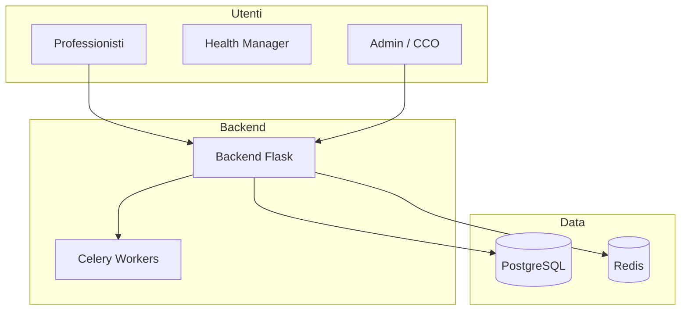

# Panoramica Generale — Suite Clinica Corposostenibile

> **Categoria**: panoramica  
> **Destinatari**: Sviluppatori, Professionisti, Team Interno  
> **Stato**: 🟢 Completo (Sprint A)  
> **Ultimo aggiornamento**: 27/03/2026

---

## Cos'è la Suite Clinica

La **Suite Clinica Corposostenibile** è la piattaforma gestionale interna sviluppata per supportare le operazioni quotidiane dell'azienda Corposostenibile. Permette di gestire l'intero ciclo di vita di un paziente: dall'acquisizione al follow-up clinico, passando per la comunicazione, la nutrizione, il coaching e la psicologia.

---

## Architettura Generale

---

## Le 5 Macro Aree

1. **🔐 Autenticazione e Gestione Team**: Accesso, RBAC, profili e KPI aziendali.
2. **🏥 Gestione Clienti (Core Clinico)**: Scheda paziente, check, nutrizione e diario.
3. **⚙️ Strumenti Operativi Interni**: Task, calendario, quality score e ricerca globale.
4. **🎫 Ticket e Supporto**: Sistema di assistenza interna tra team.
5. **💬 Comunicazione e Integrazioni**: WhatsApp (Respond.io), Appointment Setting e Push.

---

## Blueprint — Indice Completo

| Blueprint | Funzionalità principale | Doc dedicata |
|-----------|------------------------|-------------|
| `auth` | Autenticazione, sessioni, OAuth2 | [autenticazione.md](../02-team-organizzazione/autenticazione.md) |
| `customers` | CRUD pazienti, scheda completa | [gestione-clienti.md](../03-clienti-core/gestione-clienti.md) |
| `nutrition` | Piani alimentari, alimenti, macro | [Integrazione Medica](../03-clienti-core/specifiche-integrazione-medica.md) |
| `client_checks` | Check periodici, form pubblici | [check-periodici.md](../03-clienti-core/check-periodici.md) |
| `tasks` | Task, reminder, solleciti | [task-calendario.md](../04-strumenti-operativi/task-calendario.md) |
| `calendar` | Calendario, Google Calendar OAuth | [task-calendario.md](../04-strumenti-operativi/task-calendario.md) |
| `communications` | Bacheca annunci interni | [comunicazione-interna.md](../05-comunicazione/comunicazione-interna.md) |
| `respond_io` | WhatsApp Respond.io | [integrazione-respond-io.md](../05-comunicazione/integrazione-respond-io.md) |
| `quality` | Quality score professionisti | [quality-score.md](../04-strumenti-operativi/quality-score.md) |
| `appointment_setting` | Frontend performance | [appointment-setting.md](../05-comunicazione/appointment-setting.md) |
| `push_notifications` | Notifiche push browser (PWA) | [notifiche-push.md](../05-comunicazione/notifiche-push.md) |
| `search` | Ricerca full-text globale | [ricerca-globale.md](../04-strumenti-operativi/ricerca-globale.md) |

---
Ultimo aggiornamento: Marzo 2026
