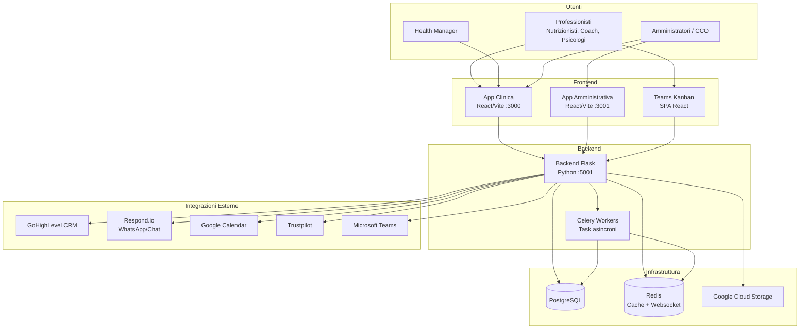

# Panoramica Generale — Suite Clinica Corposostenibile

> **Categoria**: panoramica  
> **Destinatari**: Sviluppatori, Professionisti, Team Interno  
> **Stato**: 🟢 Completo (Fase 1)  
> **Ultimo aggiornamento**: Marzo 2026

---

## Cos'è la Suite Clinica

La **Suite Clinica Corposostenibile** è la piattaforma gestionale interna sviluppata per supportare le operazioni quotidiane dell'azienda Corposostenibile. Permette di gestire l'intero ciclo di vita di un paziente: dall'acquisizione al follow-up clinico, passando per la comunicazione, la nutrizione, il coaching e la psicologia.

Il sistema è composto da **più applicazioni integrate** che comunicano tra loro attraverso un backend centrale.

---

## Architettura Generale

La suite si articola in 5 componenti principali:



---

## Stack Tecnologico

### Backend
| Tecnologia | Versione / Note | Utilizzo |
|-----------|-----------------|---------|
| Python | 3.11+ | Linguaggio principale |
| Flask | 3.x | Framework web |
| SQLAlchemy | 2.x | ORM database |
| SQLAlchemy-Continuum | — | Versioning automatico delle entità |
| PostgreSQL | 14+ | Database principale |
| Redis | 7.x | Cache, WebSocket, broker Celery |
| Celery | 5.x | Task asincroni e schedulati |
| Flask-SocketIO | — | WebSocket real-time |
| Flask-Login | — | Gestione sessioni autenticazione |
| Flask-Dance (Google OAuth2) | — | Login con Google / Calendar |
| Flask-Mail | — | Invio email |
| Flask-WTF (CSRF) | — | Protezione form |
| Marshmallow | — | Serializzazione/deserializzazione |
| Alembic (Flask-Migrate) | — | Migrazioni database |

### Frontend — App Clinica
| Tecnologia | Utilizzo |
|-----------|---------|
| React 18 | Framework UI |
| Vite | Build tool e dev server |
| React Router v6 | Navigazione SPA |
| Axios | Chiamate API al backend |
| CSS Vanilla | Stile (no Tailwind) |

### Frontend — App Amministrativa
| Tecnologia | Utilizzo |
|-----------|---------|
| React 18 | Framework UI |
| Vite | Build tool |
| Focalizzato su | Gestione ticket interni, SOP, Appointment Setting |

### Infrastruttura e Deploy
| Tecnologia | Utilizzo |
|-----------|---------|
| Google Cloud Platform (GCP) | Cloud provider principale |
| Google Kubernetes Engine (GKE) | Orchestrazione container |
| Cloud Build | CI/CD pipeline |
| Docker | Containerizzazione |
| Kubernetes | Deploy, scaling, rolling updates |

---

## Le 5 Macro Aree

### 1. 🔐 Autenticazione e Gestione Team
Gestisce l'accesso alla piattaforma, i profili di tutti i professionisti, i ruoli, le capacità operative e i dipartimenti aziendali.

**Include**: `auth`, `team`, `department`, `recruiting`, `kpi`, `dev_tracker`, `it_projects`

→ Vedi: [Blueprint 01 — Autenticazione & Team](../blueprint/01-auth-team.md)

---

### 2. 🏥 Gestione Clienti (Core Clinico)
Il cuore operativo della suite. Contiene l'intera scheda paziente, le liste per specializzazione (nutrizione, coach, psicologia, health manager), il diario clinico, il modulo nutrizione con piani alimentari, e il sistema di check periodici.

**Include**: `customers`, `nutrition`, `client_checks`, `clienti/` (React), check form pubblici

→ Vedi: [Blueprint 02 — Gestione Clienti](../blueprint/02-clienti.md)

---

### 3. ⚙️ Strumenti Operativi Interni
Tutti gli strumenti che il team usa quotidianamente per organizzare il lavoro: task e reminder, calendario integrato con Google, chat interna, knowledge base, formazione, quality score, post-it e ricerca globale.

**Include**: `tasks`, `calendar`, `communications`, `knowledge_base`, `quality`, `postit`, `search`, `loom`, `news`

→ Vedi: [Blueprint 05 — Task & Calendario](../blueprint/05-task-calendario.md)

---

### 4. 🎫 Ticket e Supporto
Sistema di ticketing interno per segnalazioni e richieste tra team. Include il sistema di ticket tradizionale e i team ticket per problemi trasversali.

**Include**: `ticket`, `team_tickets`

→ Vedi: [Blueprint 07 — Ticket & Supporto](../blueprint/07-ticket.md)

---

### 5. 🔗 Integrazioni Esterne
Il layer di connessione con i sistemi esterni: CRM GoHighLevel per la gestione lead/opportunità, Respond.io per la messaggistica WhatsApp, Google Calendar per la sincronizzazione appuntamenti, Trustpilot per le recensioni e Microsoft Teams per le notifiche interne.

**Include**: `ghl_integration`, `respond_io`, `appointment_setting`, `review`, `marketing_automation`, `suitemind`, `sop_chatbot`, `push_notifications`

→ Vedi: [Blueprint 10 — Integrazioni GHL](../blueprint/10-ghl.md)

---

## Ruoli Utente e Responsabilità

| Ruolo | Accesso Principale | Profilo Tipico |
|-------|--------------------|----------------|
| `admin` | Accesso completo a tutto | IT / Direzione |
| `cco` | Gestione team, report, qualità | Chief Clinical Officer |
| `nutritionist` | Lista pazienti nutrizione, piani alimentari | Nutrizionista |
| `coach` | Lista pazienti coach, task | Coach |
| `psychologist` | Lista pazienti psicologia | Psicologo |
| `health_manager` | Lista pazienti HM, monitoraggio | Health Manager |
| `appointment_setter` | Gestione lead, messaggi welcome | Appointment Setter |
| `sales` | Form vendita, lead | Sales |

Il controllo degli accessi è gestito tramite sistema **RBAC** (Role-Based Access Control). Le regole sono definite in `src/utils/rbacScope.js` (frontend) e nei permessi per ogni blueprint (backend).

---

## Flusso di Onboarding di un Nuovo Paziente (End-to-End)

Questo esempio mostra come i diversi moduli si integrano nella pratica:

```
1. ACQUISIZIONE LEAD
   GHL crea l'opportunità → webhook notifica il backend

2. ASSEGNAZIONE AI (SuiteMind)
   Il sistema analizza il profilo → suggerisce il professionista ottimale
   L'admin/CCO conferma l'assegnazione

3. FORM WELCOME
   Il cliente riceve un link al form pubblico (/welcome-form/<codice>)
   Compila i dati anagrafici, consensi, obiettivi

4. CREAZIONE CLIENTE
   Il backend crea il record cliente (blueprint: customers)
   Il professionista assegnato vede il cliente nella propria lista

5. PRIMO CONTATTO (Respond.io)
   Messaggio automatico WhatsApp tramite Respond.io
   L'appointment setter gestisce la comunicazione iniziale

6. CHECK SETTIMANALE
   Il sistema invia un link al check periodico via email/WhatsApp
   Il paziente compila il form pubblico (/check/weekly/<token>)
   Il professionista legge il check nella sezione "Check da leggere"

7. SCHEDA CLINICA
   Il professionista lavora sulla scheda paziente completa:
   – Diario clinico, progressi, misurazioni
   – Piano alimentare (se nutrizionista)
   – Task e reminder per il paziente

8. RECENSIONE (Trustpilot)
   Al termine del percorso, il sistema invita il cliente a lasciare una recensione
```

---

## Struttura delle URL (App Clinica)

| Area | URL Frontend | Blueprint Backend |
|------|-------------|-------------------|
| Dashboard | `/welcome` | `welcome` |
| Login | `/auth/login` | `auth` |
| Lista Clienti | `/clienti-lista` | `customers` |
| Scheda Paziente | `/clienti-dettaglio/:id` | `customers` |
| Lista Nutrizione | `/clienti-nutrizione` | `customers` |
| Lista Coach | `/clienti-coach` | `customers` |
| Lista Psicologia | `/clienti-psicologia` | `customers` |
| Lista Health Mgr | `/clienti-health-manager` | `customers` |
| Task | `/task` | `tasks` |
| Calendario | `/calendario` | `calendar` |
| Check Azienda | `/check-azienda` | `client_checks` |
| Check da leggere | `/check-da-leggere` | `client_checks` |
| Quality | `/quality` | `quality` |
| Formazione | `/formazione` | `loom` |
| Ricerca Globale | `/ricerca-globale` | `search` |
| Documentazione | `/documentazione` | `documentation` |
| Supporto | `/supporto` | — |
| Profilo | `/profilo` | `team` |
| In Prova | `/in-prova` | `customers` |
| Assegnazioni AI | `/assegnazioni-ai` | `suitemind` |

---

## Ambienti

| Ambiente | Descrizione | DB | Backend | Frontend |
|----------|-------------|-----|---------|----------|
| Sviluppo locale | Dev con Vite + Flask separati | SQLite o Postgres locale | `localhost:5001` | `localhost:3000` |
| Staging | GKE con dati di test | Postgres GCP | URL staging | URL staging |
| Produzione | GKE scalabile | Postgres GCP (managed) | URL produzione | Servito da Flask |

In produzione, il backend Flask serve anche il frontend React buildata (tramite `serve_spa_for_pages`). In sviluppo, Vite e Flask girano separatamente e si parlano tramite proxy configurato in `vite.config.js`.

---

## Repository e Branch Strategy

```
main                    ← branch stabile, production-ready
  ├── feature/...       ← nuove funzionalità
  ├── fix/...           ← bugfix
  └── docs/...          ← aggiornamenti documentazione
```

---

## Documenti di Approfondimento

| Area | Documento |
|------|-----------|
| Deploy e CI/CD | [ci_cd_analysis.md](../infrastruttura/ci_cd_analysis.md) |
| Setup GCP | [gcp_infrastructure_setup_report.md](../infrastruttura/gcp_infrastructure_setup_report.md) |
| Migrazioni DB | [procedura_migrazione.md](../infrastruttura/procedura_migrazione.md) |
| Infrastruttura 2026 | [rapporto_infrastruttura_2026.md](../infrastruttura/rapporto_infrastruttura_2026.md) |

---

## Blueprint — Indice Completo

Di seguito tutti i 42 blueprint del backend con una descrizione sintetica:

| Blueprint | Funzionalità principale | Doc dedicata |
|-----------|------------------------|-------------|
| `auth` | Autenticazione, sessioni, OAuth2 Google | [01-auth-team.md](../blueprint/01-auth-team.md) |
| `welcome` | Homepage, dashboard | — |
| `customers` | CRUD pazienti, scheda completa | [02-clienti.md](../blueprint/02-clienti.md) |
| `team` | Professionisti, ruoli, profili | [01-auth-team.md](../blueprint/01-auth-team.md) |
| `department` | Dipartimenti, documenti org | [01-auth-team.md](../blueprint/01-auth-team.md) |
| `nutrition` | Piani alimentari, alimenti, macro | [04-nutrizione.md](../blueprint/04-nutrizione.md) |
| `client_checks` | Check periodici, form pubblici | [03-client-checks.md](../blueprint/03-client-checks.md) |
| `tasks` | Task, reminder, solleciti | [05-task-calendario.md](../blueprint/05-task-calendario.md) |
| `calendar` | Calendario, Google Calendar OAuth | [05-task-calendario.md](../blueprint/05-task-calendario.md) |
| `communications` | Chat interna, messaggistica | [06-comunicazioni.md](../blueprint/06-comunicazioni.md) |
| `respond_io` | Integrazione WhatsApp Respond.io | [11-respond-io.md](../blueprint/11-respond-io.md) |
| `ticket` | Ticket interni | [07-ticket.md](../blueprint/07-ticket.md) |
| `team_tickets` | Ticket trasversali tra team | [07-ticket.md](../blueprint/07-ticket.md) |
| `quality` | Quality score professionisti | [08-quality.md](../blueprint/08-quality.md) |
| `feedback` | Feedback per area (nutrizione/coach/psico) | [08-quality.md](../blueprint/08-quality.md) |
| `feedback_global` | Sistema feedback democratico anonimo | [08-quality.md](../blueprint/08-quality.md) |
| `knowledge_base` | Base di conoscenza interna | [13-knowledge-base.md](../blueprint/13-knowledge-base.md) |
| `documentation` | Documentazione tecnica integrata | [13-knowledge-base.md](../blueprint/13-knowledge-base.md) |
| `loom` | Libreria video Loom | — |
| `kpi` | KPI, ARR, metriche aziendali | [09-kpi-finance.md](../blueprint/09-kpi-finance.md) |
| `finance` | Modulo finanziario | [09-kpi-finance.md](../blueprint/09-kpi-finance.md) |
| `recruiting` | Candidature, selezione | [01-auth-team.md](../blueprint/01-auth-team.md) |
| `ghl_integration` | GoHighLevel CRM, webhook, status | [10-ghl.md](../blueprint/10-ghl.md) |
| `old_suite_integration` | Bridge verso CRM legacy (temporaneo) | [10-ghl.md](../blueprint/10-ghl.md) |
| `sales_form` | Form onboarding pubblici | [10-ghl.md](../blueprint/10-ghl.md) |
| `appointment_setting` | Messaggi automatici appuntamenti | [11-respond-io.md](../blueprint/11-respond-io.md) |
| `marketing_automation` | Automazioni marketing, sequenze | [11-respond-io.md](../blueprint/11-respond-io.md) |
| `suitemind` | AI assegnazione, chat su SOP | [12-suitemind.md](../blueprint/12-suitemind.md) |
| `sop_chatbot` | Chatbot RAG su procedure aziendali | [12-suitemind.md](../blueprint/12-suitemind.md) |
| `push_notifications` | Notifiche push PWA | [14-push-notifications.md](../blueprint/14-push-notifications.md) |
| `pwa` | Progressive Web App manifest | [14-push-notifications.md](../blueprint/14-push-notifications.md) |
| `review` | Raccolta recensioni Trustpilot | [08-quality.md](../blueprint/08-quality.md) |
| `postit` | Note rapide / promemoria | — |
| `search` | Ricerca full-text globale | — |
| `news` | Bacheca novità/aggiornamenti | — |
| `project` | Gestione progetti interni | — |
| `blueprint_registry` | Registro blueprint (tool interno) | — |
| `database_registry` | Registro modelli DB (tool interno) | — |
| `dev_tracker` | Tracker sviluppo team IT | — |
| `it_projects` | Gestione progetti IT | — |
| `manual` | Manuale operativo suite | [13-knowledge-base.md](../blueprint/13-knowledge-base.md) |
| `health` | Health check endpoint | — |
