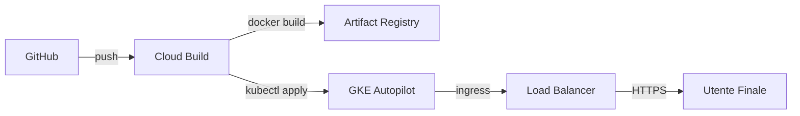

# Analisi CI/CD GCP

> **Categoria**: `infrastruttura`
> **Destinatari**: Sviluppatori, DevOps
> **Stato**: 🟢 Completo
> **Ultimo aggiornamento**: 27/03/2026

---

## Cos'è e a Cosa Serve

Questo documento descrive la pipeline di Continuous Integration e Continuous Deployment (CI/CD) su Google Cloud Platform. La pipeline automatizza il passaggio dal codice sorgente al deploy operativo dell'applicazione (Backend Flask + Frontend React) su un cluster GKE Autopilot, garantendo coerenza tra gli ambienti e velocità di rilascio.

---

## Chi lo Usa

| Ruolo | Utilizzo |
|-------|----------|
| **Sviluppatori** | Per capire come il proprio codice finisce in produzione |
| **DevOps / SysAdmin** | Per gestire la configurazione di Cloud Build e dei manifest K8s |
| **Team Leader** | Per verificare lo stato operativo del deploy per le PWA |

---

## Flusso Principale (dal punto di vista tecnico)

1. **Push**: Lo sviluppatore esegue il push sul branch `main`.
2. **Trigger**: Cloud Build rileva il cambiamento e avvia il build.
3. **Build & Push**: Viene creata l'immagine Docker multi-stage e salvata in Artifact Registry.
4. **Deploy**: `gke-deploy` applica i manifest aggiornati al cluster GKE.
5. **Post-Deploy**: Vengono eseguite le migrazioni del database e il seed dei dati iniziali.

---

## Architettura Tecnica

### Componenti coinvolti

| Layer | Componente GCP | Ruolo |
|-------|----------------|-------|
| SCM | GitHub | Repository del codice sorgente |
| CI/CD | Cloud Build | Automazione build e deploy |
| Registry | Artifact Registry | Storage immagini Docker |
| Orchestration | GKE Autopilot | Esecuzione container |
| Networking | Cloud Load Balancing | Ingress HTTP/S e Terminazione TLS |

### Schema del flusso



---

## Risorse Kubernetes Rilevanti

### 2.1 Deployment (`k8s/deployment.yaml`)

Punti chiave:
- app esposta internamente su `:8080` (gunicorn)
- cookie/sessione configurati per HTTPS:
  - `SESSION_COOKIE_SECURE=true`
  - `SESSION_COOKIE_SAMESITE=Lax`
  - `PREFERRED_URL_SCHEME=https`
- `SPA_HANDLE_AUTH_ROUTES=1` per servire le route `/auth/*` tramite SPA React
- per push PWA task servono anche:
  - `VAPID_PUBLIC_KEY`
  - `VAPID_PRIVATE_KEY`
  - `VAPID_CLAIMS_SUB`

### 2.2 Service (`k8s/service.yaml`)

- tipo: `ClusterIP`
- annotation NEG: `cloud.google.com/neg: '{"ingress": true}'`
- porta servizio: `80 -> 8080`

### 2.3 Ingress (`k8s/ingress.yaml`)

- classe: `gce`
- host: `clinica.corposostenibile.com`
- path `/*` verso `suite-clinica-service:80`
- annoto:
  - managed certificate (`clinica-corposostenibile-cert`)
  - frontend config (redirect HTTPS)

### 2.4 Managed Certificate (`k8s/managed-certificate.yaml`)

- certificato TLS gestito da Google per il dominio pubblico

### 2.5 FrontendConfig (`k8s/frontendconfig.yaml`)

- redirect HTTP -> HTTPS abilitato

## Endpoint di Verifica

| Tipo | URL / Path | Scopo |
|------|------------|-------|
| Web | `https://<dominio>/auth/login` | Login standard |
| PWA | `https://<dominio>/manifest.webmanifest` | Manifest PWA |
| PWA | `https://<dominio>/sw.js` | Service Worker |
| API | `https://<dominio>/api/push/public-key` | Verifica chiavi Push |

## 4) Cloud Build (estratto)

`cloudbuild.yaml` deploya i manifest principali e aggiorna l'immagine:

```yaml
- name: 'gcr.io/cloud-builders/gke-deploy'
  args:
    - run
    - --filename=k8s/deployment.yaml
    - --filename=k8s/service.yaml
    - --filename=k8s/frontendconfig.yaml
    - --filename=k8s/managed-certificate.yaml
    - --filename=k8s/ingress.yaml
    - --filename=k8s/hpa.yaml
    - --location=europe-west8
    - --cluster=suite-clinica-cluster-prod
    - --image=europe-west8-docker.pkg.dev/$PROJECT_ID/suite-clinica-repo/backend:$COMMIT_SHA
```

Nota:
- le env runtime documentate devono essere presenti nel deployment GKE (`k8s/deployment.yaml`)
- i valori sensibili vanno in Secret Kubernetes (es. `k8s/app-integrations-secret.example.yaml` -> `app-integrations`)
- se il deploy viene lanciato manualmente con `gcloud builds submit`, passare sempre `COMMIT_SHA` nelle substitutions (altrimenti il tag immagine resta vuoto e lo step Docker fallisce):

```bash
gcloud builds submit \
  --config=cloudbuild.yaml \
  --substitutions=COMMIT_SHA=$(git rev-parse HEAD) \
  .
```

## 5) Checklist go-live GCP

1. DNS: punta il dominio all'IP del Load Balancer creato da Ingress
2. Certificato managed: stato `Active`
3. Pod backend `Ready`
4. Migrazioni DB applicate (obbligatorio, incluse tabelle push)
5. Seed check iniziali applicato (Check 1 PDF + Check 2 mockup)
6. Verifica endpoint:

```bash
kubectl exec deploy/suite-clinica-backend -- flask db upgrade
kubectl exec deploy/suite-clinica-backend -- python corposostenibile/blueprints/client_checks/scripts/seed_initial_checks.py
curl -I https://<dominio>/auth/login
curl -I https://<dominio>/manifest.webmanifest
curl -I https://<dominio>/sw.js
curl -i https://<dominio>/api/auth/me | head -n 20
```

Post-deploy manuale (se il build Cloud fallisce dopo il rollout immagine):

```bash
kubectl exec deploy/suite-clinica-backend -c backend -- bash -lc '
  set -euo pipefail
  flask db upgrade
  PYTHONPATH=/app python /app/scripts/migration_scripts/verify_schema_parity.py
'
```

## Variabili d'Ambiente Rilevanti

| Variabile | Descrizione |
|-----------|-------------|
| `SESSION_COOKIE_SECURE` | Obbligatoria `true` in produzione |
| `VAPID_PUBLIC_KEY` | Chiave pubblica per notifiche push |
| `RESPOND_IO_API_TOKEN` | Integrazione chat esterna |
| `GHL_GLOBAL_STATUS_WEBHOOK_URL` | Sync stato clienti da GHL |

## 6) Problemi comuni

### 6.1 Certificato managed resta in provisioning

- DNS non ancora propagato o non puntato al LB
- host in `managed-certificate.yaml` non coerente col dominio reale

### 6.2 Login route non renderizzata da SPA

- verificare env `SPA_HANDLE_AUTH_ROUTES=1` in `k8s/deployment.yaml`
- verificare che il build frontend sia incluso nell'immagine Docker

### 6.3 Sessione non persistente in produzione

- verificare `SESSION_COOKIE_SECURE=true`
- verificare che l'accesso avvenga solo in HTTPS

### 6.4 Push task non arriva

- verificare variabili VAPID nel deployment
- verificare migrazione `push_subscriptions` applicata
- verificare che l'utente abbia autorizzato le notifiche nel browser/PWA

### 6.5 Rollout bloccato con PVC `uploads-pvc` (Multi-Attach)

Sintomo:
- `kubectl rollout status deployment/suite-clinica-backend` resta in attesa
- il nuovo pod backend resta `ContainerCreating`
- eventi pod con `FailedAttachVolume ... Multi-Attach error` sul PVC `uploads-pvc`

Causa:
- `uploads-pvc` è montato in `ReadWriteOnce`
- il Deployment usa `RollingUpdate` (`maxSurge > 0`), quindi durante il rollout prova a tenere vecchio e nuovo pod insieme
- il nuovo pod non può montare il PVC finché il vecchio pod non rilascia il volume

Workaround operativo (downtime breve):
1. Forzare lo spegnimento del pod vecchio o scalare il deployment a `0`.
2. Riportare il deployment a `1`.
3. Verificare rollout e readiness.

Comandi utili:

```bash
kubectl describe pod <nuovo-pod>
kubectl scale deploy/suite-clinica-backend --replicas=0
kubectl scale deploy/suite-clinica-backend --replicas=1
kubectl rollout status deployment/suite-clinica-backend --timeout=900s
```

Mitigazione consigliata:
- configurare una strategia di rollout compatibile con PVC `RWO` (es. `Recreate` oppure `RollingUpdate` con `maxSurge: 0` e `maxUnavailable: 1`)

Stato attuale su `main` (4 marzo 2026):
- `k8s/deployment.yaml` è a `replicas: 1` e usa `RollingUpdate` con `maxSurge: 1` e `maxUnavailable: 0`
- `k8s/hpa.yaml` è presente ma con `minReplicas: 1` e `maxReplicas: 1` (nessun autoscaling effettivo)
- con PVC `uploads-pvc` in `ReadWriteOnce`, questa combinazione può riattivare il rischio `Multi-Attach` nei rollout
- mitigazione consigliata: tornare a `maxSurge: 0`/`maxUnavailable: 1` oppure usare `Recreate` finché `uploads-pvc` resta `RWO`

### 6.6 `sync_criteria_prod.py` fallisce dopo riordino script

Sintomo:
- step post-deploy Cloud Build termina con errore file non trovato per `Criteri Ai.xlsx`

Possibile causa:
- lo script `sync_criteria_prod.py` usa un path relativo/hardcoded non più valido dopo il riordino di `backend/scripts`

Impatto:
- non blocca il deploy dell'immagine o le migration Alembic
- blocca solo la sincronizzazione criteri automatica post-deploy

Verifica manuale:

```bash
kubectl exec deploy/suite-clinica-backend -c backend -- bash -lc '
  ls -l /app/scripts/migration_scripts/sync_criteria_prod.py
  ls -l "/app/corposostenibile/blueprints/sales_form/assegnazioni_xlsx/Criteri Ai.xlsx"
'
```

### 6.7 Cloud Build `FAILURE` ma build/push/deploy immagine riusciti (timeout rollout)

Sintomo (caso reale 26 febbraio 2026):
- Cloud Build fallisce allo step `kubectl rollout status ... --timeout=300s`
- gli step precedenti (`docker build`, `docker push`, `kubectl set image`) risultano completati
- il nuovo pod backend non raggiunge `Ready` entro timeout durante il warm-up

Causa:
- il backend può impiegare più di `300s` a superare la readiness in alcuni rollout (startup lento / warm-up)
- Cloud Build marca `FAILURE` per timeout rollout, anche se immagine e deploy sono già stati applicati

Mitigazioni applicate:
- `cloudbuild.yaml`: timeout rollout aumentato a `900s`
- `k8s/deployment.yaml`: aggiunta `startupProbe` sul backend per evitare restart/liveness prematuri durante lo startup
- `k8s/deployment.yaml`: `readinessProbe`/`livenessProbe` rese meno aggressive (timeout/failure threshold più tolleranti)

Verifica consigliata:
```bash
kubectl get pods -n default | grep suite-clinica-backend
kubectl describe pod <pod-backend>
kubectl rollout status deployment/suite-clinica-backend --timeout=900s
curl -I https://clinica.corposostenibile.com/auth/login
```

Nota operativa:
- se la produzione va giù durante il rollout (1 replica), fare rollback immediato dell'immagine e indagare `/health`:

```bash
kubectl set image deployment/suite-clinica-backend \
  backend=europe-west8-docker.pkg.dev/suite-clinica/suite-clinica-repo/backend:<tag_stabile>
```

## Note Operative e Casi Limite

> [!IMPORTANT]
> In caso di errori `Multi-Attach` su volumi `RWO`, è spesso necessario scalare il deployment a zero repliche per permettere il distacco del volume prima del nuovo rollout.

### Documenti Correlati

- [Setup Infrastruttura GCP](./gcp_infrastructure_setup_report.md)
- [Procedura Migrazione](./procedura_migrazione.md)
- [Panoramica Generale](../00-panoramica/overview.md)
