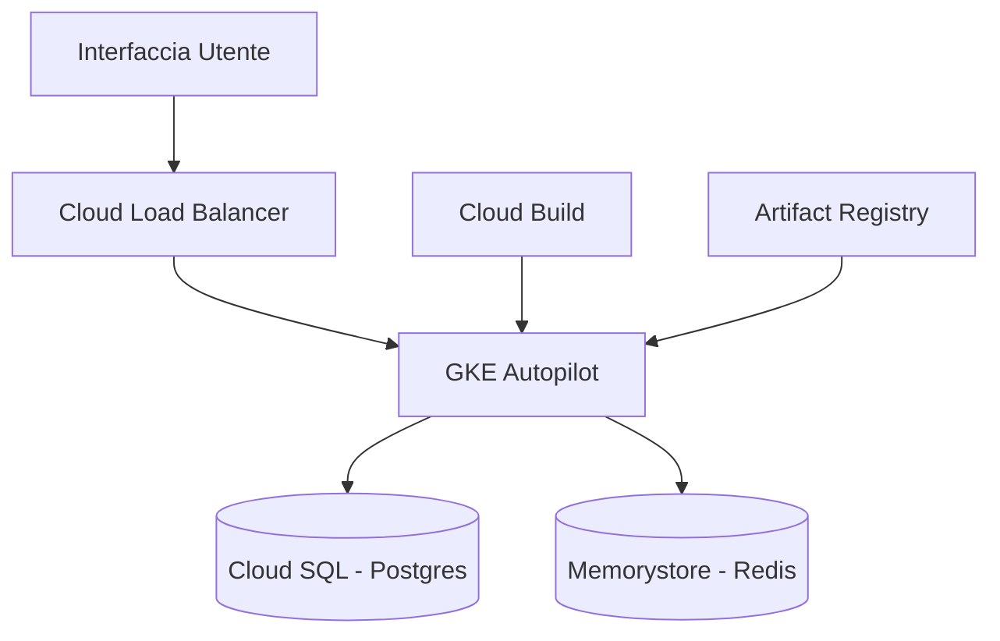

# Setup Infrastruttura GCP

> **Categoria**: `infrastruttura`
> **Destinatari**: Sviluppatori, DevOps, Amministratori
> **Stato**: 🟢 Completo
> **Ultimo aggiornamento**: 27/03/2026

---

## Cos'è e a Cosa Serve

Questo documento riporta la configurazione iniziale e lo stato dei servizi Google Cloud Platform (GCP) attivati per il progetto "Suite Clinica". Serve come riferimento per la topologia delle risorse, il dimensionamento dei servizi core (Database, Cache, Cluster) e le configurazioni di sicurezza (IAM).

---

## Chi lo Usa

| Ruolo | Utilizzo |
|-------|----------|
| **Amministratori** | Setup account, fatturazione e permessi IAM |
| **DevOps / DevOps** | Gestione risorse Cloud SQL, GKE, Redis |
| **Sviluppatori** | Riferimento per le specifiche tecniche dell'ambiente di produzione |

---

## Architettura Tecnica

### Componenti GCP Attivi

| Servizio | Modulo | Ruolo |
|----------|--------|-------|
| GKE Autopilot | `cluster-prod` | Orchestrazione container |
| Cloud SQL | `db-prod` | PostgreSQL 15 (Alta Disponibilità) |
| Memorystore | `cache-prod` | Redis gestito per sessioni e cache |
| Artifact Registry | `repo` | Registry Docker privato |
| Secret Manager | — | Gestione chiavi e credenziali |

### Schema dell'Architettura

---

## Dettaglio Risorse

### 1. Servizi e API Attivati
Abbiamo inizializzato il progetto attivando i *Control Plane* necessari per operare:
*   **Kubernetes Engine API**: Per gestire i container.
*   **Cloud SQL Admin API**: Per gestire i database relazionali.
*   **Artifact Registry API**: Per lo storage delle immagini Docker.
*   **Cloud Memorystore for Redis API**: Per la cache gestita.
*   **Secret Manager API**: Per la sicurezza delle credenziali.
*   **Cloud Build API**: Per la pipeline di CI/CD nativa.

### 2. Cluster Kubernetes (GKE Autopilot)
**Risorsa:** `suite-clinica-cluster-prod`
- **Configurazione**: Modalità **Autopilot** (Fully Managed).
- **Regione**: `europe-west8` (Milano).
- **Vantaggi**: Scalabilità automatica e riduzione dei costi (pay-per-pod).

### 3. Database (Cloud SQL PostgreSQL)
**Risorsa:** `suite-clinica-db-prod`
- **Motore**: PostgreSQL 15 Enterprise.
- **Specifiche**: 4 vCPU, 16 GB RAM, 500 GB SSD (auto-increase).
- **Disponibilità**: Multi-Zona (Failover <60s).
- **Backup**: Giornalieri (30gg) + Point-in-Time Recovery.

### 4. Cache (Memorystore for Redis)
**Risorsa:** `suite-clinica-cache-prod`
- **Tier**: Standard (Alta Disponibilità).
- **Dimensionamento**: 5 GB.
- **Sicurezza**: AUTH abilitato.

### 5. Magazzino Codice (Artifact Registry)
**Risorsa:** `suite-clinica-repo`
- **Formato**: Docker.
- **Security**: Scansione vulnerabilità automatica attiva.

---

## Note Operative e Casi Limite

> [!WARNING]
> Il database `db-prod` utilizza attualmente un IP Pubblico come workaround temporaneo per limitazioni IAM. È prioritario migrare a un Private Service Access non appena i permessi saranno regolarizzati dall'Owner.

### Documenti Correlati

- [Analisi CI/CD](./ci_cd_analysis.md)
- [Compliance Infrastruttura](./infrastructure_compliance_report.md)
- [Panoramica Generale](../00-panoramica/overview.md)
