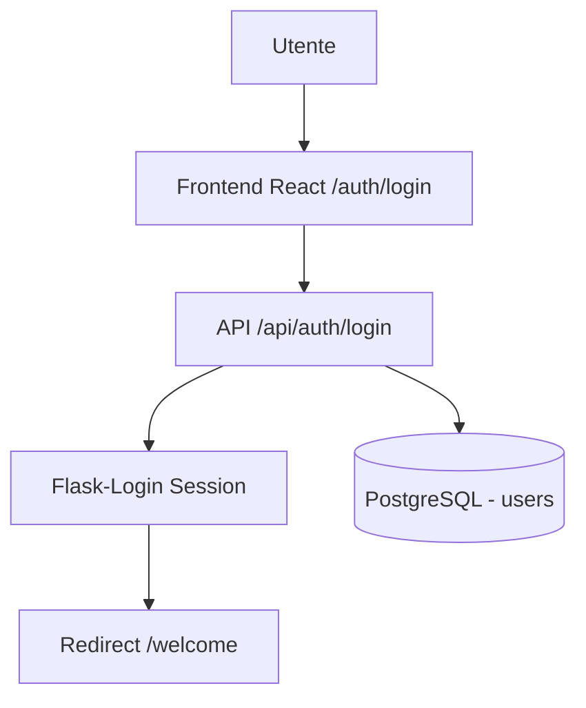

# Autenticazione

# Autenticazione

> **Categoria**: `team-organizzazione`
> **Destinatari**: Sviluppatori, Professionisti
> **Stato**: 🟢 Completo
> **Ultimo aggiornamento**: 27/03/2026

---

## Cos'è e a Cosa Serve

Il modulo di autenticazione gestisce l'accesso sicuro alla Suite Clinica. Ogni membro del team accede con le proprie credenziali (email + password) e ottiene una sessione valida per navigare nelle aree a cui è autorizzato.

Per motivi operativi (supporto, debug, formazione), gli amministratori possono anche **accedere temporaneamente come un altro utente** tramite la funzione di impersonation, con piena tracciabilità dell'azione.

---

## Chi lo Usa

| Ruolo | Azione |
|-------|--------|
| **Tutti i professionisti** | Login / logout, reset password |
| **Amministratori** | Impersonation di altri utenti, gestione sessioni |
| **Team IT** | Configurazione chiavi di sicurezza, deploy |

---

## Flusso Principale (dal punto di vista dell'utente)

### Login

```
1. L'utente apre /auth/login e inserisce email + password
2. Il backend verifica email nel DB → controlla is_active
3. Se le credenziali sono corrette → sessione Flask-Login creata
4. Redirect a /welcome (dashboard principale)
```

**Opzione "Ricordami"**: se selezionata, la sessione viene mantenuta anche dopo la chiusura del browser (cookie persistente).

### Reset password

```
1. L'utente va su /auth/forgot-password e inserisce la sua email
2. Il backend genera un token firmato (URLSafeTimedSerializer, TTL: 1 ora)
3. Email inviata con link /auth/reset-password/<token>
4. L'utente imposta la nuova password (validazione: min 8 char, maiuscola,
   minuscola, numero, carattere speciale)
5. Email di conferma inviata con IP della richiesta
```

> [!NOTE]
> La risposta al "forgot password" è sempre positiva, anche se l'email non esiste. Questo protegge la privacy degli utenti (non si rivela chi è registrato).

### Impersonation (Admin Only)

Permette agli admin di navigare la suite nei panni di un altro utente, utile per supporto e debug.

```
1. Admin va su /auth/impersonate
2. Seleziona l'utente target dalla lista
3. Il sistema:
   - Crea un record ImpersonationLog (admin_id, user_id, IP, timestamp)
   - Fa logout dell'admin
   - Fa login come utente target
   - Salva in sessione: impersonating=True, original_admin_id
4. L'admin naviga come se fosse l'utente target
5. Per tornare: "Stop impersonation"
   - Il log viene chiuso (ended_at)
   - Viene ripristinato il login dell'admin
```

> [!IMPORTANT]
> Non è possibile avviare una nuova impersonation mentre se ne è già in corso una, né è possibile impersonare se stessi.

---

## Architettura Tecnica

### Componenti coinvolti

| Layer | File / Modulo | Ruolo |
|-------|--------------|-------|
| Backend | `blueprints/auth/` | Route server-side, template Jinja2 |
| Backend | `blueprints/auth_api/` | REST API JSON |
| Frontend | `src/pages/auth/` | Interfaccia React di login |
| Database | Modello `User` | Persistenza dati utenti |

### Schema del flusso



Il modulo è composto da **due blueprint separati**:

| Blueprint | Prefix | Scopo |
|-----------|--------|-------|
| `auth` (`auth_bp`) | — (nessun prefix) | Route server-side, template Jinja2 |
| `auth_api` (`auth_api_bp`) | `/api/auth` | REST API JSON per il frontend React |

Il frontend React usa esclusivamente le API REST (`/api/auth`). Le route server-side sono un fallback legacy per casi specifici.

**Protezione CSRF**: il blueprint API è esplicitamente esente (`csrf.exempt`), perché usa sessioni con cookie HttpOnly che offrono protezione equivalente.

---

## Endpoint API Principali

| Metodo | Endpoint | Auth richiesta | Descrizione |
|--------|----------|---------------|-------------|
| `POST` | `/api/auth/login` | No | Login con email/password |
| `POST` | `/api/auth/logout` | Sì | Logout utente corrente |
| `GET` | `/api/auth/me` | No | Info utente corrente (o `{authenticated: false}`) |
| `POST` | `/api/auth/forgot-password` | No | Richiesta email reset |
| `GET` | `/api/auth/verify-reset-token/<token>` | No | Verifica validità token |
| `POST` | `/api/auth/reset-password/<token>` | No | Imposta nuova password |
| `GET` | `/api/auth/impersonate/users` | Admin | Lista utenti impersonabili |
| `POST` | `/api/auth/impersonate/<user_id>` | Admin | Avvia impersonation |
| `POST` | `/api/auth/stop-impersonation` | Admin (in imp.) | Termina impersonation |

### Payload login

```json
POST /api/auth/login
{
  "email": "mario.rossi@corposostenibile.com",
  "password": "SecurePass1!",
  "remember_me": false
}
```

### Risposta `/api/auth/me`

```json
{
  "authenticated": true,
  "user": {
    "id": 42,
    "email": "mario.rossi@corposostenibile.com",
    "first_name": "Mario",
    "last_name": "Rossi",
    "full_name": "Mario Rossi",
    "is_admin": false,
    "role": "professionista",
    "specialty": "nutrizione",
    "avatar_path": "/static/avatars/mario_rossi.jpg",
    "is_trial": false,
    "trial_stage": null,
    "is_health_manager_team_leader": false,
    "impersonating": false,
    "original_admin_name": null
  }
}
```

---

## Modelli di Dati Principali

### `User` (tabella `users`)

| Campo | Tipo | Note |
|-------|------|------|
| `id` | Integer PK | — |
| `email` | String(255) | Unique, indexed |
| `password_hash` | String(255) | Werkzeug hash |
| `first_name`, `last_name` | String(80) | — |
| `is_admin` | Boolean | Privilegi admin |
| `is_active` | Boolean | False = accesso bloccato |
| `role` | `UserRoleEnum` | Vedi tabella ruoli |
| `specialty` | `UserSpecialtyEnum` | Specializzazione clinica |
| `last_login_at` | DateTime | Ultimo accesso |
| `last_password_change_at` | DateTime | — |
| `reset_token` | String(128) | Token one-time reset |
| `is_trial` | Boolean | Utente in periodo di prova |
| `trial_stage` | Integer | Fase del trial (1/2/3) |

### `ImpersonationLog` (tabella `impersonation_logs`)

| Campo | Tipo | Note |
|-------|------|------|
| `id` | Integer PK | — |
| `admin_id` | FK → `users.id` | Chi ha avviato l'impersonation |
| `impersonated_user_id` | FK → `users.id` | Chi è stato impersonato |
| `ip_address` | String | IP di provenienza |
| `user_agent` | String | Stringa browser |
| `started_at` | DateTime | Inizio sessione |
| `ended_at` | DateTime | Fine sessione (null se ancora attiva) |

---

## Variabili d'Ambiente Rilevanti

| Variabile | Utilizzo |
|-----------|---------|
| `SECRET_KEY` | Chiave Flask per firma cookie di sessione e token |
| `SECURITY_PASSWORD_SALT` | Salt aggiuntivo per token di reset password (default: `"pw-reset"`) |
| `MAIL_SERVER`, `MAIL_PORT`, `MAIL_USERNAME`, `MAIL_PASSWORD`, `MAIL_DEFAULT_SENDER` | Configurazione SMTP per invio email di reset |

---

## Regole di validazione password

La password deve rispettare **tutti** i criteri seguenti:
- Almeno **8 caratteri**
- Almeno **una lettera maiuscola**
- Almeno **una lettera minuscola**
- Almeno **un numero**
- Almeno **un carattere speciale** (`!@#$%^&*(),.?":{}|<>`)

---

## Note Operative e Casi Limite

- **Rollback preventivo**: prima di ogni query di login viene eseguito `db.session.rollback()` per evitare errori da transazioni aperte da richieste precedenti.
- **Sessione Google OAuth2**: gestita separatamente da Flask-Dance (blueprint `google`). Il token OAuth non è usato per l'autenticazione alla suite, ma solo per le integrazioni (Calendar, ecc.).
- **Impersonation + stato sessione**: le chiavi di sessione (`impersonating`, `original_admin_id`, ecc.) vengono impostate **dopo** `login_user()`, perché Flask-Login resetta parzialmente la sessione al login.
- **Trial users**: gli utenti `is_trial` hanno accesso limitato in base a `trial_stage`. Non sono bloccati dall'auth, ma la visibilità dei dati è ristretta dai componenti React.

---

## Documenti Correlati

- → [Team & Professionisti](./team-professionisti.md) — ruoli e struttura organizzativa
- → [Panoramica generale](../00-panoramica/overview.md) — visione d'insieme della suite
