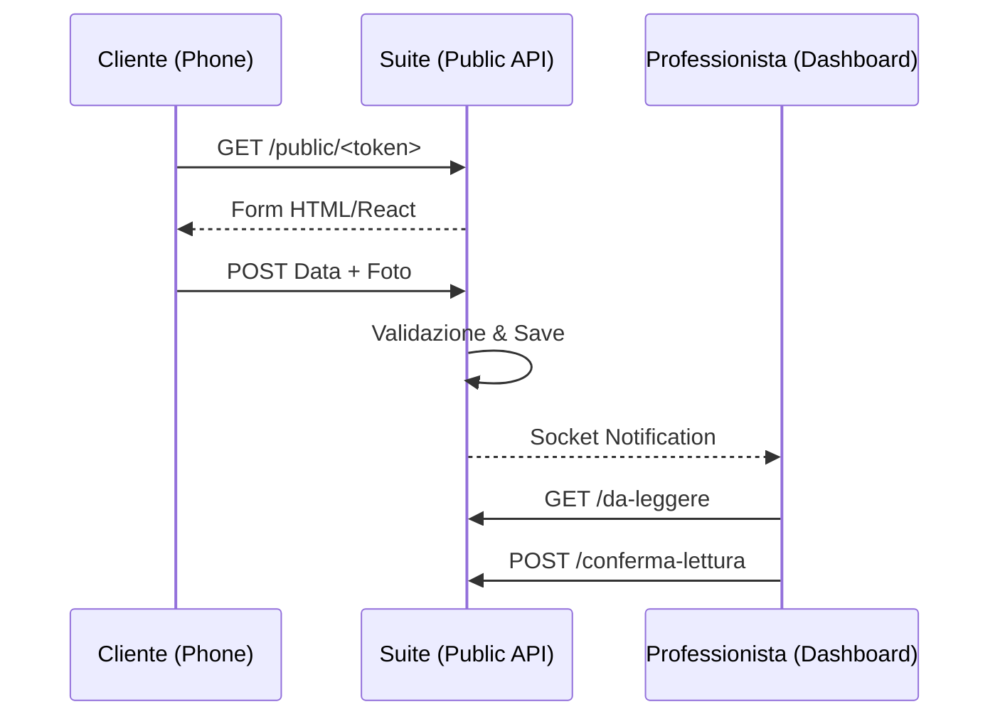

# Check Periodici

> **Categoria**: `clienti`
> **Destinatari**: Sviluppatori, Professionisti, Admin
> **Stato**: 🟢 Completo
> **Ultimo aggiornamento**: 27/03/2026

---

## Cos'è e a Cosa Serve

Il sistema di check periodici permette ai professionisti di raccogliere feedback regolari dai propri pazienti attraverso form digitali. Il paziente riceve un link personalizzato via WhatsApp o email, compila il form senza necessità di login, e i dati vengono aggregati nella suite per il monitoraggio clinico e il calcolo del Quality Score.

---

## Chi lo Usa

| Ruolo | Utilizzo |
|-------|----------|
| **Clienti** | Compilazione feedback settimanale o specifico (DCA) |
| **Professionisti** | Lettura feedback, visione foto progresso, conferma lettura |
| **Admin** | Creazione template form (Form Builder) e assegnazione manuale |
| **Coordinatori** | Valutazione "Quality Score" basata sulle risposte |

Il sistema è composto da **tre tipologie di check distinte**, ognuna con struttura e scopo differente:

| Tipo | Nome | Quando | Chi lo compila |
|------|------|--------|---------------|
| **Weekly Check** | Check Settimanale | Ogni settimana | Il cliente, via link permanente |
| **DCA Check** | Check DCA | Periodicamente (pazienti psicologici con DCA) | Il cliente, via link permanente |
| **Check Generico (CheckForm)** | Form personalizzato | Su richiesta del professionista | Il cliente, via token unico per assegnazione |

---

## Flusso Principale (Technical Workflow)

1. **Assignment**: L'admin o il sistema assegna un form (link permanente o token unico).
2. **Notification**: Il link viene inviato al cliente.
3. **Submission**: Il cliente compila il form (pubblico, bypass CSRF).
4. **Ingestion**: I dati vengono salvati in JSONB o tabelle strutturate (Weekly/DCA).
5. **Review**: Il professionista riceve la notifica e conferma la lettura nella Inbox.

---

## Architettura Tecnica

### Componenti coinvolti

| Layer | Componente | Ruolo |
|-------|------------|-------|
| Backend | `check_forms_bp` | Gestione template e assegnazioni |
| Public | `public_checks_bp` | Rendering form pubblici e upload foto |
| Storage | `uploaded_file` | Gestione persistenza foto su PVC |

### Schema del Flusso Check



---

## Le tre tipologie di check

### 1. Weekly Check (Check Settimanale)

È il check più usato: ogni paziente ha un **link permanente** che può compilare ogni settimana. Il link non cambia mai — ogni compilazione genera un nuovo record `WeeklyCheckResponse`.

**Dati raccolti**:

| Categoria | Campi |
|-----------|-------|
| **Foto fisico** | Frontale, laterale, posteriore (upload immagine) |
| **Domande aperte** | Cosa ha funzionato, cosa no, cosa ha imparato, focus settimana prossima, infortuni, aderenza piano alimentare, aderenza piano sporitvo, passi medi, settimane completate, giorni allenamento, tematiche LIVE, commenti extra |
| **Valutazioni 0–10** | Digestione, energia, forza, fame, sonno, umore, motivazione |
| **Peso** | In Kg |
| **Feedback professionisti** | Valutazione (1–10) + testo per nutrizionista, psicologo, coach |
| **Valutazione percorso** | Voto complessivo (1–10) |
| **Referral** | Nome/telefono/email di un contatto da segnalare |

**Snapshot professionisti**: al momento della compilazione, il sistema salva gli ID dei professionisti assegnati (`nutritionist_user_id`, `psychologist_user_id`, `coach_user_id`) per garantire che il feedback sia storicizzato correttamente anche in caso di future riassegnazioni.

---

### 2. DCA Check

Struttura analoga al Weekly Check ma dedicata ai pazienti con patologie DCA (Disturbi del Comportamento Alimentare). Ha un proprio link permanente (`DCACheck.token`) e raccoglie dati specifici per il monitoraggio psicologico.

---

### 3. Check Generico (CheckForm Builder)

Un sistema flessibile che permette agli admin di creare **template di form personalizzati** con campi di qualsiasi tipo, da assegnare manualmente a clienti specifici.

#### Form Builder

I template `CheckForm` sono composti da campi `CheckFormField` con tipi:

| Tipo campo | Descrizione |
|-----------|-------------|
| `text` | Testo breve |
| `textarea` | Testo lungo |
| `number` | Numero |
| `email` | Indirizzo email |
| `select` | Selezione singola da lista |
| `multiselect` | Selezione multipla da lista |
| `radio` | Scelta singola (pulsanti) |
| `checkbox` | Selezione multipla (caselle) |
| `scale` | Scala numerica (configurabile min/max) |
| `date` | Data |
| `file` | Upload file |
| `rating` | Valutazione a stelle |
| `yesno` | Sì/No |

Ogni campo può avere: label, placeholder, testo di aiuto, opzioni (JSONB), obbligatorietà, posizione.

#### Assegnazione a un cliente

```
Admin → "Assegna form" → seleziona template + cliente
→ Sistema genera token univoco (secrets.token_urlsafe(32))
→ Crea ClientCheckAssignment (cliente_id, form_id, token)
→ Link pubblico: /client-checks/public/<token>
```

Ogni assegnazione è **indipendente** — lo stesso template può essere assegnato più volte allo stesso cliente, generando token distinti.

---

## Flusso: compilazione da parte del cliente

```
1. Il cliente riceve il link (via WhatsApp/email/GHL)
2. Apre /client-checks/public/<token> — nessun login richiesto
3. Vede il form con i suoi campi (o il Weekly Check se è un link permanente)
4. Compila e invia
5. Il sistema salva la risposta:
   - WeeklyCheckResponse (per Weekly Check)
   - DCACheckResponse (per DCA Check)
   - ClientCheckResponse con JSONB (per form generico)
6. Reindirizzamento a pagina di conferma
7. Il professionista riceve notifica (webhook/socket)
```

> [!NOTE]
> Le route `/client-checks/public/<token>` sono **escluse da CSRF** perché sono form pubblici accessibili senza autenticazione. Il token fungere da meccanismo di autenticazione implicita.

---

## Flusso: lettura dei check da parte del professionista

Il professionista ha una **Inbox check** (`/client-checks/da-leggere`) che mostra tutti i check non ancora letti dei propri clienti:

```
1. Il sistema carica tutti i clienti visibili al professionista
2. Per ogni cliente, cerca WeeklyCheckResponse e DCACheckResponse
   non ancora confermati (LEFT JOIN con ClientCheckReadConfirmation)
3. Mostra la lista ordinata per data (più recente prima)
4. Il professionista clicca su un check → lo legge
5. Clicca "Conferma lettura" → crea ClientCheckReadConfirmation
   (response_type, response_id, user_id, read_at)
6. Il check sparisce dalla Inbox
```

**Unicità della conferma**: il constraint `uq_type_response_user_read` impedisce di confermare lo stesso check due volte.

---

## Dettaglio Implementazione

### Blueprint

| Blueprint | Prefix | Scopo |
|-----------|--------|-------|
| `client_checks` (`client_checks_bp`) | `/client-checks` | Route HTML admin + form pubblici + API |
| `client_checks_api` | `/api/client-checks` | REST API JSON per React |

Le route pubbliche (compilazione form) sono gestite dal blueprint principale. Le route admin (gestione template, assegnazioni, statistiche) sono un mix tra HTML Jinja2 (form builder) e API JSON.

### Normalizzazione path foto

Le foto caricate dai clienti nel Weekly Check possono avere path in formati diversi (assoluti, relativi, `/static/uploads/`, URL esterni). La funzione `_photo_path_to_url()` normalizza tutto a `/uploads/...` servito dalla route `uploaded_file` definita in `__init__.py`.

### Accesso ai check

```python
# Verifica se un professionista può vedere i check di un cliente:
_can_access_cliente_checks(cliente_id)
  → get_accessible_clients_query()    # RBAC basato su ruolo
     → None: Admin (passa sempre)
     → subquery: Team Leader, Professionista
```

---

## Endpoint API Principali

### Route admin (autenticazione richiesta)

| Metodo | Endpoint | Descrizione |
|--------|----------|-------------|
| `GET` | `/client-checks/` | Dashboard: statistiche generali, form e risposte recenti |
| `GET` | `/client-checks/da-leggere` | Inbox check non letti del professionista |
| `POST` | `/client-checks/conferma-lettura/<type>/<id>` | Conferma lettura check |
| `GET` | `/client-checks/forms/` | Lista template form |
| `GET/POST` | `/client-checks/forms/create` | Crea nuovo template |
| `GET/POST` | `/client-checks/forms/<id>/edit` | Modifica template |
| `GET` | `/client-checks/forms/<id>/preview` | Anteprima template |
| `POST` | `/client-checks/forms/<id>/delete` | Elimina template (soft delete) |
| `GET/POST` | `/client-checks/assign` | Assegna form a un cliente |
| `GET` | `/client-checks/assignments/` | Lista assegnazioni |
| `GET` | `/client-checks/responses/` | Lista risposte ricevute |
| `GET` | `/client-checks/responses/<id>` | Dettaglio singola risposta |

### Route API JSON

| Metodo | Endpoint | Descrizione |
|--------|----------|-------------|
| `GET` | `/api/client-checks/weekly/<cliente_id>` | Check settimanali del cliente |
| `GET` | `/api/client-checks/dca/<cliente_id>` | Check DCA del cliente |
| `GET` | `/api/client-checks/weekly/<id>/responses` | Tutte le compilazioni di un Weekly Check |
| `POST` | `/api/client-checks/weekly/assign` | Assegna Weekly Check a un cliente |
| `POST` | `/api/client-checks/dca/assign` | Assegna DCA Check a un cliente |

### Route pubbliche (senza autenticazione)

| Metodo | Endpoint | Descrizione |
|--------|----------|-------------|
| `GET` | `/client-checks/public/<token>` | Visualizza e compila il form |
| `POST` | `/client-checks/public/<token>` | Invia la compilazione |
| `GET` | `/client-checks/public/<token>/success` | Pagina conferma invio |

---

## Modelli di Dati Principali

### `WeeklyCheck` (tabella `weekly_checks`)

| Campo | Tipo | Note |
|-------|------|------|
| `id` | Integer PK | — |
| `cliente_id` | FK → `clienti.cliente_id` | Cliente assegnato |
| `token` | String(64) | Token permanente univoco |
| `is_active` | Boolean | Link attivo/disattivato |
| `assigned_by_id` | FK → `users.id` | Chi ha assegnato |
| `assigned_at` | DateTime | Data assegnazione |
| `deactivated_at` | DateTime | Data disattivazione (se null = attivo) |

### `WeeklyCheckResponse` (tabella `weekly_check_responses`)

| Campo | Tipo | Contenuto |
|-------|------|-----------|
| `weekly_check_id` | FK | Link al check permanente |
| `submit_date` | DateTime | Data compilazione |
| `photo_front/side/back` | String(500) | URL foto fisico |
| `what_worked` / `what_didnt_work` / ... | Text | Domande aperte (13 campi) |
| `digestion_rating` … `motivation_rating` | Integer | Valutazioni 0–10 (7 campi) |
| `weight` | Float | Peso in Kg |
| `nutritionist_rating` / `_feedback` | Integer / Text | Feedback nutrizionista |
| `psychologist_rating` / `_feedback` | Integer / Text | Feedback psicologo |
| `coach_rating` / `_feedback` | Integer / Text | Feedback coach |
| `nutritionist_user_id` / `psychologist_user_id` / `coach_user_id` | FK | Snapshot professionisti in quel momento |
| `progress_rating` | Integer | Voto percorso complessivo |
| `coordinator_rating` / `coordinator_notes` | Integer / Text | Voto/note coordinatore (sostituisce progress_rating nel Quality Score se presente) |
| `referral` | Text | Contatto referral segnalato |

### `CheckForm` (tabella `check_forms`)

| Campo | Tipo | Note |
|-------|------|------|
| `name` | String(255) | Nome del template |
| `form_type` | Enum | `iniziale` \| `settimanale` |
| `is_active` | Boolean | Template attivo |
| `created_by_id` | FK → `users.id` | — |
| `department_id` | FK → `departments.id` | Dipartimento di appartenenza (opzionale) |

### `CheckFormField` (tabella `check_form_fields`)

| Campo | Tipo | Note |
|-------|------|------|
| `form_id` | FK → `check_forms.id` | — |
| `label` | String(255) | Etichetta campo |
| `field_type` | Enum | Vedi tabella tipi sopra |
| `is_required` | Boolean | Obbligatorio o meno |
| `position` | Integer | Ordine nel form |
| `options` | JSONB | Opzioni per select/radio/scale/checkbox |

### `ClientCheckAssignment` (tabella `client_check_assignments`)

| Campo | Tipo | Note |
|-------|------|------|
| `cliente_id` | FK → `clienti` | Cliente assegnato |
| `form_id` | FK → `check_forms` | Template usato |
| `token` | String(64) | Token accesso pubblico (univoco) |
| `response_count` | Integer | Numero compilazioni ricevute |
| `last_response_at` | DateTime | Data ultima compilazione |
| `is_active` | Boolean | Link attivo |

### `ClientCheckResponse` (tabella `client_check_responses`)

| Campo | Tipo | Note |
|-------|------|------|
| `assignment_id` | FK → `client_check_assignments` | — |
| `responses` | JSONB | `{ "field_id": "valore", ... }` |
| `ip_address` | String | IP del compilatore |
| `notifications_sent` | Boolean | Professionista notificato |

### `ClientCheckReadConfirmation` (tabella `client_check_read_confirmations`)

| Campo | Tipo | Note |
|-------|------|------|
| `response_type` | String | `weekly_check` \| `dca_check` |
| `response_id` | Integer | ID della risposta letta |
| `user_id` | FK → `users.id` | Professionista che ha confermato |
| `read_at` | DateTime | Timestamp conferma |

Constraint univoco su `(response_type, response_id, user_id)` — ogni professionista può confermare una sola volta per ogni risposta.

---

## Note Operative e Casi Limite

- **Link permanente vs. token unico**: il Weekly Check usa un **token permanente** (lo stesso link per tutte le compilazioni), mentre i `ClientCheckAssignment` generici usano un **token per assegnazione** (un'assegnazione = un link dedicato).
- **Reset sequenza DB**: la funzione `_fix_sequence()` viene chiamata in caso di `UniqueViolation` per correggere seq PostgreSQL disallineati dopo import di dati.
- **Costruzione URL pubblici**: la funzione `_frontend_base_url()` ha una logica di fallback a 5 livelli per trovare l'URL del frontend in qualsiasi ambiente (configurazione, Origin header, Referer, X-Forwarded-Host, host request).
- **Quality Score**: il campo `coordinator_rating` sostituisce `progress_rating` nel calcolo del Quality Score professionale se presente — questo permette al coordinatore di esprimere una valutazione indipendente.
- **Foto e path storage**: le foto dei check vengono caricate su un PVC (Persistent Volume Claim) in Kubernetes e servite tramite la route `/uploads/`. Non risiedono nel filesystem Flask Static.
- **Notifiche**: dopo ogni compilazione, il sistema invia notifiche al professionista (via socket o push notification). Il campo `notifications_sent` traccia l'avvenuto invio.

---

## Documenti Correlati

- → [Gestione Clienti](./gestione-clienti.md) — scheda paziente, CRUD, stati percorso
- → [Team & Professionisti](../02-team-organizzazione/team-professionisti.md) — assegnazione clienti ai team
- → [Panoramica generale](../00-panoramica/overview.md) — visione d'insieme della suite
