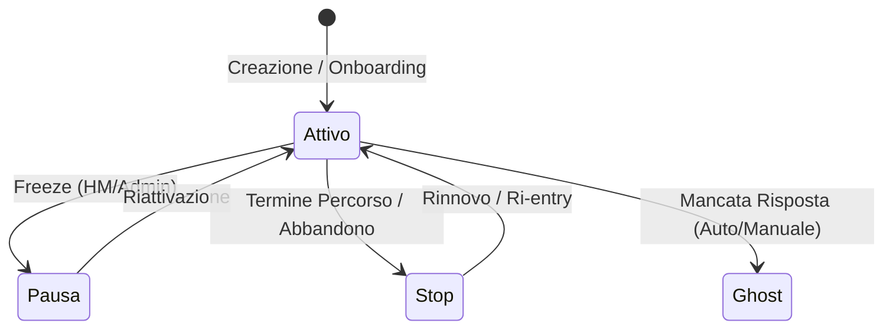

# Gestione Clienti

> **Categoria**: `clienti`
> **Destinatari**: Sviluppatori, Professionisti, Amministratori
> **Stato**: 🟢 Completo
> **Ultimo aggiornamento**: 27/03/2026

---

## Cos'è e a Cosa Serve

Il modulo clienti è il **nucleo operativo** della Suite Clinica. Ogni paziente è rappresentato da una scheda (`Cliente`) che raccoglie tutti i dati clinici, amministrativi, relazionali e di tracciamento del percorso, permettendo una gestione centralizzata e collaborativa tra i diversi professionisti della salute.

---

## Chi lo Usa

| Ruolo | Utilizzo |
|-------|----------|
| **Professionisti** | Gestione clinica, aggiornamento piani e monitoraggio diario |
| **Health Manager** | Onboarding, gestione commerciale e monitoraggio soddisfazione |
| **Team Leader / CCO** | Supervisione casi clinici e performance del team |
| **Amministratori** | Gestione configurazioni, permessi e audit log |

Funzionalità principali:
- Anagrafica completa del paziente con 70+ campi strutturati
- Assegnazione ai professionisti (nutrizionista, coach, psicologa, consulente, health manager)
- Stati del percorso per ogni servizio (nutrizione, coaching, psicologia)
- Storico versioni completo (ogni modifica è tracciata e ripristinabile)
- Dashboard con KPI per monitorare l'andamento del portfolio clienti
- Gestione scadenze, rinnovi, freeze e transizioni di stato
- Integrazione con GHL, Trustpilot e sistemi di payment interno

---

## Chi lo usa e cosa vede

La visibilità dei clienti è determinata dal ruolo dell'utente loggato:

| Ruolo | Visibilità |
|-------|-----------|
| **Admin** | Tutti i clienti senza restrizioni |
| **CCO** | Tutti i clienti senza restrizioni |
| **Team Leader** | Clienti assegnati ai membri dei propri team (incluso sé stesso) |
| **Professionista** | Propri clienti (come nutrizionista/coach/psicologa) + clienti con `ClienteProfessionistaHistory` attivo + clienti con CallBonus accettata assegnata a lui |
| **Health Manager** | Clienti del proprio portfolio HM |
| **Influencer** | Solo clienti con `origine_id` associato alle sue origins |

> [!IMPORTANT]
> La visibilità si applica sia alle liste che ai dati di dettaglio. Un professionista non può aprire la scheda di un cliente non suo.

---

## Flusso Principale (dal punto di vista dell'utente)

### Visualizzazione lista clienti

```
1. Il professionista accede a /clienti (App React)
2. Il frontend carica la lista filtrata per ruolo
   → Admin/CCO: tutti i clienti
   → Professionista: solo i propri
3. La lista mostra: nome, stato, scadenza, team di appartenenza,
   professionisti assegnati, tipologia cliente
4. Filtri disponibili per trovare rapidamente i pazienti
```

### Apertura scheda cliente

La scheda paziente è organizzata in **tab tematici**:

| Tab | Contenuto |
|-----|-----------|
| **Generale** | Anagrafica base, contatti, programma, obiettivo |
| **Nutrizione** | Piano alimentare, stato nutrizione, storia nutrizionale, date |
| **Coach** | Piano allenamento, storia coaching, luogo allenamento |
| **Psicologia** | Stato psicologia, sedute, storia psicologica |
| **Health Manager** | Consensi social, recensioni, referral, marketing flags |
| **Pagamenti** | Pagamenti interni, stato approvazione, rinnovi |
| **Storico** | Cronologia modifiche con possibilità di ripristino versione |
| **Diario** | Voci del diario del cliente |
| **Check** | Check settimanali e DCA compilati dal cliente |

### Creazione di un nuovo cliente

```
1. Admin/professionista → "+ Nuovo Cliente"
2. Inserisce nome, email, programma, team di appartenenza
3. Assegna i professionisti (nutrizionista, coach, psicologa, HM)
4. Salva → cliente creato con stato "attivo"
5. Il sistema calcola automaticamente data_rinnovo:
   data_inizio_abbonamento + durata_programma_giorni
```

### Aggiornamento di un campo (in-place editing)

La scheda cliente supporta **modifica in-place** senza ricaricare la pagina:

```
PATCH /customers/<id>/field
{ "field": "stato_cliente", "value": "pausa" }
→ Validazione Marshmallow → aggiornamento → ActivityLog
```

L'aggiornamento multiplo di campi avviene via:
```
POST /customers/<id>/update
{ ...campi multipli... }
```

### Freeze di un cliente

Il "freeze" è una pausa del percorso. Solo Health Manager (dept. 13) o admin possono attivarlo:

```
POST /customers/<id>/freeze
{ "freeze_reason": "Motivo della pausa" }
→ stato_cliente = 'pausa'
→ Record in ClienteFreezeHistory (motivo, data inizio, responsabile)
```

### Storico versioni e ripristino

Ogni modifica alla scheda cliente è versionata tramite **SQLAlchemy-Continuum**:

```
GET /customers/<id>/history/json
→ Lista delle ultime 50 versioni con:
   - timestamp (timezone Europe/Rome)
   - utente che ha fatto la modifica
   - campi cambiati (vecchio → nuovo valore)
   - tipo operazione (Creazione / Modifica / Eliminazione)

POST /customers/<id>/history/<tx_id>/restore
→ Ripristina lo stato alla versione selezionata
```

---

## Architettura Tecnica

### Componenti coinvolti

| Layer | File / Modulo | Ruolo |
|-------|--------------|-------|
| Backend | `blueprints/customers/` | API REST, logica business, versioning |
| Frontend | `src/pages/customers/` | Scheda paziente React (Tab-based) |
| Database | Modello `Cliente` | Persistenza dati (tabella `clienti`) |

### Schema del Ciclo di Vita Cliente



### Blueprint

| Blueprint | Prefix | Scopo |
|-----------|--------|-------|
| `customers` (`customers_bp`) | `/customers` | REST API backend + endpoints legacy |

Il frontend React consuma le API via `/customers/<id>/...`. Non esiste un'interfaccia HTML separata — tutto il rendering è lato React.

### Pattern RBAC

```
routes.py
  └→ services.apply_role_filtering(query)
       └→ Filtra la SQLAlchemy query in base a current_user.role
             → Admin: nessun filtro
             → Team Leader: filtra per team.members IDs
             → Professionista: filtra per assegnazioni dirette + history + CallBonus

permissions.py
  └→ CustomerPerm enum: VIEW, EDIT, DELETE, CREATE, EXPORT, ...
     has_permission(user, perm) → True per tutti gli utenti autenticati (policy attuale)
```

> [!NOTE]
> Il sistema di permessi `CustomerPerm` è strutturato per supportare regole granulari, ma attualmente tutti gli utenti autenticati hanno accesso completo ai permessi: la visibilità è controllata **solo a livello di query** tramite `apply_role_filtering`.

### Calcolo automatico date

Il backend calcola automaticamente le date di scadenza ogni volta che vengono aggiornate data di inizio o durata:

```
data_rinnovo = data_inizio_abbonamento + durata_programma_giorni
data_scadenza_nutrizione = data_inizio_nutrizione + durata_nutrizione_giorni
data_scadenza_coach      = data_inizio_coach + durata_coach_giorni
data_scadenza_psicologia = data_inizio_psicologia + durata_psicologia_giorni
```

---

## Endpoint API Principali

| Metodo | Endpoint | Auth | Descrizione |
|--------|----------|------|-------------|
| `GET` | `/customers/` | Sì | Lista clienti (con filtri e paginazione) |
| `GET` | `/customers/<id>` | Sì | Dettaglio cliente |
| `POST` | `/customers/new` | Sì | Crea nuovo cliente |
| `PATCH` | `/customers/<id>/field` | Sì | Aggiorna singolo campo (in-place) |
| `POST` | `/customers/<id>/update` | Sì | Aggiorna campi multipli |
| `POST` | `/customers/<id>/delete` | Admin | Elimina cliente (hard delete) |
| `POST` | `/customers/<id>/freeze` | Admin/HM | Attiva freeze |
| `GET` | `/customers/<id>/history/json` | Sì | Storico versioni |
| `POST` | `/customers/<id>/history/<tx>/restore` | Sì | Ripristina versione |
| `POST` | `/customers/dashboard/data` | Sì | KPI dashboard (con filtri) |

### Filtri lista clienti

I filtri vengono applicati via `customers/filters.py`:

| Parametro | Tipo | Descrizione |
|-----------|------|-------------|
| `q` | string | Ricerca full-text (nome/cognome) via PostgreSQL FTS |
| `stato_cliente` | string | Stato principale (`attivo`, `stop`, `pausa`, `ghost`) |
| `stato_nutrizione` | string | Stato servizio nutrizione |
| `stato_coach` | string | Stato servizio coaching |
| `stato_psicologia` | string | Stato servizio psicologia |
| `nutrizionista_id` | int | Filtro per professionista assegnato |
| `di_team` | string | Team di appartenenza |
| `tipologia_cliente` | string | Tipologia cliente (es. A, B, C) |
| `patologia` | string | Filtro per patologia presente |
| `nessuna_patologia` | bool | Solo clienti senza patologie |
| `in_scadenza` | bool | Clienti con rinnovo imminente (≤30 giorni) |
| `page` / `per_page` | int | Paginazione |

---

## Modelli di Dati Principali

Tabella: `clienti` — versionata con SQLAlchemy-Continuum (`__versioned__ = {}`)

### Sezione: Anagrafica base

| Campo | Tipo | Note |
|-------|------|------|
| `cliente_id` | BigInteger PK | — |
| `nome_cognome` | String(255) | Obbligatorio |
| `mail` | String(255) | Email |
| `numero_telefono` | String(50) | — |
| `data_di_nascita` | Date | — |
| `genere` | String(20) | M/F/Altro |
| `paese` | String(100) | Paese di residenza |
| `indirizzo` | Text | — |
| `professione` | Text | — |
| `origine_id` | FK → `origins.id` | Canale di acquisizione |

### Sezione: Programma & Abbonamento

| Campo | Tipo | Note |
|-------|------|------|
| `programma_attuale` | Text | Programma attivo |
| `programma_attuale_dettaglio` | String(100) | Es: BP, BALANCE PLATE |
| `data_inizio_abbonamento` | Date | — |
| `durata_programma_giorni` | Integer | — |
| `data_rinnovo` | Date | Calcolata automaticamente |
| `tipologia_cliente` | `TipologiaClienteEnum` | Tipologia percorso |
| `di_team` | `TeamEnum` | Team di appartenenza |
| `modalita_pagamento` | `PagamentoEnum` | — |
| `obiettivo_cliente` | Text | Obiettivo dichiarato |

### Sezione: Professionisti assegnati

| Campo | Tipo | Note |
|-------|------|------|
| `nutrizionista_id` | FK → `users.id` | Nutrizionista principale |
| `coach_id` | FK → `users.id` | Coach principale |
| `psicologa_id` | FK → `users.id` | Psicologa principale |
| `consulente_alimentare_id` | FK → `users.id` | Consulente |
| `health_manager_id` | FK → `users.id` | Health Manager |
| `nutrizionisti_multipli` | M2M → `users` | Nutrizionisti aggiuntivi |
| `coaches_multipli` | M2M → `users` | Coach aggiuntivi |
| `psicologi_multipli` | M2M → `users` | Psicologi aggiuntivi |
| `consulenti_multipli` | M2M → `users` | Consulenti aggiuntivi |

### Sezione: Stati del percorso

| Campo | Tipo | Valori `StatoClienteEnum` |
|-------|------|--------------------------|
| `stato_cliente` | Enum | `attivo`, `stop`, `pausa`, `ghost` |
| `stato_nutrizione` | Enum | Idem |
| `stato_coach` | Enum | Idem |
| `stato_psicologia` | Enum | Idem |
| `stato_cliente_chat_nutrizione` | Enum | Stato chat per area |
| `stato_cliente_chat_coaching` | Enum | Stato chat per area |
| `stato_cliente_chat_psicologia` | Enum | Stato chat per area |

> [!NOTE]
> Ogni cambio di stato registra anche la data e l'ora in campi dedicati (`stato_nutrizione_data`, `stato_coach_data`, ecc.) per tracciabilità.

### Sezione: Scadenze per servizio

| Campo | Automaticamente calcolato da | — |
|-------|---------------------------|---|
| `data_scadenza_nutrizione` | `data_inizio_nutrizione + durata_nutrizione_giorni` | — |
| `data_scadenza_coach` | `data_inizio_coach + durata_coach_giorni` | — |
| `data_scadenza_psicologia` | `data_inizio_psicologia + durata_psicologia_giorni` | — |

### Sezione: Patologie

Ogni patologia è un campo `Boolean` separato. Nutrizione:

| Campo | Patologia |
|-------|-----------|
| `nessuna_patologia` | Flag "nessuna patologia" |
| `patologia_ibs` | IBS |
| `patologia_dca` | DCA |
| `patologia_diabete` | Diabete |
| `patologia_insulino_resistenza` | Insulino resistenza |
| `patologia_pcos` | PCOS |
| `patologia_tiroidee` | Patologie tiroidee |
| `patologia_altro` | Campo testo libero |
| _(+ 10 altre)_ | reflusso, gastrite, dislipidemie, steatosi, ipertensione, endometriosi, obesità, osteoporosi, diverticolite, Crohn, stitichezza |

Psicologia:

| Campo | Patologia |
|-------|-----------|
| `nessuna_patologia_psico` | Flag "nessuna patologia psicologica" |
| `patologia_psico_dca` | DCA (psicologico) |
| `patologia_psico_ansia_umore_cibo` | Ansia/umore legato al cibo |
| `patologia_psico_immagine_corporea` | Immagine corporea |
| `patologia_psico_altro` | Campo testo libero |
| _(+ 3 altre)_ | obesità psicoemotiva, comportamenti disfunzionali, psicosomatiche, relazionali |

### Sezione: ARR & Obiettivi

| Campo | Tipo | Note |
|-------|------|------|
| `has_goals_left` | Boolean\|null | Se `False`, escluso dal denominatore ARR |
| `goals_evaluation_date` | DateTime | Data ultima valutazione |
| `evaluated_by_user_id` | FK → `users.id` | Chi ha valutato |

### Tabelle correlate

| Tabella | Scopo |
|---------|-------|
| `clienti_version` (auto-generata) | Storico versioni (SQLAlchemy-Continuum) |
| `client_freeze_history` | Storico freeze/pause |
| `cliente_professionista_history` | Storico assegnazioni professionisti |
| `pagamenti_interni` | Pagamenti e rinnovi del cliente |
| `trustpilot_reviews` | Recensioni Trustpilot associate |
| `call_bonus` | Upgrade e referral del cliente |

---

## Dashboard KPI

La dashboard clienti calcola in tempo reale (filtrati per ruolo):

| KPI | Calcolo |
|-----|---------|
| `total_active` | `COUNT(*)` dove `stato_cliente = 'attivo'` |
| `new_month` | Clienti creati nel mese corrente |
| `percent_scadenza` | `(clienti con data_rinnovo ≤ oggi+30gg) / totale × 100` |
| `nutrizione_attivo` | Clienti con `stato_nutrizione = 'attivo'` |
| `coach_attivo` | Clienti con `stato_coach = 'attivo'` |
| `psicologia_attivo` | Clienti con `stato_psicologia = 'attivo'` |

L'endpoint `POST /customers/dashboard/data` accetta filtri arbitrari e ricalcola tutto.

---

## Note Operative e Casi Limite

- **Rollback profilattico**: prima di certi endpoint viene eseguito `db.session.rollback()` per evitare errori da transazioni aperte.
- **ActivityLog**: ogni `update_cliente()` scrive un record in `ActivityLog` con user, timestamp e campi modificati. Questo è usato dallo storico versioni per identificare l'utente responsabile.
- **Enum legacy**: lo stato `'cliente'` viene automaticamente mappato a `'attivo'`, `'ex_cliente'` a `'stop'`, `'freeze'` a `'pausa'` per compatibilità con dati provenienti dal vecchio sistema GHL.
- **Assegnazione multipla professionisti**: un cliente può avere più nutrizionisti/coach/psicologi, gestiti come relazioni M2M separate dalle FK principali.
- **Full-text search**: il campo `search_vector` (tipo `TSVectorType`) è popolato automaticamente da PostgreSQL su `nome_cognome` e `consulente_alimentare`, consentendo ricerche veloci anche con milioni di record.
- **Hard delete**: la cancellazione è definitiva (no soft delete). Solo gli admin non in trial possono eliminare clienti.

---

## Documenti Correlati

- → [Check Periodici](./check-periodici.md) — form check settimanali, DCA, flusso pubblico
- → [Team & Professionisti](../02-team-organizzazione/team-professionisti.md) — assegnazioni e capienza
- → [KPI & Performance](../02-team-organizzazione/kpi-performance.md) — ARR e tasso rinnovi
- → [Panoramica generale](../00-panoramica/overview.md) — visione d'insieme della suite
