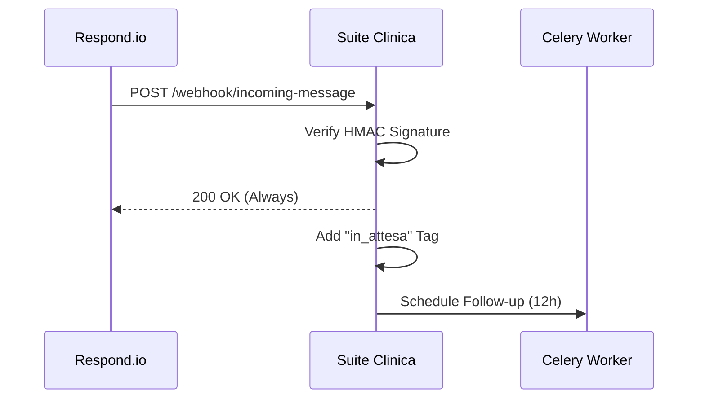

# Integrazione Respond.io (WhatsApp/Omnichannel)

> **Categoria**: `comunicazione`
> **Destinatari**: Appointment Setters, Sales, Health Managers
> **Stato**: 🟢 Completo
> **Ultimo aggiornamento**: 27/03/2026

---

## Cos'è e a Cosa Serve

L'integrazione con Respond.io costituisce il layer di comunicazione esterna omnichannel (WhatsApp, Facebook Messenger, Instagram, ecc.) della Suite Clinica. Gestisce in tempo reale la sincronizzazione dei lead, le transizioni del ciclo di vita del contatto (Lifecycle), l'invio di follow-up automatici e il tracciamento delle metriche di messaggistica per monitorare l'efficacia del team di front-end.

In particolare, permette di:
- Monitorare il **ciclo di vita (lifecycle)** di un contatto (es. Nuova Lead, In Target, Prenotato).
- Gestire **follow-up automatici** se un cliente non risponde entro 12 ore.
- Tracciare **metriche giornaliere** di messaggistica e conversioni.
- Automatizzare l'assegnazione dei tag (es. "in_attesa") per segnalare nuovi messaggi agli agenti.

---

## Chi lo Usa

| Ruolo | Utilizzo |
|-------|----------|
| **Appointment Setters** | Gestione operativa delle lead e delle conversazioni inbound |
| **Sales Team** | Monitoraggio dello stato di avanzamento commerciale (Lifecycle) |
| **Health Managers** | Verifica dell'attivazione iniziale dei nuovi clienti |

---

## Flusso Principale (Technical Workflow)

1. **Webhook Ingestion**: Respond.io invia eventi (lifecycle, messaggi) alla Suite.
2. **Lifecycle Sync**: Aggiornamento dello stato commerciale nel database locale.
3. **Automated Follow-up**: Schedulazione via Celery di messaggi di check-in dopo 12h di inattività.
4. **Tag Management**: Aggiunta/rimozione automatica di tag (es. `in_attesa`) su Respond.io via API.
5. **Metric Aggregation**: Consolidamento giornaliero dei volumi di messaggistica (`RespondIODailyMetrics`).

---

## Architettura Tecnica

### Componenti coinvolti

| Layer | Componente | Ruolo |
|-------|------------|-------|
| Webhook | `/webhook/*` | Ricezione eventi real-time da Respond.io |
| Client API | `RespondIOClient` | Chiamate outbound REST verso Respond.io |
| Worker | Celery | Scheduling follow-up asincroni e gestione Code |

### Ciclo di Vita Webhook

---

## Endpoint API e Webhook

| Endpoint | Metodo | Descrizione |
|---|---|---|
| `/webhook/new-contact` | POST | Registra la creazione di un nuovo contatto. |
| `/webhook/lifecycle-update` | POST | Registra il passaggio di stato (es. Lead -> In Target). |
| `/webhook/incoming-message` | POST | Messaggio ricevuto dal cliente (aggiunge tag "in_attesa"). |
| `/webhook/outgoing-message` | POST | Messaggio inviato dall'agente (rimuove tag "in_attesa", arma follow-up). |

---

## Modelli di Dati Principali

- `RespondIOLifecycleChange`: Storico dei cambi di stato per ogni contatto.
- `RespondIOFollowupQueue`: Coda dei follow-up programmati (Celery state).
- `RespondIODailyMetrics`: Aggregati giornalieri per il monitoraggio delle performance.

---

## Variabili d'Ambiente Rilevanti

| Variabile | Descrizione | Obbligatoria |
|-----------|-------------|--------------|
| `RESPOND_IO_API_KEY` | Chiave API per chiamate REST outbound | Sì |
| `RESPOND_IO_WEBHOOK_SECRET` | Segreto per verifica firma HMAC webhook | Sì |

---

## Note Operative e Casi Limite

- **Firma Webhook**: Tutti i webhook verificano la firma HMAC-SHA256 (`X-Webhook-Signature`) per sicurezza.
- **Risposta 200 OK**: Il sistema ritorna *sempre* 200 OK ai webhook (anche in caso di errore interno dopo il logging) per evitare che Respond.io disconnetta l'endpoint.
- **Quiet Period**: Se il follow-up cade tra mezzanotte e le 7:00 del mattino, viene posticipato alle 7:00 per non disturbare il cliente.

---

## Documenti Correlati

- [Appointment Setting](./appointment-setting.md)
- [Comunicazione Interna](./comunicazione-interna.md)
- [Notifiche Push](./notifiche-push.md)
