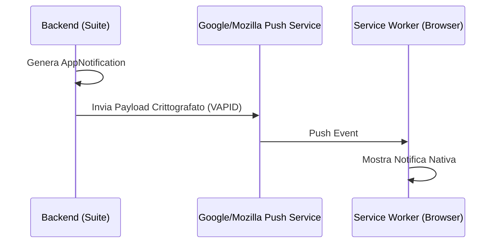

# Notifiche Push (PWA)

> **Categoria**: `comunicazione`
> **Destinatari**: Professionisti, Admin, Team Leader
> **Stato**: 🟢 Completo
> **Ultimo aggiornamento**: 27/03/2026

---

## Cos'è e a Cosa Serve

Il sistema di notifiche push permette alla Suite Clinica di inviare avvisi istantanei direttamente sul browser o sul dispositivo mobile del professionista tramite tecnologia PWA (Progressive Web App). Questo garantisce che il team risponda tempestivamente agli eventi critici (nuovi pazienti, task scaduti, messaggi urgenti) anche quando l'applicazione non è in primo piano.

---

## Chi lo Usa

| Ruolo | Utilizzo |
|-------|----------|
| **Professionisti** | Ricezione avvisi su nuovi task assegnati e check compilati |
| **Admin** | Invio di messaggi push manuali ("Broadcast") per avvisi urgenti |
| **Sviluppatori** | Gestione della sottoscrizione VAPID e del Service Worker |

---

## Flusso Principale (Technical Workflow)

1. **Subscription**: Al primo accesso, il frontend richiede il consenso e registra l'endpoint del browser.
2. **Persistence**: Le chiavi di sottoscrizione (`p256dh`, `auth`) vengono salvate in `PushSubscription`.
3. **Trigger**: Un evento di sistema (es. nuovo task) invoca il servizio di notifica.
4. **Push Delivery**: Il backend crittografa il payload (VAPID) e lo invia al push service del browser.
5. **App Notification**: Viene creato in parallelo un record `AppNotification` per lo storico interno UI.

---

## Architettura Tecnica

### Componenti coinvolti

| Layer | Componente | Ruolo |
|-------|------------|-------|
| Backend | `push_notifications` | Gestione sottoscrizioni e invio WebPush |
| Protocollo | WebPush (VAPID) | Standard di crittografia e consegna notifiche |
| Frontend | Service Worker | Ricezione del messaggio in background e visualizzazione |

### Schema di Consegna

---

## Endpoint API Principali

| Endpoint | Metodo | Descrizione |
|---|---|---|
| `/public-key` | GET | Ritorna la chiave pubblica VAPID per il frontend. |
| `/subscriptions` | POST | Registra o aggiorna un dispositivo per le notifiche. |
| `/notifications` | GET | Lista delle notifiche ricevute dall'utente (centro notifiche). |
| `/notifications/<id>/read` | POST | Segna una notifica come letta. |
| `/admin/send` | POST | (Admin) Invia una notifica push manuale a un utente. |

---

## Modelli di Dati Principali

- `PushSubscription`: Dati tecnici dell'endpoint del browser per l'invio fisico.
- `AppNotification`: Messaggi salvati nel database per la visualizzazione nel "Centro Notifiche" della UI.

---

## Variabili d'Ambiente Rilevanti

| Variabile | Descrizione | Obbligatoria |
|-----------|-------------|--------------|
| `VAPID_PUBLIC_KEY` | Chiave pubblica per la sottoscrizione frontend | Sì |
| `VAPID_PRIVATE_KEY` | Chiave privata per la firma dei payload push | Sì |
| `VAPID_CLAIM_EMAIL` | Email di contatto per il provider di push | Sì |

---

## Note Operative e Casi Limite

- **Sicurezza**: Richiede obbligatoriamente HTTPS per funzionare.
- **Service Worker**: Se il service worker non è registrato o è bloccato, la notifica non verrà mai ricevuta.
- **Gone (410)**: Se il browser risponde con 410, la sottoscrizione viene eliminata automaticamente dal database perché non più valida.

---

## Documenti Correlati

- [Task & Calendario](../04-strumenti-operativi/task-calendario.md)
- [Integrazione Respond.io](./integrazione-respond-io.md)
- [Comunicazione Interna](./comunicazione-interna.md)
