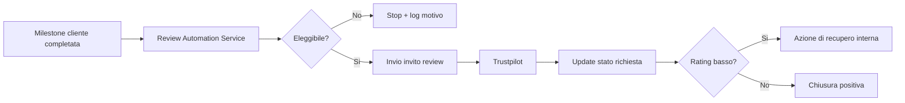

# Trustpilot e Review Automation

> **Categoria**: `integrazione`
> **Destinatari**: Sviluppatori, Marketing, Health Manager
> **Stato**: 🟡 Bozza avanzata
> **Ultimo aggiornamento**: 27/03/2026

---

## Cos'è e a Cosa Serve

Questo modulo gestisce il ciclo di richiesta recensioni post-servizio e l'allineamento con Trustpilot. Automatizza invio, monitoraggio e reporting delle review per migliorare reputazione online e tasso di testimonianze raccolte.

Obiettivi operativi:
- Inviare richieste review nei momenti a maggiore probabilita' di risposta.
- Tracciare conversione invio -> recensione pubblicata.
- Evidenziare ticket/azioni di recupero in caso di feedback negativo.

---

## Chi lo Usa

| Ruolo | Utilizzo |
|-------|----------|
| **Marketing** | Pianifica campagne review e monitora conversioni |
| **Health Manager** | Controlla qualità feedback cliente e azioni correttive |
| **Sviluppatori** | Mantiene integrazione API e automazioni di scheduling |

---

## Flusso Principale (Technical Workflow)

1. Un evento di chiusura milestone cliente attiva il trigger review.
2. Il sistema verifica eleggibilita' (consenso, timing, no duplicati recenti).
3. Parte l'invio via canale configurato (email/SMS/WhatsApp tramite connettori).
4. Lo stato richiesta viene monitorato fino a review pubblicata o timeout.
5. In caso di feedback critico, viene aperta azione interna di follow-up.

---

## Architettura Tecnica

### Componenti coinvolti

| Layer | Componente | Ruolo |
|-------|------------|-------|
| Trigger | Event listener lifecycle | Avvio richiesta review |
| Service | Review Automation Service | Regole eleggibilita' e scheduling |
| Integrazione | Trustpilot API connector | Invio inviti e raccolta stato |
| Reporting | Dashboard KPI review | Analisi tasso conversione |

### Schema del flusso

---

## Endpoint API Principali

| Metodo | Endpoint | Descrizione | Autenticazione |
|--------|----------|-------------|----------------|
| `GET` | `/api/v1/customers/trustpilot-overview` | Panoramica clienti + stato inviti/recensioni. | `CustomerPerm.VIEW` |
| `GET` | `/api/v1/customers/<cliente_id>/trustpilot` | Stato singolo cliente (latest + history). | `CustomerPerm.VIEW` |
| `POST` | `/api/v1/customers/<cliente_id>/trustpilot/link` | Genera link invito Trustpilot. | `CustomerPerm.VIEW` + ruolo manager Trustpilot |
| `POST` | `/api/v1/customers/<cliente_id>/trustpilot/invite` | Invia invito email via API Trustpilot. | `CustomerPerm.VIEW` + ruolo manager Trustpilot |

---

## Modelli di Dati Principali

- `TrustpilotReview`: storico inviti/review, reference IDs, stato pubblicazione, payload ultimo webhook/API.
- `Cliente`: anagrafica cliente usata come sorgente email e correlazione review.
- `User`: tracciamento professionista richiedente e conferme HM.

---

## Variabili d'Ambiente Rilevanti

| Variabile | Descrizione | Obbligatoria |
|-----------|-------------|--------------|
| `TRUSTPILOT_ENABLED` | Feature flag integrazione Trustpilot | Sì |
| `TRUSTPILOT_API_KEY` | Chiave API integrazione Trustpilot | Sì |
| `TRUSTPILOT_API_SECRET` | Secret API/OAuth Trustpilot | Sì |
| `TRUSTPILOT_BUSINESS_UNIT_ID` | ID account/business unit Trustpilot | Sì |
| `TRUSTPILOT_EMAIL_TEMPLATE_ID` | Template email invito recensione | Sì (per invito email) |
| `TRUSTPILOT_SENDER_EMAIL` | Sender email invito | Sì (per invito email) |
| `TRUSTPILOT_REPLY_TO` | Reply-To invito | Sì (per invito email) |

---

## Permessi e Ruoli (RBAC)

| Funzionalita' | Admin | CCO | Health Manager | Altri professionisti |
|-------------|-------|-----|----------------|--------------------|
| Visualizza overview/stato (`CustomerPerm.VIEW`) | ✅ | ✅* | ✅* | ✅* |
| Genera link/invia invito Trustpilot | ✅ | ✅ | ✅ | ❌ |
| Aggiornare configurazione env/API | ✅ | ❌ | ❌ | ❌ |

> `*` accesso dipende anche dai filtri/scope del modulo customers associati a `CustomerPerm.VIEW`.

---

## Note Operative e Casi Limite

- **Nessun webhook route dedicato**: nel codice attuale non e' esposta una route Trustpilot webhook, anche se il modello prevede campi webhook.
- **Gate autorizzativo doppio**: per azioni attive serve sia `CustomerPerm.VIEW` sia `_can_manage_trustpilot` (admin, health_manager, specialty cco).
- **Email obbligatoria cliente**: senza `cliente.mail` le route di invito ritornano `400`.
- **Token OAuth cached**: `TrustpilotService` cache in-memory access token con refresh automatico.
- **Invito link vs email**: due flussi distinti (`generated_link` / `email_invitation`) con status dedicato su `TrustpilotReview`.

---

## Documenti Correlati

- [Appointment Setting](./appointment-setting.md)
- [Integrazione Respond.io](./integrazione-respond-io.md)
- [Report completamento documentazione](../06-sviluppo-e-varie/report-completamento-documentazione.md)
