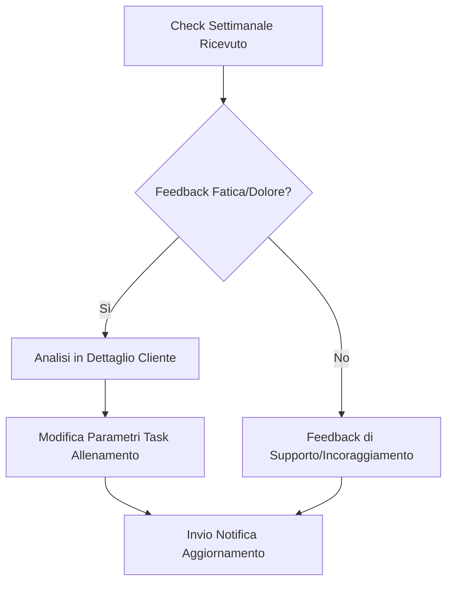

# Guida Operativa: Coach

> **Categoria**: `guida-ruolo`
> **Destinatari**: Coach, Team Leader Coaching
> **Stato**: 🟢 Completo
> **Ultimo aggiornamento**: 27/03/2026

---

## Cos'è e a Cosa Serve

Il Coach è la figura di riferimento per la gestione dell'allenamento, dello stile di vita e della motivazione del paziente. Utilizza la Suite Clinica per monitorare i volumi di allenamento, rispondere ai dubbi tecnici sulla programmazione e assicurarsi che il paziente mantenga l'aderenza necessaria al raggiungimento dei goal prefissati.

---

## Attività Giornaliere

| Attività | Frequenza | Modulo Suite |
|----------|-----------|--------------|
| Revisione Task allenamento | Quotidiana | `tasks` |
| Analisi feedback settimanali | Settimanale | `customers / client_checks` |
| Risposta chat motivazionale | Quotidiana | `comunicazioni-chat` |
| Inserimento note di progresso | Al bisogno | `diario-progresso` |

---

## Flussi Principali (Technical Workflow)

### 1. Gestione Feedback Allenamento

---

## Errori Comuni e Gotcha

- **Task Duplicati**: Prima di creare un nuovo task di allenamento, verifica che non ne esistano già di simili attivi nel calendario del paziente.
- **Visibilità**: Se non vedi un paziente assegnato, verifica con il Team Leader il corretto tagging nel reparto "Coaching".

---

## Escalation

| Problema | Referente | Strumento |
|----------|-----------|-----------|
| Infortunio riportato dal cliente | Team Leader Coach + Medico | Ticket Urgente |
| Difficoltà motivazionali gravi | Psicologo assegnato | Chat Interna / Diario Condiviso |
| Problemi accesso calendario | Supporto IT | Ticket Supporto |

---

## Documenti Correlati

- [Gestione Clienti](../03-clienti-core/gestione-clienti.md)
- [Task e Calendario](../04-strumenti-operativi/task-calendario.md)
- [Check Periodici](../03-clienti-core/check-periodici.md)
