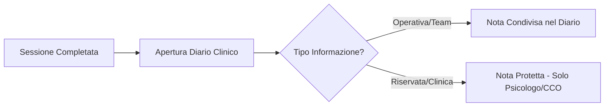

# Guida Operativa: Psicologo

> **Categoria**: `guida-ruolo`
> **Destinatari**: Psicologi, CCO
> **Stato**: 🟢 Completo
> **Ultimo aggiornamento**: 27/03/2026

---

## Cos'è e a Cosa Serve

Lo Psicologo supporta il paziente nella gestione del rapporto con il cibo, dell'immagine corporea e degli aspetti emotivi legati al percorso di cambiamento. Utilizza la Suite Clinica per tracciare l'evoluzione del benessere psicologico, gestire i colloqui e coordinarsi con gli altri professionisti del team (nutrizionista/coach) salvaguardando la privacy dei dati sensibili.

---

## Attività Giornaliere

| Attività | Frequenza | Modulo Suite |
|----------|-----------|--------------|
| Gestione Appuntamenti Colloqui | Quotidiana | `calendar` |
| Analisi indicatori psicologici Check | Settimanale | `client_checks` |
| Inserimento Note Cliniche | Dopo ogni sessione | `diario-progresso` |
| Coordinamento multidisciplinare | Al bisogno | `ticket` / `chat` |

---

## Flussi Principali (Technical Workflow)

### 1. Gestione Note Cliniche Riservate
Lo psicologo deve assicurarsi di utilizzare i campi di nota corretti protetti da RBAC.

---

## Errori Comuni e Gotcha

- **Privacy**: Evitare assolutamente la condivisione di dettagli clinici sensibili via chat interna. Usare esclusivamente il Diario Clinico con i corretti livelli di visibilità.
- **Calendario**: Sincronizzare sempre gli slot di disponibilità su Google Calendar per permettere la prenotazione dei colloqui.

---

## Escalation

| Problema | Referente | Strumento |
|----------|-----------|-----------|
| Emergenza Psichiatrica / Rischio | CCO + Medico di Riferimento | Chiamata Urgente + Ticket |
| Sospetto disturbo comportamento alimentare | Nutrizionista assegnato | Diario Clinico (Segnalazione) |
| Problemi sincro Google Calendar | Supporto IT | Ticket Supporto |

---

## Documenti Correlati

- [Diario e Progresso](../03-clienti-core/diario-progresso.md)
- [Task e Calendario](../04-strumenti-operativi/task-calendario.md)
- [Quality Score](../04-strumenti-operativi/quality-score.md)
