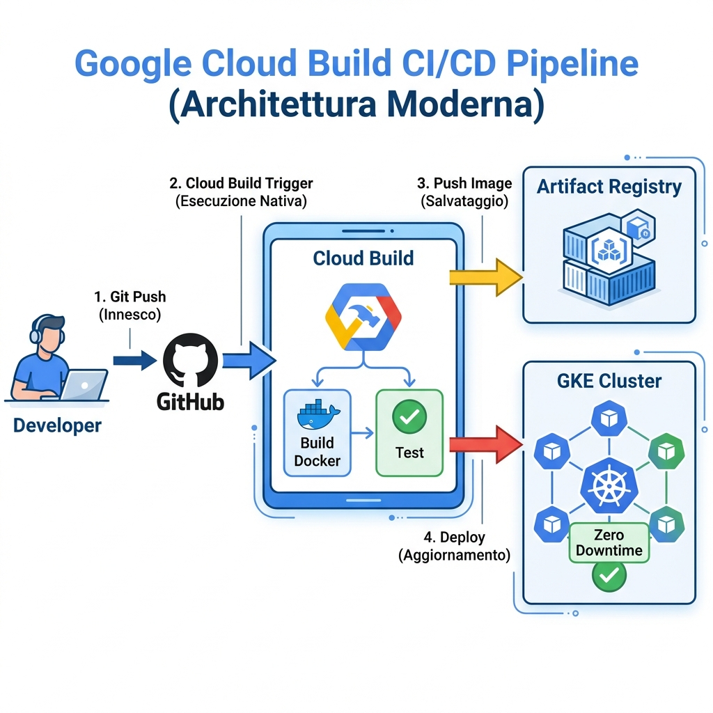
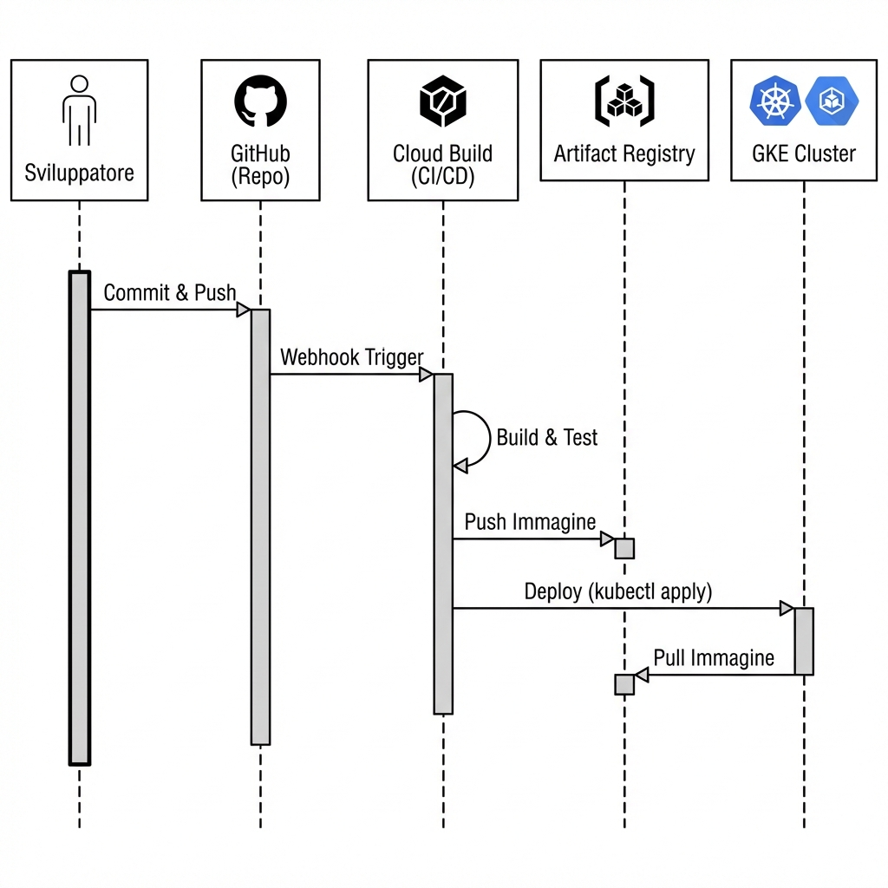

# Analisi Architetturale CI/CD con Google Cloud Build

**Target Audience**: Developers / DevOps Engineers
**Stack**: GitHub -> Cloud Build Trigger -> Artifact Registry -> GKE Autopilot

Questo documento descrive la pipeline di Continuous Integration & Deployment (CI/CD) aggiornata per utilizzare **Google Cloud Build**, la soluzione nativa di GCP.

---

## 1. Architettura dei Flussi (Cloud Native)

Il seguente diagramma illustra come il codice passa dal repo GitHub al cluster GKE rimanendo sempre all'interno della rete sicura di Google.

### Visione d'Insieme (Architettura)


### Visione Temporale (Sequenza)
Il flusso degli eventi automatizzati:


---

### 🧐 Dettagli delle Fasi

Ecco cosa avviene esattamente in ogni fase del diagramma:

1.  **Git Push (L'Innesco)**
    *   *Azione:* Lo sviluppatore invia il codice al branch `main` su GitHub.
    *   *Differenza:* Non c'è nessuna "Action" che parte su GitHub. GitHub si limita a inviare una notifica (Webhook) a Google.

2.  **Cloud Build Trigger (L'Esecuzione)**
    *   *Azione:* Google Cloud riceve la notifica e avvia un "Worker" interno.
    *   *Vantaggio:* Il worker è già autenticato. Non servono chiavi segrete, federazioni OIDC o passaggi complessi. È un servizio Google che parla con altri servizi Google.

3.  **Docker Build & Test (La Costruzione)**
    *   *Azione:* Cloud Build esegue le istruzioni del file `cloudbuild.yaml`. Scarica il codice, esegue i test e costruisce il container.
    *   *Performance:* I server di build sono super-veloci e hanno accesso diretto alla rete Google.

4.  **Artifact Registry Push (Il Salvataggio)**
    *   *Azione:* L'immagine Docker creata viene salvata nel registro `suite-clinica-repo`.
    *   *Sicurezza:* Il caricamento è interno alla rete Google, massimizzando velocità e sicurezza.

5.  **GKE Deploy (L'Aggiornamento)**
    *   *Azione:* Cloud Build usa lo strumento `gke-deploy` (o `kubectl`) per aggiornare il cluster.
    *   *Zero Downtime:* Come prima, Kubernetes avvia i nuovi pod e spegne i vecchi solo quando tutto è pronto.

---

## 2. Configurazione Tecnica

Per abilitare il deployment automatico, è necessario aggiungere al repository i seguenti file di configurazione:

### 2.1 Dockerfile (`Dockerfile`)
Un file **multi-stage** che gestisce sia la build del frontend (React) che il runtime del backend (Flask).
- **Stage 1 (Frontend)**: Usa l'immagine `node` per compilare gli asset statici (`npm run build`).
- **Stage 2 (Backend)**: Usa l'immagine `python` per eseguire l'applicazione Flask, servendo anche gli asset statici compilati nello stage precedente.

### 2.2 Manifesti Kubernetes (`k8s/`)
Una cartella contenente le definizioni delle risorse Kubernetes:
- **`deployment.yaml`**: Definisce come eseguire l'applicazione (repliche, risorse, variabili d'ambiente).
- **`service.yaml`**: Espone l'applicazione all'interno o all'esterno del cluster (LoadBalancer/ClusterIP).

### 2.3 Cloud Build (`cloudbuild.yaml`)
Il file che orchestra la pipeline. Al posto dei workflow di GitHub Actions, useremo un unico file `cloudbuild.yaml` nella root del progetto.

### Esempio di Struttura

```yaml
steps:
  # 1. Build Layer: Crea l'immagine Docker
  - name: 'gcr.io/cloud-builders/docker'
    args: ['build', '-t', 'europe-west8-docker.pkg.dev/$PROJECT_ID/suite-clinica-repo/backend:$COMMIT_SHA', '.']

  # 2. Push Layer: Carica su Artifact Registry
  - name: 'gcr.io/cloud-builders/docker'
    args: ['push', 'europe-west8-docker.pkg.dev/$PROJECT_ID/suite-clinica-repo/backend:$COMMIT_SHA']

  # 3. Deploy Layer: Aggiorna GKE
  - name: 'gcr.io/cloud-builders/gke-deploy'
    args:
      - run
      - --filename=k8s/
      - --location=europe-west8
      - --cluster=suite-clinica-cluster-prod
      - --image=europe-west8-docker.pkg.dev/$PROJECT_ID/suite-clinica-repo/backend:$COMMIT_SHA

# Configurazione Timeout e Log
timeout: 1200s
options:
  logging: CLOUD_LOGGING_ONLY
```

### 2.4 Setup del Trigger (GCP Console)
Per collegare il repository a Cloud Build, seguire questi passaggi nella Console Google Cloud:

1.  **Connessione Repository**:
    *   Andare su **Cloud Build** > **Repositories**.
    *   Cliccare su **CONNECT HOST** e seguire la procedura per collegare l'account GitHub.
    *   Selezionare il repository `suite-clinica`.

2.  **Creazione del Trigger**:
    *   Andare su **Cloud Build** > **Triggers**.
    *   Cliccare su **CREATE TRIGGER**.
    *   **Name**: `suite-clinica-cd-main` (o simile).
    *   **Event**: "Push to a branch".
    *   **Source**: Selezionare il repo collegato e il branch `main` (o il branch desiderato per il deploy).
    *   **Configuration**: Selezionare "Cloud Build configuration file (yaml or json)".
    *   **Location**: Lasciare `cloudbuild.yaml` (default).
    *   **Service Account**: Assicurarsi di usare il Service Account predefinito o uno dedicato che abbia i permessi IAM necessari (vedi punto 4).

---

### 2.5 Risoluzione Problemi Comuni
**Errore: `Permission 'secretmanager.secrets.create' denied`**
Se si riscontra questo errore durante la connessione del repository:
1.  **Abilitare API**: Cercare "Secret Manager API" nella console GCP e cliccare "Abilita".
2.  **Permessi**: 
    - Andare su **IAM e amministrazione**.
    - Cercare l'agente di servizio di Cloud Build (formato: `service-[NUMERO]@gcp-sa-cloudbuild.iam.gserviceaccount.com`).
    - Assegnare il ruolo **Secret Manager Admin** (o `Secret Manager VS Code Admin` per test).

---

## 3. Vantaggi della scelta Cloud Build

1.  **Sicurezza Semplificata**: Non dobbiamo gestire Service Account Key o Workload Identity Federation su GitHub. Cloud Build usa un Service Account interno gestito da Google.
2.  **Visibilità**: I log di build sono integrati nella console GCP insieme ai log dell'applicazione. Se il deploy fallisce, clicchi sul log e vedi subito perché.
3.  **Velocità**: Il traffico tra Cloud Build, Artifact Registry e GKE è tutto su rete interna Google (Google Backbone), molto più veloce e affidabile dell'upload da runner esterni.

---

## 4. Prossimi Passi Operativi

1.  **[Console GCP]** Creare il **Trigger**: Collegare il repo GitHub a Cloud Build dalla console.
2.  **[Codice]** Creare `Dockerfile`, `cloudbuild.yaml` e cartella `k8s/` con i manifesti.
3.  **[IAM]** Verificare che il Service Account di Cloud Build (`[NUMERO-PROGETTO]@cloudbuild.gserviceaccount.com`) abbia i permessi `Kubernetes Engine Developer`.
